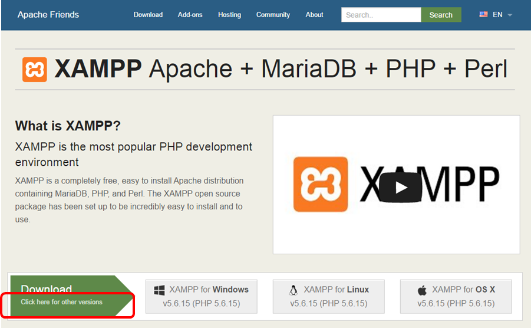
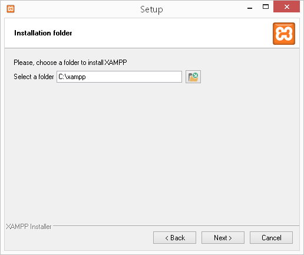
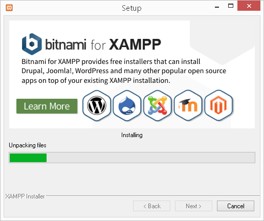
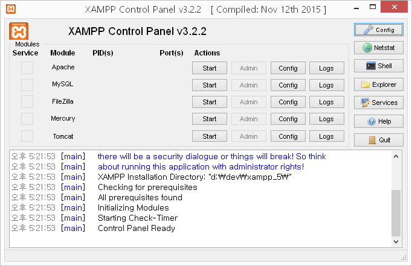

## Table of Contents
1. [문서 개요](#1--문서-개요)
     * [목적](#11--목적)
     * [범위](#12--범위)
     * [참고자료](#13--제약사항)
     * [참고자료](#14--참고자료)
2. [개발환경 구성](#2--개발환경-구성)
     * [PHP 샘플 소스 받기](#21--PHP-샘플-소스-받기)
     * [XAMP설치](#22--XAMP설치)
     * [PHP 실행 환경설정](#23--PHP-실행-환경설정)
     * [Composer 설치](#24--Composer-설치)
     * [Mongo 드라이버 설치](#25--Mongo-드라이버-설치)
3. [개발](#3--개발)
     * [사용 Package 설명](#31--사용-Package-설명)
     * [디렉토리설명](#32--디렉토리설명)
     * [애플리케이션 환경설정](#33--애플리케이션-환경설정)
     * [VCAP_SERVICES 환경설정 정보](#34--VCAP_SERVICES-환경설정-정보)
     * [Mysql 연동](#32--Mysql-연동)
     * [CUBRID 연동](#32--CUBRID-연동)
     * [MongoDB 연동](#32--MongoDB-연동)
     * [Redis 연동](#32--Redis-연동)
     * [RabbitMQ 연동](#32--RabbitMQ-연동)
     * [GlusterFS 연동](#32--GlusterFS-연동)
4. [배포](#4--배포)
5. [테스트](#5--테스트)

#1.  문서 개요

## 1.1.  목적 

본 문서(PHP 애플리케이션 개발 가이드)는 개발형 플랫폼 프로젝트의 서비스를PHP 애플리케이션과 연동하는 방법을 제공하는데 있습니다.

## 1.2.  범위

연동을 하는 서비스는 MySQL, MongoDB, Redis, GlusterFS 입니다. 데이터 저장에는 MySQL, MongoDB를 사용하고 사용자의 Session은 Redis에 샘플 어플리케이션에서 사용하는 이미지 파일 관리(Upload)를 위해서는 GlusterFS를 사용합니다.

## 1.3.  제약사항

현재 PHP 빌드팩(CloudFoundry의 공식 빌드팩 v4.3.1)의 지원하는 드라이버가 본 사업의 서비스와 정확하게 맞지 않아 일부 서비스(RabbitMQ, CUBRID)는 연동하지 못했습니다. 또한 MongoDB와 연결은 DB인증 절차가 적용이 되지 않아 DB Admin 계정으로 접속하는 방법을 설명하였습니다.
실제 사용시에는 PHP 빌드팩을커스터마이징하여 프로젝트 환경에 맞추어서 개발을 진행하셔야 합니다.

## 1.4.  참고자료

-	PHP 빌드팩 :https://github.com/cloudfoundry/php-buildpack
-	XAMP 사이트 :https://www.apachefriends.org/index.html

#2. 개발환경 구성

개발환경은 개방형 플랫폼의 네트워크의 구성에 따라 로컬에 구성을 하거나 직접 개방형 플랫폼에 Deploy하여 관리할 수 있습니다. 여기서는 Windows 환경에 간단하게 개발환경을 구성하고 개방형 플랫폼에 배포(Deploy)하는 방법을 설명하겠습니다.
PHP 개발환경을 구성하려면 Web Server와 PHP 엔진, Extension 설치등을해야하는데 이를 간편하게 구성 놓은 툴이 있습니다. 본 가이드에서는 XAMP를 이용하여 설치를 하고 구성하도록 하겠습니다.

본 문서 작성을 위해 구성한 시스템은 아래와 같습니다.
-	OS : Windows 8.1 64bit
-	XAMP PHP 5.5.30
-	Mongo 라이브러리 :
-	Composer : 

PHP로 REST/full 서버를 구현하였고 화면(HTML)은 Apache의 Web 서버에서 제공을 합니다. HTML과 PHP는 별도로 돌아가는 구조입니다.

## 2.1.  PHP 샘플 소스 받기

샘플의 위치는 변경될수있느나 개방형 플랙폼 홈페이지에서 찾아볼 수 있습니다. 해당 GIT 위치를 확인하시고 아래와 같은 명령문으로 소스를 다운로드 받습니다. 해당 명령을 위해서는 GIT Client가 설치되어 있어야 합니다.

$ git clone 

## 2.2.  XAMP설치

BOSH는 스템셀을 생성하는 VM을 AWS에 생성하고 관리한다. 스템셀을 생성하기 위해서는 AWS에 계정을 생성하고 스템셀을 생성하기 위한 환경을 구성해야 한다.
  1.	URL (https://www.apachefriends.org/index.html) 에 접속하면 바로 다운로드 화면이 나옵니다. 여기서 "Click here for other version"을 선택합니다. 
    
  
  XAMP 공식 홈페이지 첫화면
    
  다운로드는 Windows버전 PHP 5.5.30 (32bit)을 다운로드 받습니다.
    
  2.	다운로드 받은 파일을 실행하고 모두 Next를 하면됩니다. 하지만 아래와 같이 디렉토리를 물어보는데 이때 이 위치를 변경하거나 정확하게 기억하고 있어야 합니다. 설치 완료후php 실행 디렉토리를 환경변수(Path)에 넣어 줘야 하기 때문입니다.
    
  
  XAMP 설치 디렉토리
    
  3.	설치가 정상적으로 이루어지고 있으면 아래와 같이 진행이 될겁니다. 처음 실행할 때 Antivirus 프로그램으로 느려질수 있다는 문구 등이 나올수도 있는데 "확인"을 누르시면 됩니다.
    
  
  XAMP 설치 진행중
    
  4.	설치가 완료되면 Control Panel을 띄우겠다는 메시지가 나옵니다. 선택이 Default로 되어 있어 완료를 선택하면 아래와 같은 Control Panel이 실행됩니다.
    
  
  XAMP 관리 패널 창
    
  사용방법은 간단합니다. 원하는 서비스(여기서는 Apache 만 사용할 예정)의 Start를 선택하면 해당 서비스가 실행이 됩니다. 단. 해당서비스가 사용하는 포트(Apache의 경우 80)는 사용하고 있지 않아야 합니다.
    
  5.	Apache의 Config를 선택하고 Apache (httpd.conf)를 선택하여 DocumentRootdhk Directory의 위치를 개발소스가 설치된 곳으로 바꾸면 브라우져에서http://localhost 로 호출시 개발하는 위치로 바로 연결됩니다. 개발소스의 위치는 2.2.1에서 설치한 위치를 지정해 넣습니다.
        
      DocumentRoot C:\개발소스위치
      <DirectoryC:\개발소스위치>

## 2.3.  RUBY 설치

Ruby 설치 절차는 다음과 같다.

1.  의존 패키지 설치

  -   Ubuntu의 경우

			$ sudo apt-get update
			$ sudo apt-get install -y build-essential zlibc zlib1g-dev ruby ruby-dev openssl libxslt-dev libxml2-dev libssl-dev libreadline6 libreadline6-dev libyaml-dev libsqlite3-dev sqlite3 libxslt1-dev libpq-dev libmysqlclient-dev
    

  -   CentOS의 경우
   
    		$ sudo yum install gcc ruby ruby-devel mysql-devel postgresql-devel postgresql-libs sqlite-devel libxslt-devel libxml2-devel yajl-ruby
    

  -   OSX의 경우
    
    		$ xcode-select --install
		    xcode-select: note: install requested for command line developer tools
  

2.  Ruby 설치 관리자 및 Ruby 설치

		$ curl -L https://get.rvm.io | bash -s stable
		$ source ~/.rvm/scripts/rvm

		#Ruby 2.1.6 설치
		$ rvm install 2.1.6

		#기본 Ruby 버전 설정
		$ rvm use 2.1.6 --default

3.  설치 확인

		$ ruby -v

## 2.4.  BOSH 설치

BOSH 설치 절차는 다음과 같다.

1.  설치할 환경 생성

		#git 설치
		$ sudo apt-get install git

		#실행 디렉토리 생성
		$ mkdir -p ~/workspace
		$ cd ~/workspace

2.  Bosh 설치 및 설정
  
		#Bosh 설치
		$ git clone https://github.com/cloudfoundry/bosh.git
  		
		#Bosh 서브모듈 설치
		$ cd bosh
		$ git submodule update --init --recursive

		#Bosh 의존 패키지 설치
		$ bundle install

		#bosh_cli 설치
		$ gem install bosh_cli
  

3.  Bosh 설치 확인

		$ bundle exec bosh 또는 bosh

## 2.5.  Vagrant 설치

Vagrant는 가상 환경을 구축해 주는 오픈 소스이다. 스템셀을 생성 할 VM을 관리하기 위해 vagrant를 사용한다.

1.  Vagrant 설치

		$ sudo apt-get install vagrant

2.  Vagrant 플러그인 설치

		$ vagrant plugin install vagrant-berkshelf
		$ vagrant plugin install vagrant-omnibus
		$ vagrant plugin install vagrant-aws --plugin-version 0.5.0

## 2.6.  스템셀 생성을 위한 VM 설치

스템셀 생성을 위한 가상 환경을 구성한다.

1.  AWS 환경 변수 설정
  
		#아래의 환경변수를 설정을 실행한다.
		$ export BOSH_AWS_ACCESS_KEY_ID=<YOUR-AWS-ACCESS-KEY>
		$ export BOSH_AWS_SECRET_ACCESS_KEY=<YOUR-AWS-SECRET-KEY>
		$ export BOSH_AWS_SECURITY_GROUP=<YOUR-AWS-SECURITY-GROUP-ID>
		$ export BOSH_AWS_SUBNET_ID=<YOUR-AWS-SUBNET-ID>
  

2.  VM 생성

	***기본으로 설정된 VM 크기는 m3.xlarge 타입으로 AWS 과금 대상이다.***

		$ cd ~/workspace/bosh/bosh-stemcell
		$ vagrant up remote --provider=aws

3.  원격 접속 확인

		#접속 키 정보 설정 실행
		$ export BOSH_KEY_PATH=<접속 키의 경로 및 파일명>
		$ export BOSH_VAGRANT_KEY_PATH=<접속 키의 경로 및 파일명>

		#접속 실행
		$ cd ~/workspace/bosh/bosh-stemcell
		$ vagrant ssh remote

4.  원격 파일 송수신

		#접속 키 정보 설정 실행
		$ export BOSH_KEY_PATH=<접속 키의 경로 및 파일명>
		$ export BOSH_VAGRANT_KEY_PATH=<접속 키의 경로 및 파일명>

		#파일 송수신 실행
		$ cd ~/workspace/bosh/bosh-stemcell

		#파일을 송신할 경우
		$ vagrant scp <로컬 파일> remote:<원격 파일 저장 경로>

		#파일을 수신할 경우
		$ vagrant scp remote:<원격 파일 저장 경로> <로컬 파일>
 

## 2.7.  BOSH Source 등을 수정하여 스템셀을 생성할 경우

1.  Source Code 수정 또는 업데이트한 gem 파일을 스템셀 생성 VM에 반영하는 경우

		$ cd ~/workspace/bosh/bosh-stemcell
		$ vagrant provision remote

#3.  기본 OS 이미지 생성 

사용자 환경에 맞는 사용자 정의의 OS로 구성한 스템셀이 필요한 경우, 기본 OS 이미지부터 생성한다. 기본 OS 이미지는 스템셀이 요구하는 최소한의 OS 기능과 Bosh agent 및 bosh 모니터로 구성 되어 있다.

## 3.1.  Ubuntu OS 이미지 생성

Ubuntu OS 이미지를 생성하는 절차를 기술한다.

1.  Build\_os\_image 실행

		#기본 OS 이미지 생성
		$ cd ~/workspace/bosh/bosh-stemcell
		$ vagrant ssh -c '
		cd /bosh
		bundle exec rake stemcell:build_os_image[ubuntu,trusty,/tmp/ubuntu_base_image.tgz]
		' remote

2.  입력 옵션 정보

	|옵션명                      |필수   |설명                                          |예시|
	|--------------------------|------|--------------------------------------------|------------------------------|
	|Operating system name      |O      |OS 타입                                      |ubuntu|
	|Operating system version   |O      |OS 버전                                      |trusty|
	|OS image path              |O      |기본 OS 이미지가 생성되는 디렉토리 및 이름       |/tmp/ubuntu_base_image.tgz|

	※ 필수 항목이 아닌 곳에 대해서는 ‘’을 입력한다.

## 3.2.  RHEL OS 이미지 생성 

RHEL OS 이미지를 생성하는 절차를 기술한다.

1.  RHEL 7.0 iso를 다운로드 받아서 스템셀 생성 VM에 업로드 한다.

  	[https://access.redhat.com/downloads/content/69/ver=/rhel---7/7.0/x86\_64/product-downloads](https://access.redhat.com/downloads/content/69/ver=/rhel---7/7.0/x86_64/product-downloads)
  
	※ 다운로드하기 위해서는 RedHat 계정이 있어야 한다.

2.  실행 환경 구성

		#스템셀 생성 VM에 접속
		$ cd ~/workspace/bosh/bosh-stemcell
		$ vagrant ssh remote

		#RHEL 이미지 마운트
		$ sudo mkdir -p /mnt/rhel
		$ sudo mount rhel-server-7.0-x86_64-dvd.iso /mnt/rhel

		#redhat 계정 정보 설정
		$ export RHN_USERNAME=<RHEL 계정>
		$ export RHN_PASSWORD=<RHEL 비밀번호>

3.  Build\_os\_image 실행

		#스템셀 생성 VM에서 build_os_image 실행
		$ cd /bosh
		$ bundle exec rake stemcell:build_os_image[rhel,7,/tmp/rhel_7_base_image.tgz]

	※ 기본 RHEL OS 이미지는 BOSH에서 제공하지 않는다.

## 3.3.  PHOTON OS 이미지 생성 

PHOTON OS 이미지를 생성하는 절차를 기술한다.

1.  PHOTON iso 이미지를 다운로드 받아서 스템셀 생성 VM에 업로드 한다. ※TP2버전 이상을 다운 받는다.
  
	[https://vmware.bintray.com/photon/iso/](https://vmware.bintray.com/photon/iso/)

2.  실행 환경 구성

		#스템셀 생성 VM에 접속
		$ cd ~/workspace/bosh/bosh-stemcell
		$ vagrant ssh remote

		#PHOTON 이미지 마운트
		$ sudo mkdir -p /mnt/photon
		$ sudo mount photon.iso /mnt/photon

3.  Build\_os\_image 실행
  
		#스템셀 생성 VM에서 build_os_image 실행
		$ cd /bosh
		$ bundle exec rake stemcell:build_os_image[photon,TP2,/tmp/photon_TP2_base_image.tgz]

	※ 기본 Photon OS 이미지는 BOSH에서 제공하지 않는다.

## 3.4.  생성한 기본 OS 이미지의 보관장소 

1.  생성한 기본 OS 이미지 확인

		$ cd ~/workspace/bosh/bosh-stemcell
		$ vagrant ssh remote
		$ ll /tmp

2.  생성한 기본 OS 다운로드
 
		$ cd ~/workspace/bosh/bosh-stemcell
		$ vagrant scp remote:/tmp/<생성한 기본 OS 이미지명> <다운받을 로컬 경로>

#4.  BOSH 스템셀 생성 

## 4.1.  원격지의 OS 이미지를 사용한 스템셀 생성 

원격지의 OS 이미지를 사용해서 스템셀을 생성하는 절차를 기술한다.

1.  Build 실행

		$ cd ~/workspace/bosh/bosh-stemcell
		$ vagrant ssh -c '
		cd /bosh
		CANDIDATE_BUILD_NUMBER=<current_build> bundle exec rake stemcell:build[vsphere,esxi,centos,7,go,bosh-os-images,bosh-centos-7-os-image.tgz]
		' remote

2.  입력 옵션 정보

	|옵션명                      |필수    |설명                       |예시|
	|--------------------------|------|-----------------------------------------------|------|
	|CANDIDATE_BUILD_NUMBER     |O      |현재 스템셀 버전            |3147|
	|Infrastructure             |O      |인프라 타입                 |Vsphere|
	|Hypervisor                 |O      |하이퍼 바이저 타입          |Esxi|
	|Operating system name      |O      |OS 타입                    |Centos|
	|Operating system version   |O      |OS 버전                    |7|
	|Agent type                 |X      |에이전트 타입               |Go|
	|OS image s3 bucket name    |O      |Bosh용 OS 이미지 버킷명     |Bosh-os-image|
	|OS image key               |O      |OS 이미지명                |Bosh-centos-7-os-image.tgz|

	※ 다른 OS image에 대해서는 다음을 참조한다. 
[http://s3.amazonaws.com/bosh-os-images/](http://s3.amazonaws.com/bosh-os-images/)

	※ Agent type타입이 필수 항목은 아니지만 현재 go 타입 이외의 에이전트는 지원하지 않으므로 go를 입력한다.

3.  설정 가능한 옵션 구성

	|Infrastructure             |Hypervisor                |OS|
	|--------------------------|-------------------------|----------------------------|
	|aws                        |Xen                       |ubuntu|
    |aws                        |Xen                       |centos|
	|openstack                  |Kvm						|ubuntu|                       
	|openstack                  |Kvm						|centos|		
	|vcloud					   |Esxi						 |ubuntu|		
	|vsphere					|Esxi						 |ubuntu|
	|vsphere					|Esxi						 |centos|

	※ 위와 다른 옵션을 지정하고 싶은 경우 Bosh source에서 필요한 부분을 수정하거나 개발 한다.

## 4.2.  로컬의 OS 이미지를 사용한 스템셀 생성 

로컬의 OS 이미지를 사용해서 스템셀을 생성하는 절차를 기술한다.

1.  기본 OS 이미지를 생성 또는 다운로드 받는다.

	|OS 명            |URL|
	|----------------|----------------------------------------------------------------------------|
	|ubuntu           |[https://s3.amazonaws.com/bosh-os-images/bosh-ubuntu-trusty-os-image.tgz](https://s3.amazonaws.com/bosh-os-images/bosh-ubuntu-trusty-os-image.tgz)|
	|centos           |[https://s3.amazonaws.com/bosh-os-images/bosh-centos-7-os-image.tgz](https://s3.amazonaws.com/bosh-os-images/bosh-centos-7-os-image.tgz)|
	|사용자 생성 OS     |[3. 기본 OS 이미지 생성 참조](#3--기본-os-이미지-생성)|

2.  기본 OS 이미지를 다운 받은 경우, 스템셀 생성 VM에 업로드 한다.

3.  build\_with\_local\_os\_image 실행
  
		$ cd ~/workspace/bosh/bosh-stemcell
		$ vagrant ssh -c '
		cd /bosh
		bundle exec rake STEMCELL_BUILD_NUMBER=<stemcell version> stemcell:build_with_local_os_image[aws,xen,ubuntu,trusty,go,/tmp/ubuntu_base_image.tgz]
		' remote

	※ STEMCELL\_BUILD\_NUMBER을 생략할 경우, 생성되는 스템셀의 버전은 0000으로 고정된다.

4.  입력 옵션 정보

	|옵션명                      |필수    |설명                                   |예시|
	|--------------------------|------|--------------------------------------|------------------------------|
	|Infrastructure             |O      |인프라 타입                             |Aws|
	|Hypervisor                 |O      |하이퍼 바이저 타입                       |Xen|
	|Operating system name      |O      |OS 타입                                |Ubuntu|
	|Operating system version   |O      |OS 버전                                |Trusty|
	|Agent type                 |X      |에이전트 타입                           |Go|
	|Local os image path        |O      |스템셀 생성 VM에 있는 OS 이미지 경로      |/tmp/ubuntu_base_image.tgz|

	※ Agent type타입이 필수 항목은 아니지만 현재 go 타입 이외의 에이전트는 지원하지 않으므로 go를 입력한다

5.  설정 가능한 옵션 구성

	|Infrastructure             |Hypervisor                |OS|
	|--------------------------|-------------------------|----------------------------|
	|aws                        |Xen                       |ubuntu|
    |aws                        |Xen                       |centos|
	|openstack                  |Kvm						|ubuntu|                       
	|openstack                  |Kvm						|centos|		
	|vcloud					   |Esxi						 |ubuntu|		
	|vsphere					|Esxi						 |ubuntu|
	|vsphere					|Esxi						 |centos|

## 4.3.  생성한 스템셀의 보관장소 

1.  생성한 스템셀 확인

		$ cd ~/workspace/bosh/bosh-stemcell
		$ vagrant ssh remote
		$ ll /bosh/tmp

2.  생성한 스템셀 다운로드

		$ cd ~/workspace/bosh/bosh-stemcell
		$ vagrant scp remote:/bosh/tmp/<생성한 스템셀명> <다운받을 로컬 경로>

#5.  BOSH Light 스템셀 생성 

## 5.1.  Bosh Light 스템셀 생성

Bosh light 스템셀은 AWS (N. Virgina region 한정)에서만 사용가능한 경량 스템셀이다. 스템셀을 AWS에 AMI로 등록하고 등록한 이미지 아이디, 스템셀 정보 등을 기록한 파일을 생성하여 tgz로 압축한다.

1.  다운로드 받았거나 생성한 스템셀을 스템셀 생성 VM에 업로드한다.

		$ cd ~/workspace/bosh/bosh-stemcell	
		$ scp <업로드 대상 스템셀> remote:/tmp/bosh-stemcell.tgz

2.  build\_light 실행

		$ cd ~/workspace/bosh/bosh-stemcell
		$ vagrant ssh -c '
		cd /bosh
		export BOSH_AWS_ACCESS_KEY_ID=<YOUR-AWS-ACCESS-KEY>
		export BOSH_AWS_SECRET_ACCESS_KEY=<YOUR-AWS-SECRET-KEY>
		bundle exec rake stemcell:build_light[/tmp/bosh-stemcell.tgz,hvm]
		' remote

3.  입력 옵션 정보

	|옵션명                |필수   |설명                   |예시|
	|---------------------|------|----------------------|------------------------|
	|Local stemcell path   |O      |로컬의 stemcell 경로   |/tmp/bosh-stemcell.tgz|
	|Virtualization type   |X      |가상화 타입            |Hvm|

	※ 필수 항목이 아닌 곳에 대해서는 ‘’을 입력한다.

#6.  스템셀 커스터마이징 

## 6.1.  스템셀 생성 소스 수정 

사용자의 요구사항에 맞는 스템셀을 생성하기 위해서는 스템셀 생성 소스를 수정 해야 할 경우가 있다. 스템셀 생성을 구성하는 대부분의 파일은 아래의 디렉토리에 있다.

	bosh/stemcell_builder/stages/<스템셀 생성 stage>/<폴더 또는 파일>

1.  수정한 내용을 스템셀 생성 VM에 적용한다.

		$ cd ~/workspace/bosh/bosh-stemcell
		$ vagrant provision remote

2.  스템셀을 생성한다. (필요한 경우 기본 OS 이미지부터 생성한다.)

3.  스템셀 생성 중 오류가 발생한 경우, 해당 오류를 조치한 후 오류가 발생한 stage부터 진행 할 수 있다. 이 경우, resume\_from=<스템셀 생성 stage\>를 생성 명령어에 추가한다. ※ 단, resume 옵션으로
    스템셀을 생성할 경우, 이전에 정상적으로 진행된 스테이지에서 오류가 발생하는 경우도 있다. 이런 경우, resume\_from옵션을 사용하지 않는다.

		$ cd ~/workspace/bosh/bosh-stemcell
		$ vagrant ssh -c '
		cd /bosh
		bundle exec rake stemcell:build_with_local_os_image[aws,xen,ubuntu,trusty,go,/tmp/ubuntu_base_image.tgz] resume_from=stemcell_openstack
		' remote