# Table Of Contents

1. [Document Outline](#1-Document-Outline)  
	1.1. [Outline](#11-Outline)  
	1.2. [Range](#12-Range)  
	1.3. [Reference Materials](#13-Reference-Materials)  
2. [Preparation before installing the development environment](#2-Preparation-before-installing-the-development-environment)  
	2.1. [Preparation before installation](#21-Preparation-before-installation)  
	2.2. [Java development kit installation](#22-Java-development-kit-installation)  
	2.3. [Installation of e-government standard framework](#23-Installation-of-e-government-standard-framework)  
	2.4. [Install Kepler version of Eclipse integrated development environment](#24-Install-Kepler-version-of-Eclipse-integrated-development-environment)  
3. [Open PaaS development environment installation](#3-Open-PaaS-development-environment-installation)  
	3.1. [Open PaaS development environment installation in e-government standard framework](#31-Open-PaaS-development-environment-installation-in-e-government-standard-framework)  
	3.2. [Install Open PaaS development environment in Eclipse integrated development environment](#32-Install-Open-PaaS-development-environment-in-Eclipse-integrated-development-environment)  
	3.3. [Use of e-government standard framework development environment including Open PaaS development environment.](#33-Use-of-e-government-standard-framework-development-environment-including-Open-PaaS-development-environment)  
4. [Open platform server connection management](#4-Open-platform-server-connection-management)  
	4.1. [Add the server](#41-Add-the-server)  
	4.2. [Registering platform server information](#42-Registering-platform-server-information)  
	4.3. [Server replication](#43-Server-replication)  
	4.4. [Modify Servers](#44-Modify-Servers)  
5. [Manage applications and service packs](#5-Manage-applications-and-service-packs)  
	5.1. [Deploy Applications](#51-Deploy-Applications)  
	5.2. [Check Application list](#52-Check-Application-list)  
	5.3. [Manage Application route](#53-Manage-Application-route)  
	5.4. [Manage Application instance](#54-Manage-Application-instance)  
	5.5. [Delete-Application](#55-Delete-Application)  
	5.6. [Add Service Pack Instance](#56-Add-Service-Pack-Instance)  
	5.7. [Service Pack Instance Binding](#57-Service-Pack-Instance-Binding)  
	5.8. [Release the Service Pack Instance Binding](#58-Release-Service-Pack-Instance-Binding)  
	5.9. [Delete Service Pack Instance](#59-Delete-Service-Pack-Instance)  
6. [Setting by the manifest](#6-Setting-by-the-manifest)  
	6.1. [Add manifest](#61-Add-manifest)  
	6.2. [Save manifest](#62-Save-manifest)  
7. [Plugin settings (Set REST API log tracking)](#7-Plugin-settings-(Set-REST-API-log-tracking))  
8. [Example project description](#8-Example-project-description)  
	8.1. [Add dependency](#81-Add-dependency)  
	8.2. [Add cloud namespace](#82-Add-cloud-namespace)  
	8.3. [Change dataSource settings](#83-Change-datasource-settings)  
	8.4. [Set dataSource initialization](#84-Set-dataSource-initialization)  
	8.5. [Notes when Deploying](#85-Notes-when-Deploying)  


# Executive Summary

This document provides an outline of how to configure and use the environment necessary for developers to develop Open PaaS-based applications by installing the Open PaaS development environment in the e-government framework development environment.

It is assumed that the user of this guide has basic knowledge of Java and Java web application development.

The guide is prepared according to the two steps below.
* Open PaaS development environment installation
* How to use Open PaaS development environment


# 1. Document Outline

### 1.1 Outline
This document installs Open PaaS development environment in e-government standard framework development environment and Eclipse integrated development environment. 
Then, it provides a guide for deploying and managing Java web applications, managing Service Pack in the Open PaaS environment through the Open PaaS development environment. 

### 1.2 Range
The guide provided in this document was written in basis of the e-government standard framework 3.2.0 and Eclipse Kepler version (Kepler, 4.3.x version).

### 1.3 Reference Materials
This document was referred to as Cloud Foundry's Cloud Foundry Eclipse plug-in document.
Cloud Foundry Eclipse plugin document:
http://docs.run.pivotal.io/buildpacks/java/sts.html

# 2. Preparation before installing the development environment

### 2.1 Preparation before installation

This document was written in basis of  installation in the e-government framework version 3.1.1 development environment. The e-government framework development environment is written in Java language.  the Java Development Kit (JDK) or Java Execution Environment (JRE) must be installed to run the e-government framework development environment. Since the Open PaaS development environment operates on the form of a plug-in in the e-government framework development environment, install the e-government framework development environment after installing the Java development kit. (Java version 7 or higher is recommended.) Also, if you don't use the e-government framework development environment ,  you could install the eclipse. becuase it is similar to the Eclipse integrated development environment Kepler version, so it was not relevant to install Eclipse.

The version used in the description below is as follows.
* jdk-8u60
* Eclipse-jee-kepler-SR2-win32-x86\_64
* openpaas\_dev\_env.jar
* eGovFrameDev-3.1.1

### 2.2 Java development kit installation

1. 아래 링크에 접속하여 “JavaSE Download” 페이지가 표시되면 중앙의 “JDK Download” 링크를 클릭하여 라이선스 동의 페이지로 이동한다.
[***http://www.oracle.com/technetwork/java/javase/downloads/index.html***](http://www.oracle.com/technetwork/java/javase/downloads/index.html)
2. 라이선스에 동의한 후 개발환경에 맞는 자바 개발 킷 설치 파일을 다운로드 받는다.
3. 설치 파일을 실행하여 화면에 표시되는 절차에 따라 설치를 완료한다.  
	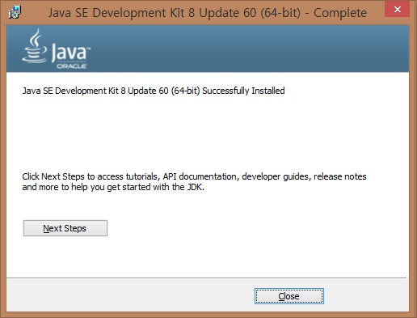

4. 명령 프롬프트에서 자바 명령어 실행을 위해 시스템 속성의 환경
    변수를 설정한다.
	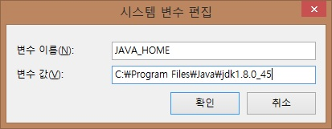
	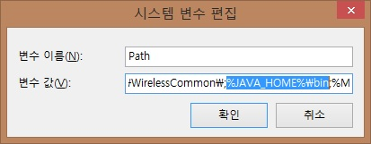
	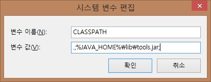

5. 명령 프롬프트에서 “java –version” 명령을 실행하여 설치된 자바 버전이
    정상적으로 출력되는지 확인한다.
	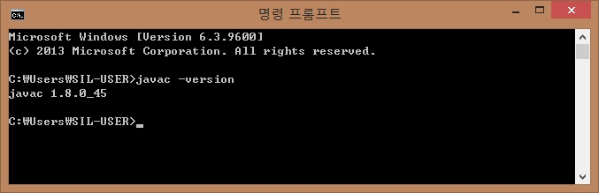

### 2.3 Installation of e-government standard framework

전자정부 표준프레임워크 설치는 전자정부 표준프레임워크의 개발자 개발 환경 설치 가이드의 개발자 개발환경 설치(http://www.egovframe.go.kr/wiki/doku.php?id=egovframework:dev2:clntinstall)를 참고한다.  
> **버전은 3.1.1 버전을 사용한다**

### 2.4 Install Kepler version of Eclipse integrated development environment

이클립스 통합개발환경 케플러 버전의 설치 절차는 다음과 같다.

1. 이클립스 홈페이지의 이클립스 통합개발환경 다운로드 페이지(**http://www.eclipse.org/downloads/**)에 접속한다.
	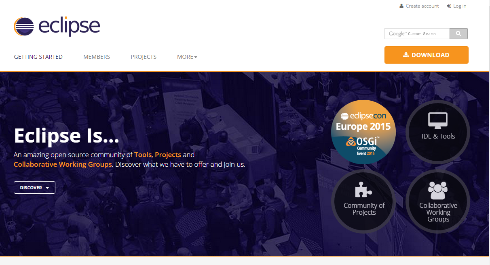

2. 이클립스 통합개발환경 케플러 버전을 설치하기 위해서는 다운로드 페이지의 오른쪽 사이드바에 “MORE DOWNLOADS”에 “Eclipse Kepler(4.3)”을 클릭한다.
	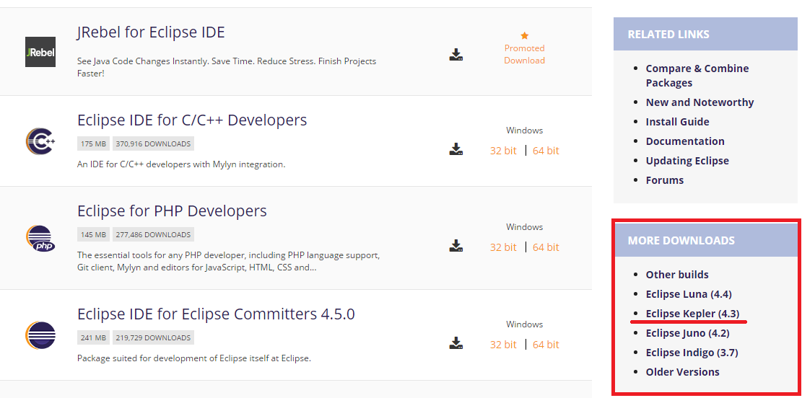

3. 다운로드 화면이 표시되면, “Eclipse IDE for Java EE Developers” 의 우측에 사용하고 있는 운영체제에 적합한 다운로드 링크를 클릭하여 다운로드한다.
	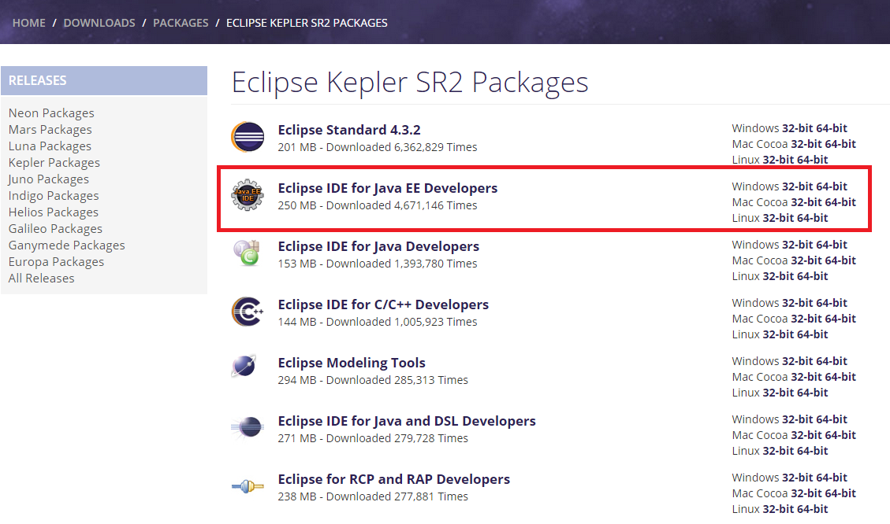

4. 다운로드 받은 파일의 압축을 해제하고 “eclipse.exe” 파일을 실행하여 별도의 설치 없이 이클립스를 사용할 수 있다.

# 3. Open PaaS development environment installation

본 절에서는 전자정부 표준프레임워크과 이클립스 통합개발환경에 Open PaaS
개발환경을 설치하는 절차를 기술한다. Open PaaS 개발환경이 포함되어 있는
전자정부 표준프레임워크 개발환경을 사용하는 경우 별도의 설치 없이
사용가능하며, 이클립스의 경우 “openpaas\_dev\_env.zip” 파일을 이용하여
플러그인으로 제공되는 Open PaaS 개발환경을 설치하여 사용한다.

### 3.1 Open PaaS development environment installation in e-government standard framework

전자정부 표준프레임워크 개발환경에 Open PaaS 개발환경을 설치하는 절차는
다음과 같다.

1. 전자정부 표준프레임워크 개발환경을 실행한 후 “Help” 메뉴의 “Install New Software…” 를 클릭한다.
	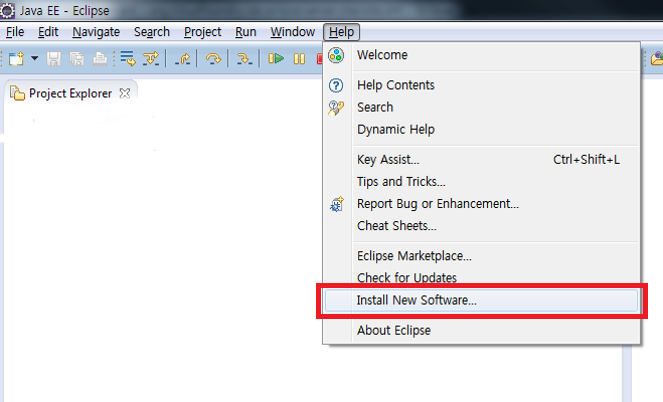

2. 설치를 진행하기 위한 “Available Software” 대화창이 표시된다.  
    Open PaaS 개발환경 파일의 경로를 설정하기 위해, “Add…” 버튼을
    클릭한다.  
    “Cancel” 버튼을 클릭하면 진행되던 과정은 취소되고 화면이 종료된다.
	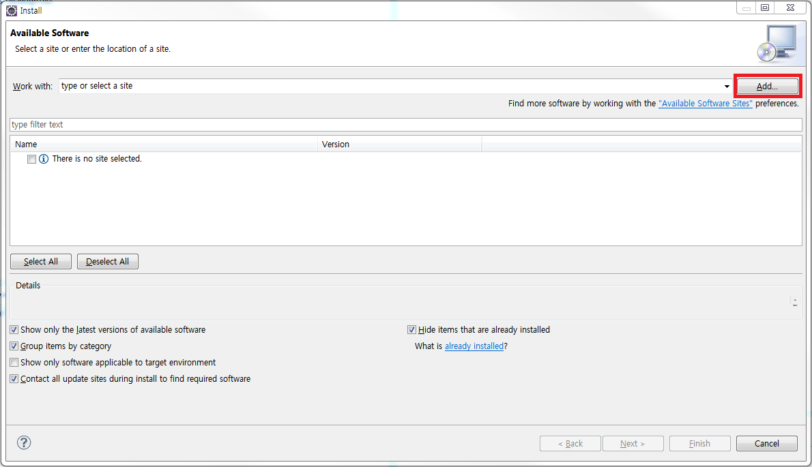

3. “Add Repository” 대화창의 “Name”란에 Open PaaS 개발환경을 입력하고,
    오른쪽의 “Archive” 버튼을 클릭하여 다운로드 받은
    “openpaas\_dev\_env.jar” 파일의 위치를 찾아 선택한 후 확인 버튼을
    누르고, “Add Repository” 대화창의 “OK” 버튼을 클릭한다. “Cancel”
    버튼을 클릭하면 취소된다.
	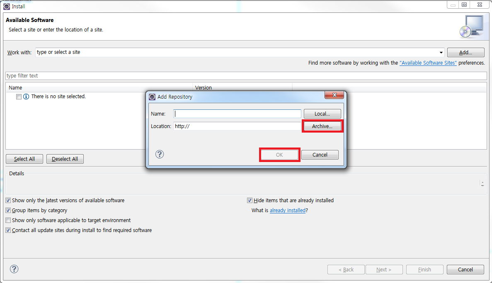

4. 대화창에 “Core / Open PaaS” 카테고리가 표시되며,  
    카테고리 좌측의 체크박스를 클릭하여 선택하고 “Next” 버튼을 클릭하여
    다음 단계로 넘어간다.  
    “Cancel” 버튼을 클릭하면 진행되던 과정은 취소되고 화면이 종료된다.
	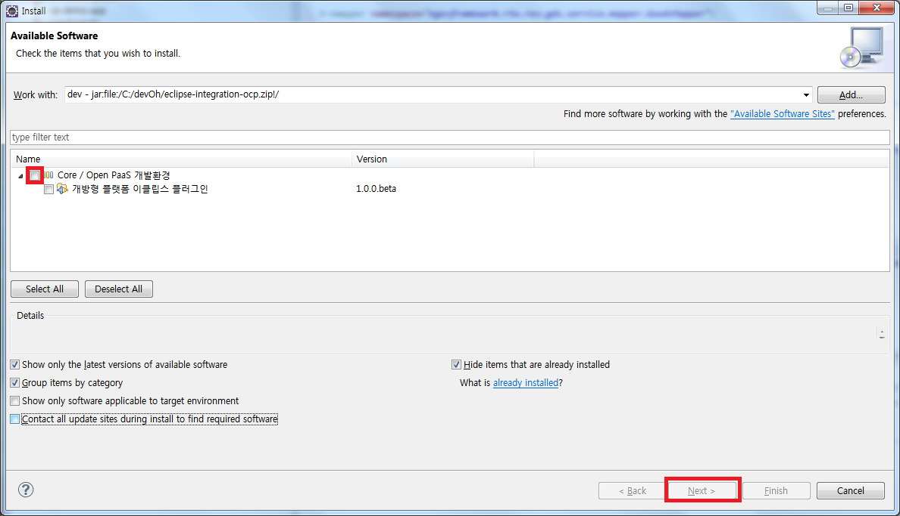

5. “Install Details” 에서 Open PaaS 개발환경에 대한 정보를 확인할 수
    있으며, “Next” 버튼을 클릭한다.  
    “Cancel” 버튼을 클릭하면 진행되던 과정은 취소되고 화면이 종료된다.
	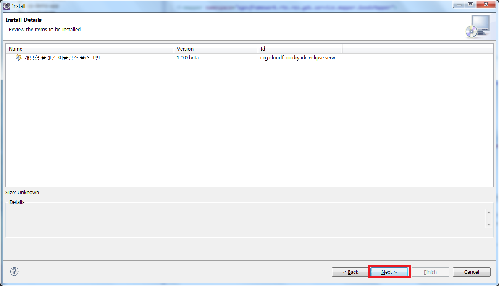

6. 다음에서 Open PaaS 개발환경의 라이선스를 확인 할 수 있으며, 이에
    동의하면 “I accept the terms of the license agreement” 라디오 버튼에
    체크하고 “Finish” 버튼을 클릭한다.  
    “Cancel” 버튼을 클릭하면 진행되던 과정은 취소되고 화면이 종료된다.
	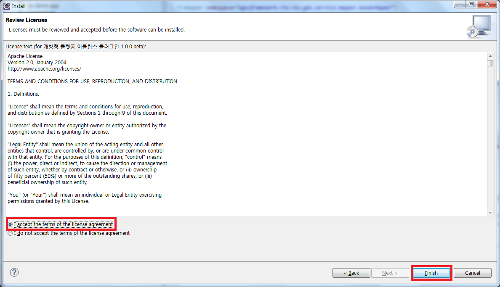

7. “Installing Software” 대화창과 함께 설치가 진행되며, “Security
    Warning” 경고창이 표시되면 무시하고 “OK” 버튼을 클릭하여 설치를
    재개한다.  
    “Cancel” 버튼을 클릭하면 설치 되지 않고 종료된다.
	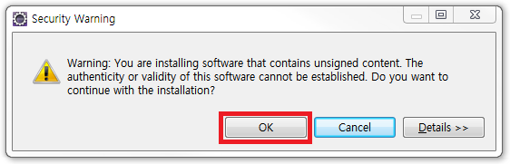

8. 설치가 완료되면 “Software Updates” 대화창이 나타나고, Open PaaS
 개발환경이 정상적으로 적용되기 위해서는 재시작이 필요하므로, “Yes”
 버튼을 클릭하여 전자정부 표준프레임워크를 재시작한다.  
 만약 “No” 버튼을 클릭하면 전자정부 프레임워크는 재시작되지 않고 Open
 PaaS 개발환경을 이용 할 수 없다.
	

9. 재시작을 완료하면 설치가 완료된다.

### 3.2 Install Open PaaS development environment in Eclipse integrated development environment

이클립스 통합개발환경에 Open PaaS 개발환경을 설치하는 절차는 “3.1 전자정부 표준프레임워크에 Open PaaS 개발환경을 설치”와 같으므로 참고한다.

### 3.3 Use of e-government standard framework development environment including Open PaaS development environment.
전자정부 표준프레임워크 개발환경에는 Open PaaS 개발환경이 설치되어 있으므로, 추가적으로 설치할 필요없이 본 가이드의 4.개방형 플랫폼 서버 연결관리부터 진행할 수 있다.

# 4. Open platform server connection management

본 절에서는 개방형 플랫폼 서버를 연결하는 방법에 대해 기술한다.

### 4.1 Add the server

1. 서버를 추가하기 위해 “Servers” 탭에서 “New” – “Server”을 클릭한다.
	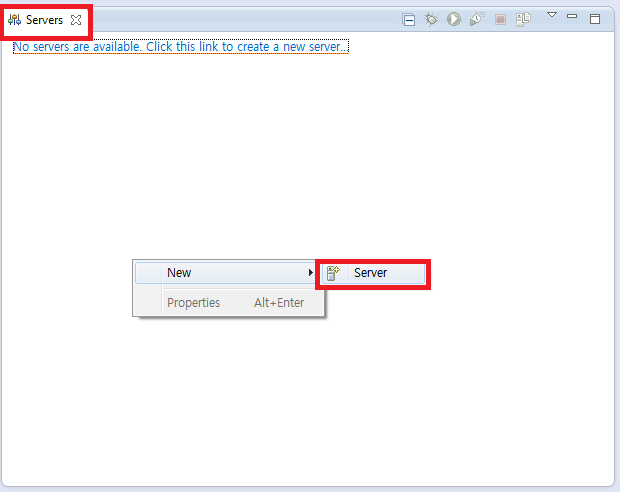

2. “Define a New Server” 대화창이 표시된다. 이 대화창은 서버의 타입을 선택하고 생성하는 화면이다.  
    리스트에서 “Open PaaS” – “개방형 플랫폼”을 선택한 후,”Server
    name”란을 작성한다. (만약 작성하지 않으면 기본 값인 “Open PaaS”이다.)  
    모두 진행되었으면 “Next” 버튼을 클릭하여 다음 페이지로 이동한다.  
    “Cancel” 버튼을 클릭하면 진행되던 과정은 취소되고 화면이 종료된다.
	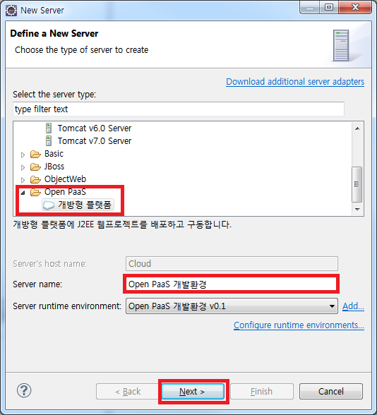

3. “Open PaaS 계정” 대화창이 표시된다. 이 대화창은 조직과 스페이스 접근하기 위해 Open PaaS의 계정으로 로그인을 하기 위한 대화창이다.  
    이메일과 비밀번호란을 작성하고 계정 확인 버튼을 클릭하여 계정의
    유효성을 체크한다.  
    계정이 정상적으로 확인되면 “Next” 버튼이 활성화된다.  
    “Next” 버튼을 눌러서 다음 화면으로 이동한다.  
    “Cancel” 버튼을 클릭하면 진행되던 과정은 취소되고 화면이 종료된다.
    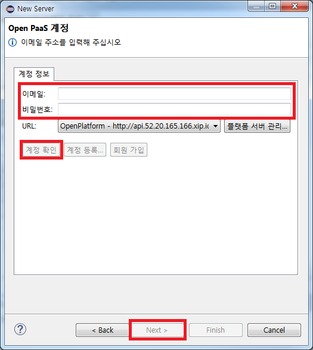

	> *위 “URL”란에 표시되어 있는 URL 주소는 임의의 주소이며, 아래 절차를 따라 실제 Open PaaS가 배포되어 있는 플랫폼 서버 정보를 등록해야 한다.  
	> [***4.2 플랫폼 서버 정보 등록***](#42-플랫폼-서버-정보-등록)을 참고한다.
	

4. “조직 및 스페이스” 목록 대화창이 표시된다. 이 대화창은 해당 계정이 가지고 있는 모든 조직과 스페이스를 보여주며, 관리를 원하는 조직과 스페이스를 선택 할 수 있는 대화창이다.  
    관리를 원하는 조직과 스페이스를 선택하고 “Next” 버튼을 눌러 다음 화면으로 이동한다. (만약 조직 또는 스페이스가 없다면 생성을 해야한다. 현재 이클립스 개발환경에서는 조직 또는 스페이스를 생성할 수 없으므로 CLI 를 설치해서 조직과 스페이스를 생성해야한다. CLI의 설치 및 사용법은 [***OpenPaas CLi 가이드.md***](OpenPaas CLi 가이드.md)을 참고한다.)  
    “Cancel” 버튼을 클릭하면 진행되던 과정은 취소되고 화면이 종료된다.
    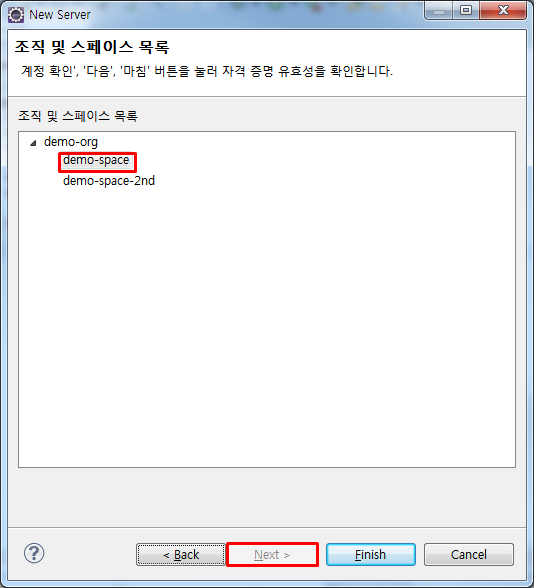

5. “Add and Remove” 대화창이 표시된다.  
    이 대화창은 Open PaaS 환경에 Application을 배포 및 삭제 할 수 있는
    대화창이다.  
    “Available”은 배포 가능한 Application 목록이고, “Configured”는 배포
    되어 있거나 배포 예정인 Application 목록이다.  
    “Available”에서 배포를 원하는 Application을 선택 한 뒤, “Add”
    버튼을 클릭하여 “Configured”로 옮기고, “Finish” 버튼을 누르면
    Application 배포가 완료된다.  
    Application 배포가 완료되면서 관리를 하려는 서버의 추가도 완료가
    된다.  
    “Cancel” 버튼을 클릭하면 진행되던 과정은 취소되고 화면이 종료된다.
    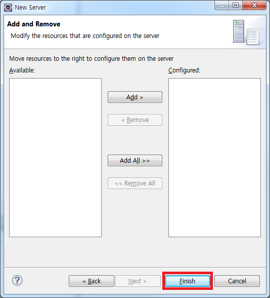

### 4.2 Registering platform server information

1. “플랫폼 서버 관리…” 버튼을 클릭하여, “플랫폼 서버 URL 관리” 대화창을
  실행한다.  
  플랫폼 서버 URL을 추가하기 위해 “추가” 버튼을 클릭한다.  
    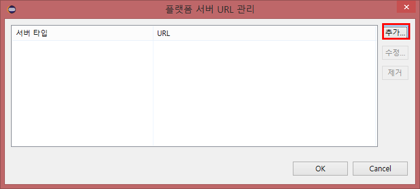

2. 추가 및 플랫폼 URL 유효성 검사 대화창이 표시된다.  
  해당 플랫폼 서버의 이름과 URL을 작성 후, “Finish” 버튼을 클릭한다.  
  “Cancel” 버튼을 클릭하면 플랫폼이 추가 되지 않고 화면이 종료된다.  
	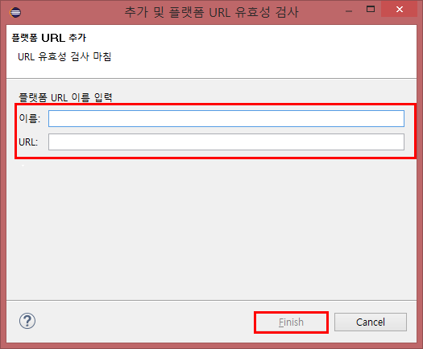

3. 현재 상태에서는 플랫폼 서버 URL 추가 사항이 반영되지 않았으므로
  “플랫폼 서버 URL 관리” 대화창에서 “Finish” 버튼을 눌러 최종 완료를 한다.
  만약 “Cancel” 버튼을 클릭하면 지금까지 진행한 모든 작업들이 취소된다.  
	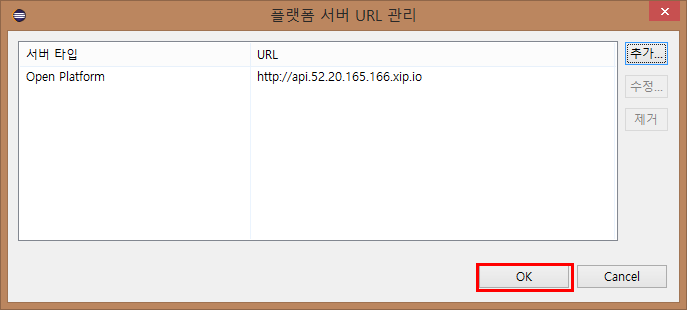


### 4.3 Server replication

개방형 플랫폼 서버 연결 정보에서 목표 스페이스는 수정할 수 없으며,
동일한 개방형 플랫폼 서버에서 다른 목표 스페이스로 변경하기 위해서는 기존
개방형 플랫폼 서버 연결 정보를 복제하여 목표 스페이스를 다시 설정해야 한다.

1. 서버 복제를 위해 “Servers” 탭에서 복제를 원하는 서버를 선택 한 후,
    오른쪽 버튼을 누르고 “서버 복제”를 선택한다.
	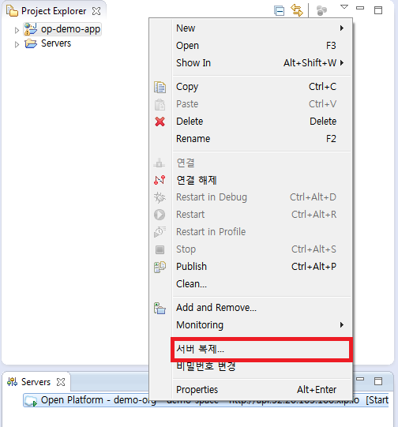

2. “조직 및 스페이스 목록” 대화창이 표시된다. 이 대화창은 복제를 원하는 조직의 스페이스를 선택하는 대화창이다.  
    복제를 원하는 스페이스를 선택 한 뒤, “Finish” 버튼을 클릭한다.  
    “Cancel” 버튼을 클릭하면 조직의 스페이스가 복제되지 않고
    화면이 종료된다.
	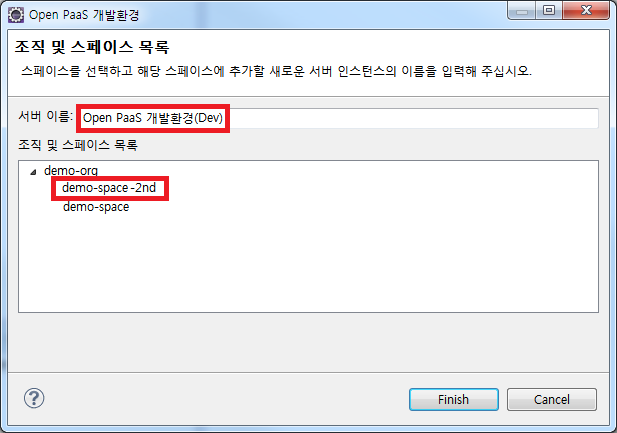

3. 해당 스페이스의 이름으로 서버 복제가 완료 되어 “Servers” 탭의
    리스트에 추가된다.
    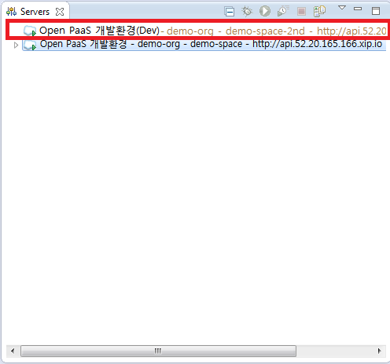

### 4.4 Modify Servers

서버 수정은 관리 서버 이름만 수정 가능하다

1. 관리 서버 이름 수정을 원하는 “Servers” 탭에서 더블 클릭한다.
	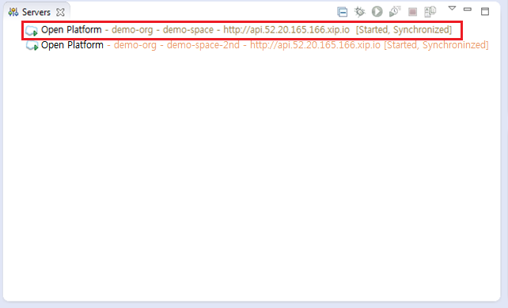

2. “개요” 대화창이 표시된다. 이 대화창은 서버의 정보 조회와 계정 정보, 서버 상태를 관리 할 수
    있는 대화창이다.  
    서버 이름을 클릭하여 수정을 한 뒤, 메뉴의 “File” – “Save”를 누른다.
	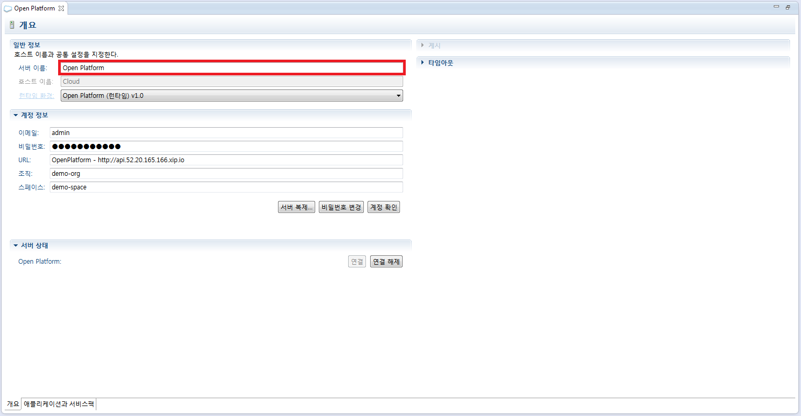

# 5. Manage applications and service packs

본 절에서는 Open PaaS 개발환경에서 Application 및 Service Pack을 관리하는
절차를 기술한다.

### 5.1 Deploy Applications

#####  “Add and Remove”로 추가하기

1. “Servers” 탭에서 Application 배포를 원하는 관리 서버를 선택 한 뒤, 오른쪽 버튼을 클릭하고, “Add and Remove”를 클릭한다.  
	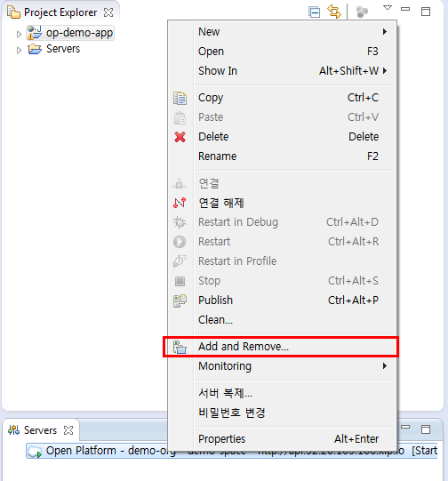

2. “Add and Remove” 대화창이 표시된다. 이 대화창은 Open PaaS 환경에 Application을 배포 및 삭제 할 수 있는 대화창이다.  
    "Available”은 배포 가능한 Application 목록이고, “Configured”는 배포 되어 있거나 배포 예정인 Application 목록이다.  
    “Available”에서 배포를 원하는 Application을 선택 한 뒤, “Add” 버튼을 클릭하여 “Configured”로 옮기고, “Finish”를 누르면 배포가 완료된다.  
    만약 첫 배포라면 배포를 위한 설정을 위해 다음 단계들이 있다.
    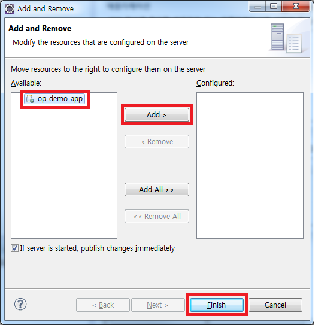

3. (여기서부터는 첫 배포시에만 해당)  
    “Application 상세 정보” 대화창이 표시된다. 이 대화창은 Application의 이름과 빌드팩 URL과 manifest 파일 저장 여부를 설정 해 줄 수 있는 대화창이다.  
    “이름”란에 원하는 이름을 입력한다. (기본 값은 현재 프로젝트명이다.)  
    “빌드팩 URL”은 해당 플랫폼에서 지원하지 않은(?) 다른 빌드팩을 사용 하고 싶을 때, 옵션 사항으로 등록하여 사용 할 수 있다. 만약 따로 사용할 빌드팩이 없다면 빈칸으로 비워두어도 무방하다.  
    manifest 파일 저장 여부를 체크박스로 표시한다.  
    “Next” 버튼을 클릭하여 다음 페이지로 진행한다.  
    “Finish” 버튼을 클릭하면 현재까지의 상태가 반영되어 배포가 된다.  
    "Cancel” 버튼을 클릭하면 배포가 취소된다.
    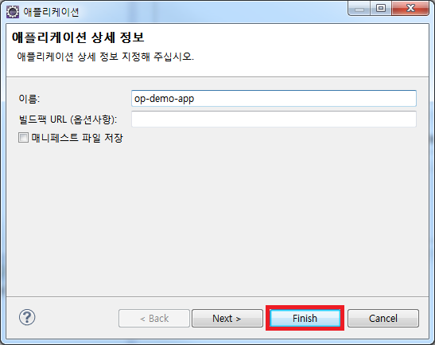

4. “배포 실행” 대화창이 표시된다. 이 대화창은 Application의 도메인과 서브도메인을 지정해주고, “배포된 URL”을 확인하며, 메모리 제한 설정과 배포된 Application의 시작 여부를 설정 할 수 있다.  
    “서브도메인”에 원하는 서브도메인명을 입력한다.(기본 값은 현재 프로젝트명이다.)  
    도메인을 선택한다.  
    “배포된 URL”은 서브도메인과 도메인이 자동으로 결합되어 만들어지니 가만히 두어도 무방하다.  
    메모리 제한란에 메모리 제한값을 입력한다. (기본 값은 512이다.)  
    모두 설정 하였으면 “Next” 버튼을 클릭하여 다음 페이지로 이동한다.  
    “Finish” 버튼을 클릭하면 현재까지의 상태가 반영되어 배포가 된다.  
    “Cancel” 버튼을 클릭하면 배포가 취소된다.
    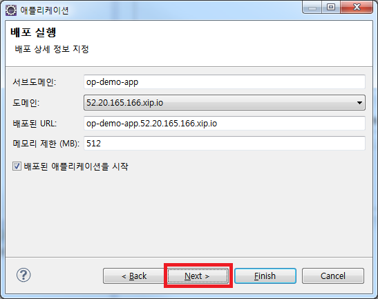

5. “Service Pack 선택” 대화창이 표시된다. 이 대화창은 Application에 Binding 할 Service Pack Instance를 추가 또는 Binding 할 수 있다.  
      해당 Application과 Binding을 원하는 Service Pack Instance를 선택한다.  
      만약 원하는 Service Pack Instance가 없다면, Service Pack 추가라는 아이콘의 버튼을 클릭하여 Service Pack Instance를 생성한다.  
      Service Pack Instance 추가하는 방법은 [***5.6 Service Pack Instance 추가***](#56-Service Pack-Instance-추가)를 참고한다.  
      원하는 Service Pack Instance를 선택한 뒤, “Next” 버튼을 클릭하여 다음 페이지로 진행한다.  
      “Finish” 버튼을 클릭하면 현재까지의 상태가 반영되어 배포가 된다.  
      “Cancel” 버튼을 클릭하면 배포가 취소된다.
    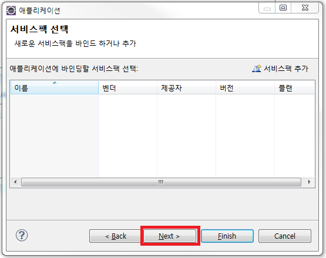

6. “환경 변수” 대화창이 표시된다. 이 대화창은 Application에 환경 변수를 추가, 수정, 및 삭제를 할 수 있는 대화창이다.  
      환경 변수 추가 및 삭제, 수정은 [***5.4 Application Instance 관리***](#54-Application-Instance-관리)를 참고한다.  
      환경 변수를 추가 및 삭제, 수정을 완료 후, “Finish” 버튼을 클릭하여 배포를 완료한다.  
      “Cancel” 버튼을 클릭하면 배포가 취소된다.
    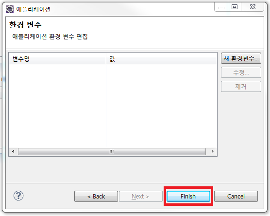

7. 배포가 완료되면 서버 편집기의 “Application과 Service Pack” 탭에서 배포된 Application을 확인 할 수 있다.
    

##### 드래그로 추가

1. Application 배포를 원하는 개방형 플랫폼 서버를 더블 클릭하여 서버 편집기를 실행한다.  
      배포를 원하는 프로젝트를 Application 섹션으로 드래그하면 배포가 완료 된다.  
      만약 처음으로 배포하는 경우 배포를 위한 설정을 위해 다음 단계를 진행해야 한다.
    

2. [***“Add and Remove”***](#51-Application-배포) 과정과 동일하므로 해당 내용의 2번부터 참고한다.

##### Application 추가/삭제 버튼으로 추가하기

1. Application 배포를 원하는 개방형 플랫폼 서버를 더블 클릭하여 서버 편집기를 실행한다.  
      Application을 배포하기 위해 Application 추가/삭제 버튼을 클릭한다.
    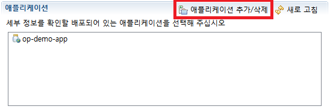

2. [***“Add and Remove”***](#51-Application-배포) 과정과 동일하므로 참고한다.

##### 프로젝트 컨텍스트 메뉴로 추가하기

1. “Package Exlporer” 에서 배포를 원하는 프로젝트를 선택한 뒤, 마우스 오른쪽 버튼을 클릭 후. “Run As” – “Run on Server”를 선택한다.
    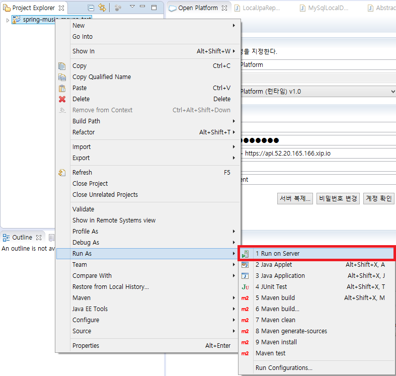

2. "Run On Server” 대화창이 표시된다. 이 대화창은 배포를 원하는 서버를 선택하는 대화창이다.  
      “Servers” 리스트에 있는 “Cloud” – “Open PaaS” 를 선택한다.(만약 리스트 화면에 “Cloud” – “Open PaaS”가 보이지 않는다면 서버를 추가하거나, “How do you want to select the server?” 에서 “Choose an existing server”를 라디오 버튼을 선택한다.)  
      “Next” 버튼을 클릭하여 배포를 진행한다.  
      “Finish” 버튼을 클릭하면 즉시 배포가 된다.
    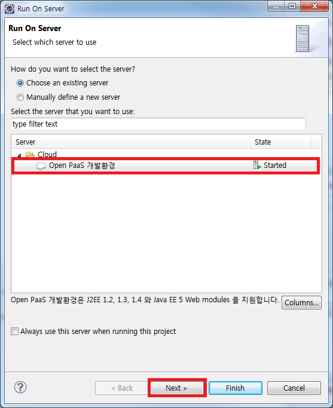

3. [***“Add and Remove”***](#51-Application-배포) 과정과 동일하므로 참고한다.

##### 서버 추가시 추가하기

[***“서버 추가”***](#41-서버-추가) 과정과 동일하므로 해당 내용 참고


### 5.2 Check Application list

Application 목록 조회를 원하는 개방형 플랫폼 서버를 더블 클릭하여 서버 편집기를 실행한다.  
편집기에서 Application이라는 목록을 찾으면 아래에 리스트로 배포되어 있는 Application 목록을 확인 할 수 있다.
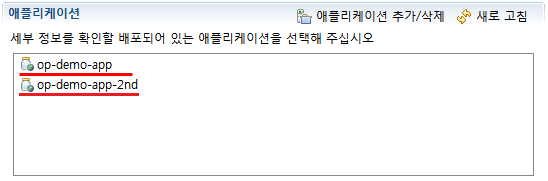

### 5.3 Manage Application route

1. Application 라우트 관리를 원하는 개방형 플랫폼 서버를 더블 클릭하여
    서버 편집기를 실행한다.  
    편집기에서 라우트라는 목록을 찾는다.  
    “제거…” 버튼을 클릭한다.
    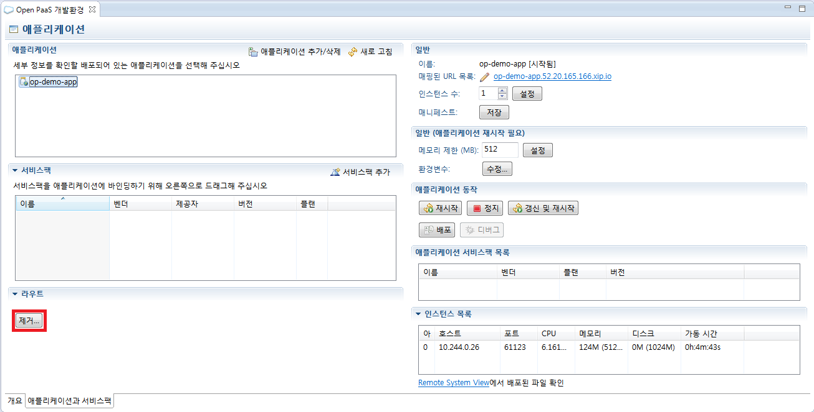

2.  “클라우드 라우트 목록” 대화창이 표시된다. 이 대화창은 클라우드 라우트 목록을 조회 또는 제거 할 수 있는
    대화창이다.  
    제거를 원하는 라우트를 클릭 한 뒤, “제거”를 클릭하고 “Finish” 버튼을
    클릭하면 라우트가 삭제된다.  
    “Cancel” 버튼을 클릭하면 삭제될 라우트들이 복구된다.
    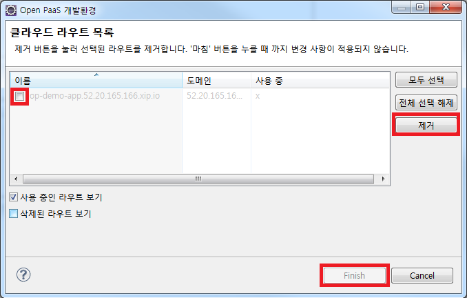

### 5.4 Manage Application instance

Application 라우트 관리를 원하는 개방형 플랫폼 서버를 더블 클릭하여
서버 편집기를 실행한다.  
편집기에서 Application 목록을 찾아 Instance 관리를 원하는
Application을 리스트에서 찾아 클릭한다.
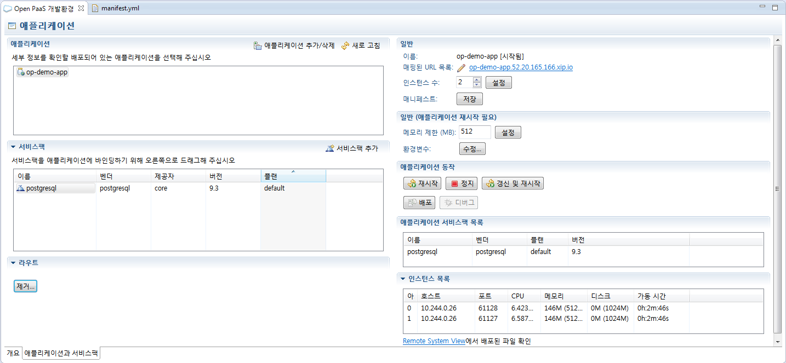

편집기의 오른쪽 화면에 Application Instance에 대한 다양한 정보들이
표시된다.  
표시되는 정보는 아래와 같다.
* 일반 : 이름, 시작 상태, 매핑된 URL, Instance 수, manifest
* 일반(Application 재시작 필요) : 메모리 제한, 환경 변수
* Application 동작 : 재시작, 정지, 갱신 및 재시작, 배포, 디버그
* Application Service Pack 목록 : 이름 ,벤더, 플랜, 버전
* Instance 목록 : 호스트, 포트, CPU, 메모리, 디스크, 가동 시간

##### 매핑된 URL 목록 조회

1. 일반 섹션에서 매핑된 URL 목록 항목을 찾는다.  
      “연필” 모양의 아이콘을 클릭한다.
	

2. “매핑된 URL 설정” 대화창이 표시된다.  
      이 대화창은 ”매핑된 URL”을 관리 할 수 있는 대화창이다.  
      이 대화창의 첫 페이지에서 “매핑된 URL” 목록을 확인 할 수 있다.

##### 매핑된 URL 추가

1. [***“매핑된 URL 목록 조회”***](#매핑된-url-목록-조회) 과정을 진행한다.

2. “매핑할 URL”을 추가하기 위해 오른쪽에 “추가” 버튼을 클릭한다.
    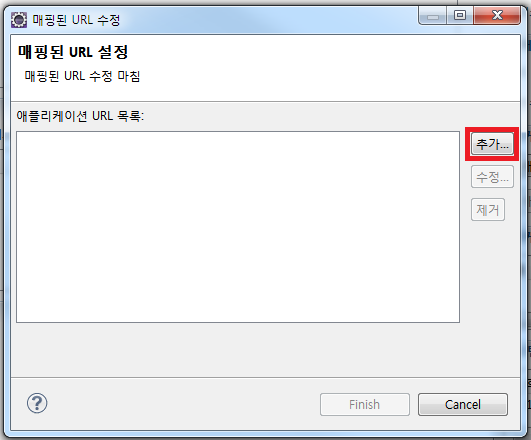

3. “추가 또는 Application URL 수정” 대화창이 표시된다. 이 대화창은 Application을 추가 할 수 있는 대화창이다.  
      원하는 서브도메인을 작성하고, 도메인을 선택하면 “배포된 URL”이 자동으로 작성된다.  
      작성이 완료 되었으면 “Finish” 버튼을 클릭한다.  
      "Cancel” 버튼을 클릭하면 종료된다.  
	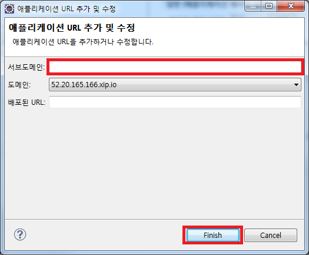

4. 현재 상태에서는 “매핑된 URL” 추가 사항이 플랫폼 서버에 반영되지 않았으므로 “매핑된 URL” 설정 대화창에서 “Finish” 버튼을 눌러야 최종 완료가 된다. 만약 “Cancel” 버튼을 클릭하면 지금까지 진행한 모든 작업들이 취소된다.
    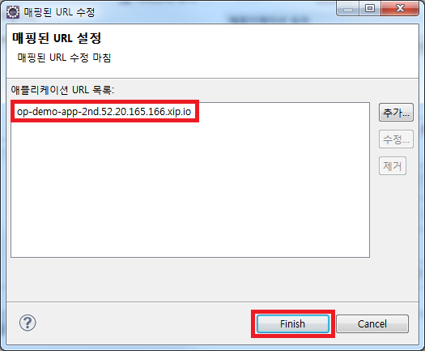
  
##### 매핑된 URL 수정
 
1. [***“매핑된 URL 목록 조회”***](#매핑된-url-목록-조회) 과정을 진행한다.

2. “매핑할 URL”을 수정하기 위해 목록에서 수정을 원하는 “매핑된 URL”을 선택한다. 그리고 오른쪽에 “수정” 버튼을 클릭한다.  
    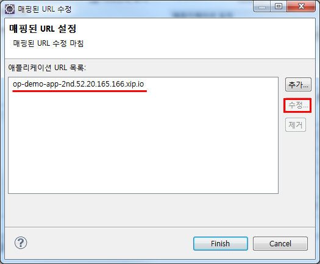

3. “추가 또는 Application URL 수정” 대화창이 표시된다. 이 대화창은 Application을 수정 할 수 있는 대화창이다.  
      원하는 서브도메인을 수정하고, 도메인을 선택하면 “배포된 URL”이 자동으로 작성된다.  
      작성이 완료 되었으면 “Finish” 버튼을 클릭한다.
    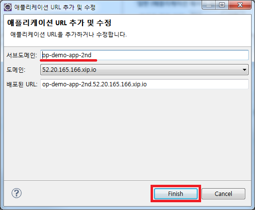

4. 현재 상태에서는 “매핑된 URL” 수정 사항이 플랫폼 서버에 반영되지 않았으므로 “매핑된 URL” 설정 대화창에서 “Finish” 버튼을 눌러야 최종 완료가 된다. 만약 “Cancel” 버튼을 클릭하면 지금까지 진행한 모든 작업들이 취소된다.
    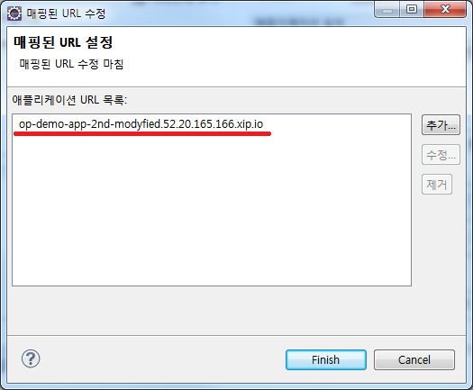

##### 매핑된 URL 제거

1. [***“매핑된 URL 목록 조회”***](#매핑된-url-목록-조회) 과정을 진행한다.

2. 매핑할 URL을 삭제하기 위해 목록에서 수정을 원하는 매핑된 URL을 선택한다. 그리고 오른쪽에 “삭제” 버튼을 클릭한다.  
	그리고 “Finish” 버튼을 눌러야 최종 완료가 된다. 만약 “Cancel” 버튼을 클릭하면 지금까지 진행한 모든 작업들이 취소된다.  
    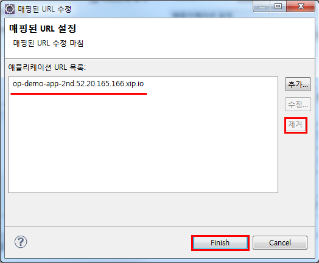

##### Instance 수 변경

일반 섹션에서 Instance 수 항목을 찾는다.  
원하는 Instance 수만큼 변경 후 설정 버튼을 클릭한다.  
Instance 변경이 완료 된다.  
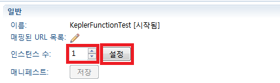

##### 메모리 제한

일반(Application 재시작 필요) 섹션에서 메모리 제한(MB) 항목을 찾는다.  
원하는 메모리 제한만큼 변경 후 설정 버튼을 클릭한다.  
메모리 제한 변경이 완료 된다.  


##### 환경 변수 목록 조회

1. 일반(Application 재시작 필요) 섹션에서 환경변수 항목을 찾아 옆의 “수정” 버튼을 클릭한다.
    

2. “환경변수” 대화창이 표시된다. 이 대화창은 환경 변수를 관리 할 수 있는 대화창이다.  
      이 대화창의 첫 페이지는 환경 변수 목록을 보여준다.
    

##### 환경 변수 추가

1. [***“환경 변수 목록 조회”***](#환경-변수-목록-조회) 과정을 진행한다

2. 환경 변수를 추가하기 위해 오른쪽에 “추가” 버튼을 클릭한다.
    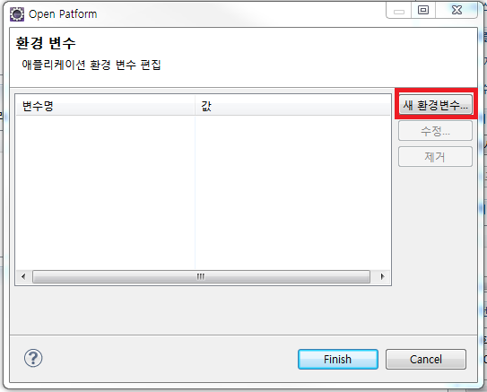

3. “변수 이름과 값을 입력해 주십시오.” 대화창이 표시된다.  
      이 대화창은 환경 변수 추가 할 수 있는 대화창이다.  
      원하는 이름과 값을 작성 후, “OK” 버튼을 클릭한다.  
    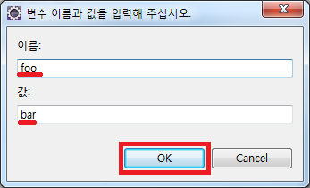

4. 현재 상태에서는 환경 변수가 플랫폼 서버에 반영되지 않았으므로, 환경 변수 대화창에서 “Finish” 버튼을 클릭하면 반영이 완료된다. “Cancel” 버튼을 클릭하면 변경 사항이 적용되지 않는다.
    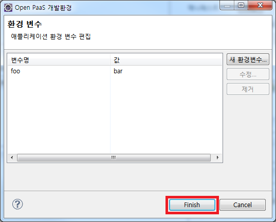

##### 환경 변수 수정

1. [***“환경 변수 목록 조회”***](#환경-변수-목록-조회) 과정을 진행한다.

2. 환경 변수를 추가하기 위해 환경 변수 목록에서 수정을 원하는 환경 변수를 클릭 후 오른쪽 “수정” 버튼을 클릭한다.
	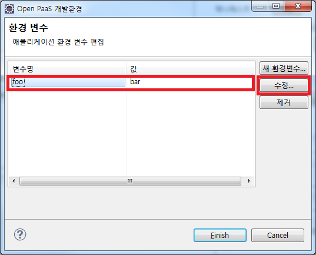

3. 변수 이름과 값을 입력해 주십시오. 대화창이 표시된다. 이 대화창은 환경 변수 수정 할 수 있는 대화창이다.  
      원하는 이름과 값을 수정 후, “OK” 버튼을 클릭한다.  
      “Cancel” 버튼을 클릭하면 변수의 이름과 값이 입력되지 않는다.  
	

4. 현재 상태에서는 환경 변수 수정 사항이 플랫폼 서버에 반영되지 않았으므로, 환경 변수 대화창에서 “Finish” 버튼을 클릭하면 반영이 완료된다. “Cancel” 버튼을 클릭하면 변경 사항이 적용되지 않는다.
	

##### 환경 변수 삭제

1. [***“환경 변수 목록 조회”***](#환경-변수-목록-조회) 과정을 진행한다

2. 환경 변수를 추가하기 위해 환경 변수 목록에서 삭제를 원하는 환경 변수를 클릭한다.  
      오른쪽에 “삭제” 버튼을 클릭한다.  
       현재 상태에서는 환경 변수 삭제 작업이 플랫폼 서버에 반영되지 않았으므로, 환경 변수 대화창에서 “Finish” 버튼을 클릭하면 반영이 완료된다. “Cancel” 버튼을 클릭하면 변경 사항이 적용되지 않는다.
	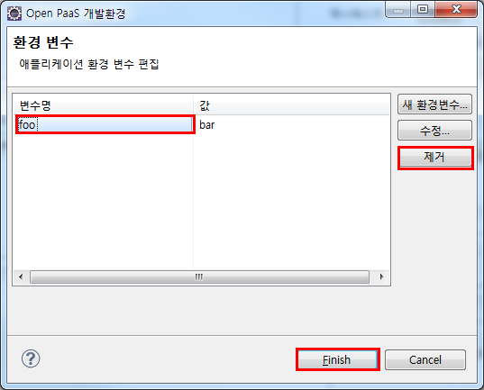

##### Application 재시작

[***Application Instance 관리***](#54-Application-Instance-관리) 화면에서 Application 동작 섹션을 찾는다.  
      “재시작” 버튼을 클릭하면 재시작 작업을 수행한다.  


##### Application 정지

[***Application Instance 관리***](#54-Application-Instance-관리) 화면에서 Application 동작 섹션을 찾는다.  
      “정지” 버튼을 클릭하면 정지 작업을 수행한다.  


##### Application 갱신 및 재시작

[***Application Instance 관리***](#54-Application-Instance-관리) 화면에서 Application 동작 섹션을 찾는다.  
      “갱신 및 재시작” 버튼을 클릭하면 갱신 및 재시작 작업을 수행한다.


##### Application 배포

[***Application Instance 관리***](#54-Application-Instance-관리)에서 Application 동작 섹션을 찾는다.  
      “배포” 버튼을 클릭하면 배포작업을 수행한다.  


### 5.5 Delete-Application

1. Application 삭제를 원하는 개방형 플랫폼 서버를 더블 클릭하여 서버
    편집기를 실행한다.  
    편집기에서 Application 목록을 찾아 삭제를 원하는 Application을
    리스트에서 찾아 선택하고, 마우스 오른쪽 버튼을 클릭한 뒤, “제거”
    버튼을 클릭한다.
	

2. 만약 Service Pack Instance와 Binding이 되어 있다면 “Service Pack 삭제”
    대화창이 표시된다. Service Pack Instance와 Binding 되어 있지 않다면 다음
    단계로 넘어간다.  
    이 대화창은 Binding 되어 있는 Service Pack Instance를 삭제 하는
    화면이다.  
    삭제하고자 하는 Application과 Binding 되어 있는 Service Pack Instance가
    더 이상 사용 되지 않는다면 체크하여 Service Pack Instance를 삭제하고,
    Service Pack Instance가 다른 Application에 Binding 되어 있다면 Service Pack
    Instance를 삭제하면 안되므로 체크를 하지 않는다.  
    그리고 “Finish” 버튼을 클릭한다.  
    만약 “Cancel” 버튼을 클릭하면 Service Pack Instance는 삭제되지 않고
    Application만 삭제된다.
	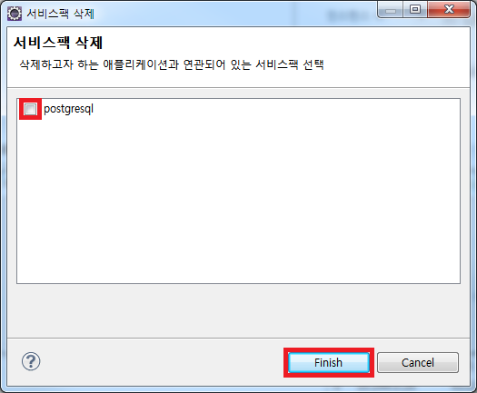

3. Application 삭제 확인을 위한 대화상자에서 “OK” 버튼 또는 ”Cancel”
    버튼을 클릭하여 Application 삭제를 완료하거나 취소한다.  
	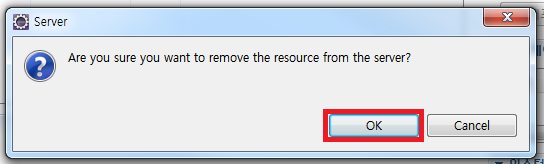

### 5.6 Add Service Pack Instance

1. 서버 편집기의 “Application과 Service Pack” 탭을 클릭한다.  
    Service Pack 섹션 타이틀 오른쪽의 “Service Pack 추가” 아이콘을 클릭한다.
	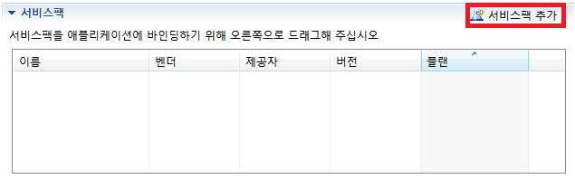

2. “Service Pack 설정” 대화창이 나타난다. 이 대화창에서 Service Pack을 조회 하고, Service Pack Instance를 추가 할 수
    있다.  
    이용 가능한 Service Pack 목록에서 Instance를 생성할 Service Pack을
    선택한다.  
    원하는 Service Pack을 선택하고, 더블 클릭을 하거나 아래에 “추가&gt;&gt;”
    버튼을 클릭한다.  
    그럼 오른쪽에 생성할 Service Pack이 추가된 것을 확인 할 수 있다.  
    그리고 생성할 Service Pack의 Instance 이름과 플랜을 설정해준다.  
    플랜은 똑같은 Service Pack을 지원Range나 리소스를 레벨에 따라 다르게
    제공하기 위한 방법을 말한다.  
    이와 같은 과정을 반복하여 여러 개의 Service Pack Instance를 추가 할 수
    있다.  
    그리고 모든 과정이 완료 되면 “Finish” 버튼을 클릭하여 Service Pack
    Instance 추가를 완료한다.  
    “Cancel” 버튼을 클릭하면 Service Pack Instance 추가가 취소된다.
	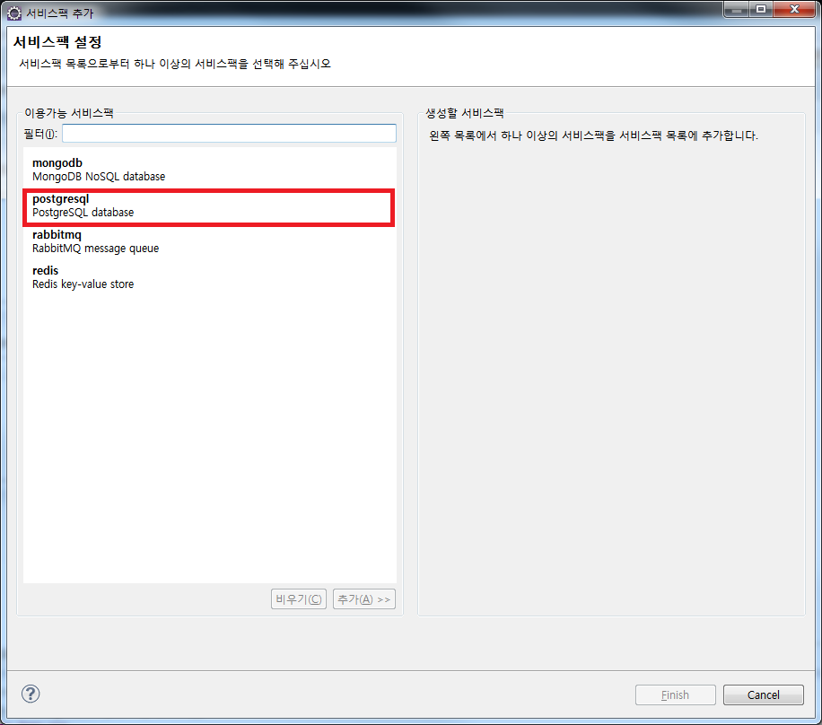
	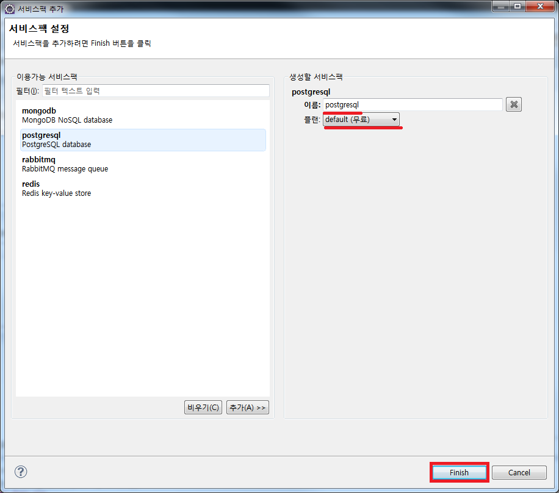

### 5.7 Service Pack Instance Binding

1. 서버 편집기의 Application과 Service Pack 탭을 클릭한다.  
    Service Pack 목록에서 Binding을 원하는 Service Pack Instance를 선택한 뒤,
    마우스 오른쪽 버튼을 클릭하고, “Service Pack Binding 관리…” 메뉴를
    누른다.  
    만약 원하는 Service Pack Instance가 없는 경우 Service Pack Instance 추가
    과정과 동일하게 진행하여 원하는 Service Pack을 추가한다.  
	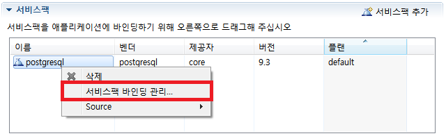

2. “Service Pack Binding 관리” 대화창이 표시된다.  
    이 대화창에서 Service Pack Instance와 Binding 또는 Binding 해제할
    Application을 선택할 수 있다.  
    리스트에서 Binding 할 Application을 체크 한 후, “Finish” 버튼을
    클릭하면 Binding이 완료 된다.
	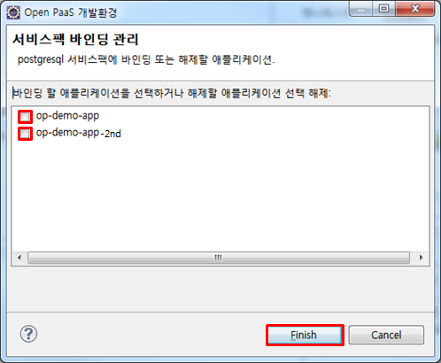

### 5.8 Release the Service Pack Instance Binding

1. 서버 편집기의 Application과 Service Pack 탭을 클릭한다.  
    Application Service Pack 목록에서 Binding을 해제할 Service Pack Instance를
    선택한 뒤, 마우스 우클릭, “Service Pack Binding 관리…” 버튼을 누른다.  
	

2. “Service Pack Binding 관리” 대화창이 표시된다. 이 대화창은 Service Pack Instance에 Binding 또는 Binding 해제할 Application을 선택하는 대화창이다.  
리스트에서 Binding을 해제할 Application을 체크해제 한 후, “Finish” 버튼을 클릭하면 Binding 해제가 완료 된다.
	

### 5.9 Delete Service Pack Instance

1. 서버 편집기의 Application과 Service Pack 탭을 클릭한다.  
    Service Pack 목록에서 삭제할 Service Pack Instance를 선택한 뒤, 마우스
    우클릭후, “삭제” 메뉴를 클릭한다.
	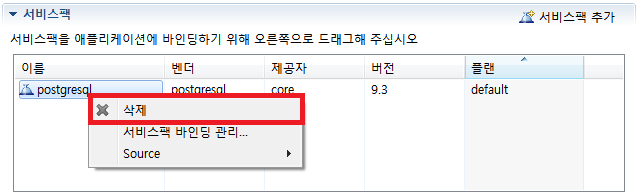

2. “Service Pack 삭제” 대화창이 표시된다..  
    “OK” 버튼을 클릭하면 Service Pack Instance 삭제가 완료된다.  
    “Cancel” 버튼을 클릭하면 Service Pack Instance 삭제가 취소된다.
	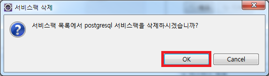

# 6. Setting by the manifest

### 6.1 Add manifest

1. 프로젝트의 루트에 manifest 파일(manifest.yml)을 추가한다.  
	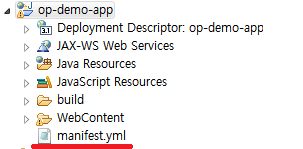
	\* manifest.yml 파일 예시 :  
	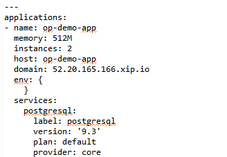
  
2. Application을 배포한다.  
    배포방법은 [***“Application 배포”***](#51-Application-배포) 과정을 참고한다.  

3. Application 배포 위자드 실행시 설정값들이 manifest의 값과 동일한
    것을 확인할 수 있다.
	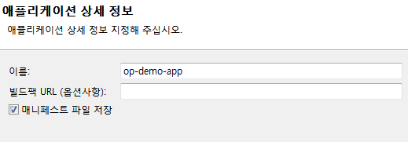

4. manifest 파일(manifest.yml)에 설정한 내용이 반영된 것을 확인할 수 있다.
	
	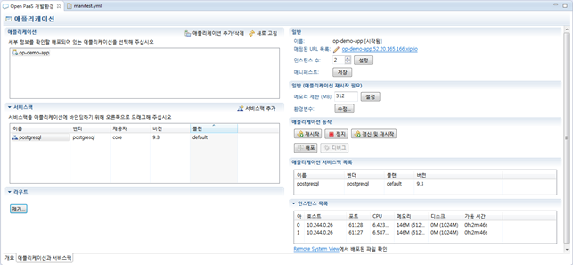

### 6.2 Save manifest

배포한 Application의 배포 설정을 manifest 파일(manifest.yml)로 저장할
수 있다.

1. Application과 Service Pack 탭에서 Application의 상세 화면 조회를 한다.
	

2. 일반 섹션에서 manifest 항목의 우측 “저장” 버튼을 클릭한다  
	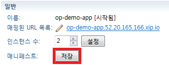

3. 프로젝트에 manifest 파일(manifest.yml)이 생성 되었음을 확인한다.  
    이미 manifest 파일(manifest.yml)이 있다면 내용이 변경되었는지 확인한다.
	

# 7. Plugin settings (Set REST API log tracking)

1. 플러그인의 설정을 위해 이클립스의 메뉴에서 “Window” – “Preferences”
    를 클릭한다.
	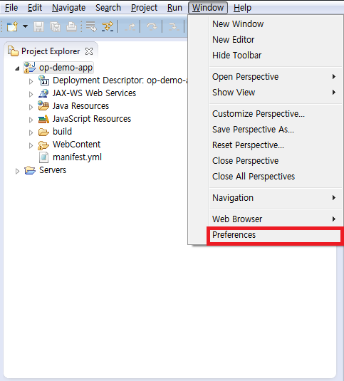

2. “Preferences” 대화창에서 이클립스의 환경 설정을 할 수 있다  
    “Preferences” 대화창의 왼쪽 목록에서 개방형 플랫폼를 찾아서
    클릭하고  
    아래의 “HTTP 로그 추적” 항목을 체크하면 “HTTP 로그 추적” 여부를 설정
    할 수 있다.  
    콘솔창에 “HTTP 로그”를 찍고 싶다면 “HTTP 로그 추적”을 체크하고,
    그렇지 않다면 체크하지 않는다.  
     “OK” 버튼을 클릭하여 설정을 완료한다.
	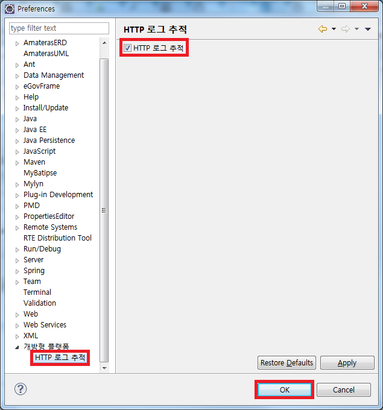


# 8. Example project description

해당 예제는 표준프레임워크 3.1 통합예제를 기준으로 작성하였다.  
서비스와 Application이 Binding된 상태에서 서비스에 어떻게 접근하는지
예제를 통해 설명한다.

### 8.1 Add dependency

클라우드 플랫폼에서 서비스에 쉽게 접속할 수 있도록 해주는 Spring Cloud
Connectors를 사용하기 위해 해당 의존성을 추가한다.
```xml
<!-- Spring Cloud Connector Start -->
<dependency>
	<groupId>org.springframework.cloud</groupId>
	<artifactId>spring-cloud-spring-service-connector</artifactId>
	<version>1.2.0.RELEASE</version>
</dependency>
<dependency>
	<groupId>org.springframework.cloud</groupId>
	<artifactId>spring-cloud-cloudfoundry-connector</artifactId>
	<version>1.2.0.RELEASE</version>
</dependency>
<!-- Spring Cloud Connector End -->
```

### 8.2 Add cloud namespace

src/main/resources/egovframework/spring/context-datasource.xml 파일을
열어 cloud 네임스페이스를 추가한다.
```xml
<?xml version="1.0" encoding="UTF-8"?>
<beans xmlns="http://www.springframework.org/schema/beans" 	xmlns:xsi="http://www.w3.org/2001/XMLSchema-instance"
	xmlns:cloud="http://www.springframework.org/schema/cloud"
	xsi:schemaLocation="http://www.springframework.org/schema/beans http://www.springframework.org/schema/beans/spring-beans-3.2.xsd
		http://www.springframework.org/schema/cloud http://www.springframework.org/schema/cloud/spring-cloud.xsd">
```
  
### 8.3 Change dataSource settings

기존의 dataSource 설정을 지우고 새로운 설정을 입력한다.

```xml
<cloud:data-source id="dataSource" service-name="serviceInstanceName">
	<cloud:connection properties="sessionVariables=sql_mode='ANSI';characterEncoding=UTF-8" />
	<cloud:pool pool-size="20" max-wait-time="200" />
</cloud:data-source>
```

### 8.4 Set dataSource initialization

Application 구동시 미리 작성한 SQL 스크립트를 실행하여 DB를 자동으로
초기화 하도록 설정한다.

1. 스크립트 파일 이동  
   스크립트 파일에 접근하기 위해 script 폴더를 src/main/resources/egovframework로 이동시킨다.

2. 스크립트 파일 수정
script\_mysql.sql 파일을 수정한다.  
기존 sql은 실행이 되지 않으므로 일부 수정한다. db생성 구문을 없애고 Drop Table 구문에 IF EXISTS를 추가한다.
	
```
sql

--CREATE DATABASE EASYCOMPANY;

DROP TABLE IF EXISTS `IDS`;
DROP TABLE IF EXISTS `RTETNAUTH`;
DROP TABLE IF EXISTS `RTETNBBS`;
DROP TABLE IF EXISTS `RTETNCART`;
DROP TABLE IF EXISTS `RTETNPURCHSLIST`;
DROP TABLE IF EXISTS `RTETNDLVYINFO`;
DROP TABLE IF EXISTS `RTETNGOODS`;
DROP TABLE IF EXISTS `RTETNCTGRY`;
DROP TABLE IF EXISTS `RTETNGOODSIMAGE`;
DROP TABLE IF EXISTS `RTETNMBER`;
DROP TABLE IF EXISTS `RTETCCODE`;
```

3. jdbc 네임스페이스 추가
src/main/resources/egovframework/spring/context-datasource.xml 파일을 열어 jdbc 네임스페이스를 추가한다.

```
xml

<?xml version="1.0" encoding="UTF-8"?>
<beans xmlns="http://www.springframework.org/schema/beans"
	xmlns:xsi="http://www.w3.org/2001/XMLSchema-instance" 
	xmlns:cloud="http://www.springframework.org/schema/cloud"
	xmlns:jdbc="http://www.springframework.org/schema/jdbc"
	xsi:schemaLocation="http://www.springframework.org/schema/beans http://www.springframework.org/schema/beans/spring-beans-3.2.xsd
		http://www.springframework.org/schema/cloud http://www.springframework.org/schema/cloud/spring-cloud.xsd
		http://www.springframework.org/schema/jdbc http://www.springframework.org/schema/jdbc/spring-jdbc-3.2.xsd">
```

4. 데이터베이스 초기화 스크립트 등록

```
xml

	<jdbc:initialize-database data-source="dataSource">
    	<jdbc:script location="classpath:egovframework/script/script_mysql.sql" />
    	<jdbc:script location="classpath:egovframework/script/data_mysql.sql" />
	</jdbc:initialize-database>
```
 

### 8.5 Notes when Deploying

Application을 배포한다. 배포 방법은 [***Application 배포***](#51-Application-배포)를
참고한다.

1.  예제 프로젝트는 메모리를 많이 차지하기 때문에 배포시 메모리 설정은
    1024mb 이상으로 설정한다.
2.  본 예제는 MySql 기반으로 작성하였다. MySql 서비스 Instance를
    생성하여 Binding을 한다.
3.  cloud:data-source 의 service-name 설정과 Binding시킬 서비스 Instance
    이름을 일치시켜야 한다.
