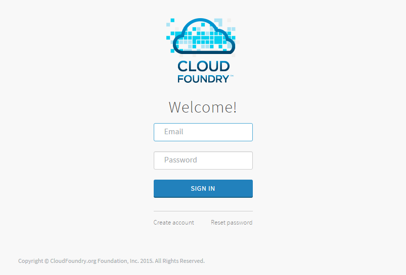

# Table Of Contents

1. [문서 개요](#1-문서-개요)  
    1.1. [목적](#11-목적)  
    1.2. [범위](#12-범위)  
    1.3. [참고자료](#13-참고자료)  
2. [관리자 대시보드 설치](#2-관리자-대시보드-설치)  
    2.1. [관리자 대시보드 설치.](#21-관리자-대시보드-설치)  
3. [관리자 대시보드 인증](#3-관리자-대시보드-인증)  
    3.1. [관리자 대시보드 로그인](#31-관리자-대시보드-로그인)  
    3.2. [관리자 대시보드 로그아웃](#32-관리자-대시보드-로그아웃)  
4. [관리자 대시보드 사용자 관리](#4-관리자-대시보드-사용자-관리)  
    4.1. [사용자 조회](#41-사용자-조회)  
5. [관리자 대시보드 조직 관리](#5-관리자-대시보드-조직-관리)  
    5.1. [조직 조회](#51-조직-조회)  
    5.2. [조직 추가](#52-조직-추가)  
    5.3. [조직 쿼타 설정](#53-조직-쿼타-설정)  
    5.4. [조직 상태 변경](#54-조직-상태-변경)  
    5.5. [조직 삭제](#55-조직-삭제)  
6. [관리자 대시보드 스페이스 관리](#6-관리자-대시보드-스페이스-관리)  
    6.1. [스페이스 조회](#61-스페이스-조회)  
    6.2. [스페이스 삭제](#62-스페이스-삭제)  
7. [관리자 대시보드 애플리케이션 관리](#7-관리자-대시보드-애플리케이션-관리)  
    7.1. [애플리케이션 조회](#71-애플리케이션-조회)  
    7.2. [애플리케이션 시작](#72-애플리케이션-시작)  
    7.3. [애플리케이션 정지](#73-애플리케이션-정지)  
    7.4. [애플리케이션 재시작](#74-애플리케이션-재시작)  
    7.5. [애플리케이션 삭제](#72-애플리케이션-삭제)  
8. [관리자 대시보드 사용량 통계](#8-관리자-대시보드-사용량-통계)  
    8.1. [사용량 추이 조회](#81-사용량-추이-조회)  
    8.2. [사용량 통계 조회](#82-사용량-통계-조회)  

# 1. 문서 개요

### 1.1. 목적
본 문서는 ruby로 작성된 관리자 대시보드 웹 어플리케이션을 사용하여
개방형 플랫폼에 연결하고 관리하는 방법에 대해 설명한다.

### 1.2. 범위
이미 설치된 관리자 대시보드를 이용하여 개방형 플랫폼을 관리하는 방법에
대해 기술하였다.

### 1.3. 참고자료
[***https://github.com/OpenPaaSRnD/admin-dashboard***](https://github.com/OpenPaaSRnD/admin-dashboard)
[***https://github.com/cloudfoundry-incubator/admin-ui***](https://github.com/cloudfoundry-incubator/admin-ui)

# 2. 관리자 대시보드 설치

### 2.1. 관리자 대시보드 설치.
본 사용 가이드는 설치에 대한 내용은 기술하지 않았다.  
관리자 대시보드의 설치는 관리자\_대시보드\_설치가이드\_v.1.0.docx 문서를
참고한다..

# 3. 관리자 대시보드 인증
관리자 대시보드에 접속하기 위한 인증 절차를 설명한다.

### 3.1. 관리자 대시보드 로그인
1. 관리자 대시보드에 접속하면 인증을 위한 로그인 화면이 나타난다.  

2. 아이디와 비밀번호를 입력후 SIGN IN 버튼을 클릭한다.  

### 3.2. 관리자 대시보드 로그아웃
1. 로그인 상태에서 메인화면 우측 상단의 로그아웃 버튼을 클릭한다.  

2. 로그아웃 팝업이 나타나면 로그아웃 버튼을 클릭하여
    로그아웃을 수행한다.

# 4. 관리자 대시보드 사용자 관리
개방형 플랫폼에 등록된 사용자를 관리하는 기능을 설명한다.

### 4.1. 사용자 조회
1. 사용자 관리 메뉴에 진입하면 개방형 플랫폼에 등록된 사용자의 목록을
    확인할 수 있다.  

2. 사용자를 클릭하면 하단 상세 정보 패널에서 상세 정보를 확인 할
    수 있다.  

# 5. 관리자 대시보드 조직 관리
개방형 플랫폼에 등록된 조직을 관리하는 기능을 설명한다.

### 5.1. 조직 조회
1. 조직 관리 메뉴에 진입하면 개방형 플랫폼에 등록된 조직의 목록을
    확인할 수 있다.  

2. 조직을 클릭하면 하단 상세 정보 패널에서 상세 정보를 확인할 수 있다.  

### 5.2. 조직 추가
1. 조직 관리 메뉴에서 추가 버튼을 클릭하면 조직 추가 팝업이 나타난다.  

2. 조직 이름을 입력하고 추가 버튼을 클릭한다.  

3. 조직 추가 완료 팝업이 나타나며 일정 시간 후 조직이 추가된다.  

### 5.3. 조직 쿼타 설정
1. 조직 목록에서 조직을 선택 후 쿼타 설정 버튼을 클릭하면 쿼타 설정
    팝업이 나타난다.  

2. 쿼타를 선택후 설정 버튼을 클릭한다.  

3. 쿼타 설정 완료 팝업이 나타나며 일정시간 후 쿼타가 변경된다.  

### 5.4. 조직 상태 변경
1. 조직목록에서 조직 선택후 활성화/비활성화 버튼을 통해 상태를 변경할
    수 있다.  

2. 버튼 클릭시 팝업 창이 나타나며 활성화/비활성화 버튼을 누르면 조직의
    상태가 변경된다.  

3. 버튼 클릭 후 일정시간이 지나면 상태가 변경된다.  

### 5.5. 조직 삭제
1. 조직 목록에서 조직 선택 후 삭제 버튼을 클릭하여 조직을 삭제할
    수 있다.  

2. 버튼을 클릭하면 조직 삭제 확인 팝업이 나타나며 팝업의 삭제 버튼을
    클릭하여 조직을 삭제할 수 있다.  

# 6. 관리자 대시보드 스페이스 관리
개방형 플랫폼에 등록된 스페이스를 관리하는 기능을 설명한다.

### 6.1. 스페이스 조회
1. 스페이스 관리 메뉴에 진입하면 개방형 플랫폼에 등록된 스페이스의
    목록을 확인할 수 있다.  

2. 스페이스를 클릭하면 하단 상세 정보 패널에서 상세 정보를 확인할
    수 있다.  

### 6.2. 스페이스 삭제
1. 목록에서 스페이스를 선택 후 삭제 버튼을 눌러 스페이스를 삭제할
    수 있다.  

2. 삭제 버튼을 클릭하면 스페이스 삭제 확인 팝업이 나타난다. 팝업의 삭제
    버튼을 클릭하면 스페이스를 삭제할 수 있다.  

# 7. 관리자 대시보드 애플리케이션 관리
개방형 플랫폼에 배포된 애플리케이션을 관리하는 기능을 설명한다.

### 7.1. 애플리케이션 조회
1. 애플리케이션 관리 메뉴에 진입하면 개방형 플랫폼에 배포된
    애플리케이션의 목록을 확인할 수 있다.  

2. 애플리케이션을 클릭하면 하단 상세 정보 패널에서 상세 정보를 확인할
    수 있다.  

### 7.2. 애플리케이션 시작
1. 목록에서 정지된 애플리케이션을 선택 후 시작 버튼을 클릭해
    애플리케이션을 시작시킬 수 있다.  

2. 애플리케이션 시작 확인 팝업이 나타나면 팝업의 시작 버튼을 눌러
    애플리케이션을 시작시킬 수 있다.  

3. 시작 작업이 완료되면 애플리케이션 시작 팝업이 나타난다. 일정시간이
    지난 후 애플리케이션이 시작된 것을 확인할 수 있다.  

### 7.3. 애플리케이션 정지
1. 목록에서 애플리케이션을 선택 후 정지 버튼을 눌러 애플리케이션을
    정지시킬 수 있다.  

2. 버튼을 누르면 애플리케이션 정지 확인 팝업이 나타나며 팝업의 정지
    버튼을 클릭하여 애플리케이션을 정지시킬 수 있다.  

3. 정지 작업이 완료되면 애플리케이션 정지 팝업이 나타난다. 일정시간이
    지난 후 애플리케이션이 정지된 것을 확인할 수 있다.  

### 7.4. 애플리케이션 재시작
1. 목록에서 애플리케이션을 선택 후 재시작 버튼을 눌러 애플리케이션을
    재시작시킬 수 있다.  

2. 버튼을 누르면 애플리케이션 재시작 확인 팝업이 나타나며 팝업의 재시작
    버튼을 클릭하여 애플리케이션을 재시작시킬 수 있다.  

3. 재시작 작업이 완료되면 애플리케이션 재시작 팝업이 나타난다.
    일정시간이 지난 후 애플리케이션이 재시작된 것을 확인할 수 있다.  

### 7.5. 애플리케이션 삭제
1. 목록에서 애플리케이션 선택 후 삭제 버튼을 클릭해 애플리케이션을 삭제할 수 있다.  

2. 버튼을 누르면 애플리케이션 삭제 확인 팝업이 나타나며 팝업의 삭제 버튼을 클릭하여 애플리케이션을 삭제할 수 있다.  

3. 삭제 작업이 완료되면 애플리케이션 삭제 완료 팝업이 나타난다. 목록을 다시 조회해보면 애플리케이션이 삭제된 것을 확인할 수 있다.  

# 8. 관리자 대시보드 사용량 통계
개방형 플랫폼에 등록된 사용자, 조직, 스페이스, 애플리케이션 등의
통계정보를 그래프와 표 형태로 보여준다.

### 8.1. 사용량 추이 조회
1. 사용량 통계 메뉴에 진입하면 사용량 추이 항목에서 통계정보를 그래프로
    확인할 수 있다.  

### 8.2. 사용량 통계 조회
1. 사용자 통계 메뉴에 진입하면 사용자 통계 항목에서 통계정보를 표
    형태로 확인할 수 있다.  

