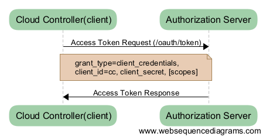
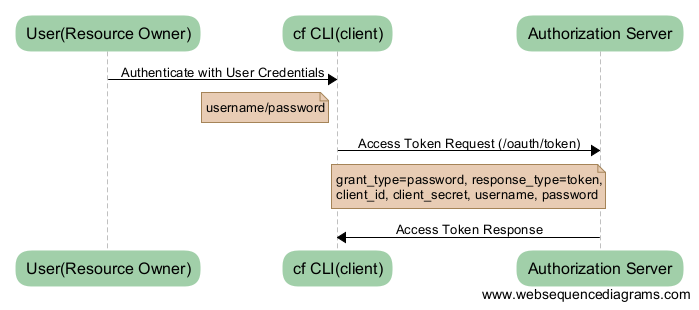
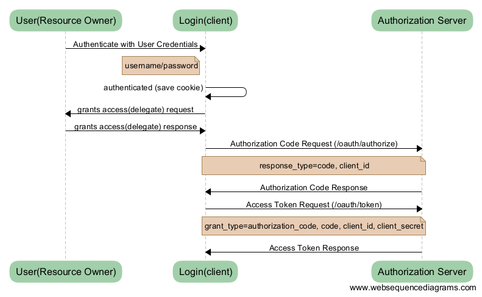
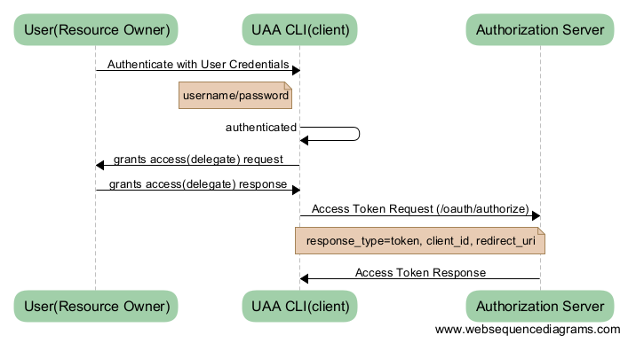
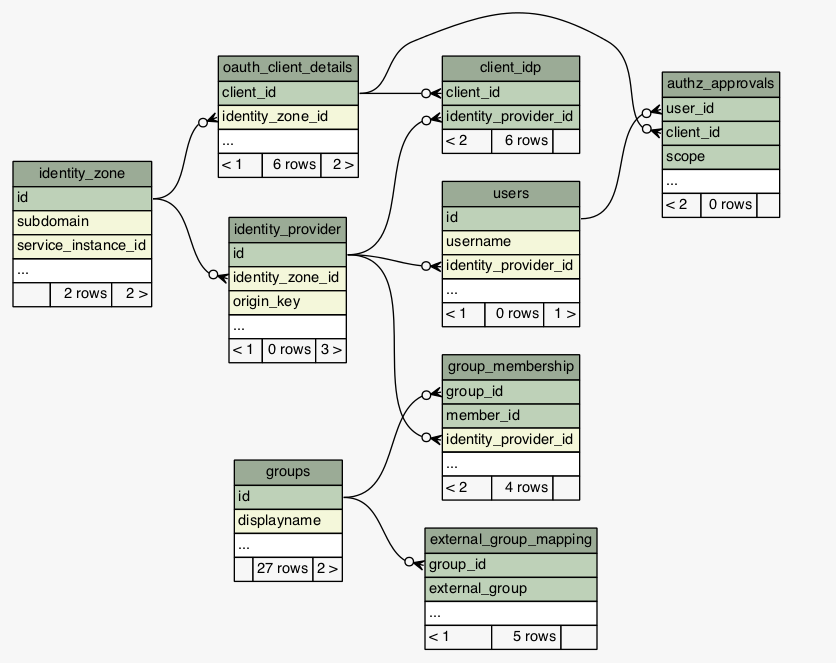

#1.  문서 개요

##1.1  목적

본 문서(UAA 권한관리 가이드)는 개방형 클라우드 플랫폼 프로젝트의
UAA(User Account and Authentication)컴포넌트에서 사용하는 자원 접근제어
방법과 이를 관리하는 방법을 가이드하는 문서이다.

본 가이드 문서는 UAA의 역할, 권한관리 아키텍쳐 및 표준 등의 내용을
포함하고 있다. 문서의 대상은 개방형 클라우드 플랫폼 관리자, 개방형
클라우드 플랫폼의 자원들(Service APIs)을 이용하거나, UAA를
권한부여자(OAuth2.0 Provider)로 사용하려는 클라이언트 개발자이다.

##1.2 참고자료

-   **UAA docs**,
    [https://docs.cloudfoundry.org/concepts/architecture/uaa.html](https://docs.cloudfoundry.org/concepts/architecture/uaa.html)

-   **UAA source**, 
    [https://github.com/cloudfoundry/uaa](https://github.com/cloudfoundry/uaa)

-   **The OAuth 2.0 Authorization Framework**,
    [http://tools.ietf.org/html/rfc6749](http://tools.ietf.org/html/rfc6749)

-   **OAuth2.0 Tutorial**, 
    [http://tutorials.jenkov.com/oauth2/index.html](http://tutorials.jenkov.com/oauth2/index.html)

-   **Understanding OAuth2**,
    [http://www.bubblecode.net/en/2013/03/10/understanding-oauth2/](http://www.bubblecode.net/en/2013/03/10/understanding-oauth2/)

#2.  UAA 권한관리 개요

UAA(User Account and Authentication Service)는 개방형 클라우드 플랫폼의
컴포넌트로써, 사용자뿐만 아니라 개방형 클라우드 플랫폼의 자원(APIs)을
사용하려는 클라이언트에 대한 인증(Authentication) 및
인가(Authorization)의 역할을 한다. UAA의 권한관리는 클라이언트의 인가와
접근제어를 포함하는 개념이다. 클라이언트의 인가는 인증을 통해 UAA에
자원을 요청할 자격을 획득하는 것을 말하며, 자신에게 부여된 권한의 범위에
따라 자원에 대한 접근제어를 받는다. 자원을 이와 같이 보호하기 위해서는
UAA가 인가 대상이 되는 클라이언트를 관리해야 한다. 또한 클라이언트에게
부여할 수 있는 접근권한 목록을 정의 및 관리해야한다. 본 장에서는 UAA의
역할을 세분화하고, 권한관리 아키텍쳐를 설명한다.

##2.1  UAA 역할

UAA의 역할은 Authentication Server, Authorization Server, Resource
Server 3가지로 구분할 수 있다. 아래 [그림 2-1]은 UAA의 역할과 각 역할을
대표하는 Endpoint를 보여주는 그림이다.

**[****그림****2-1] UAA****의 역할 및****Endpoint****예**

-   **Authentication(****인증****)**: 사용자 계정에 대한 인증을 담당하며, LDAP 또는 SAML을 사용하는 외부 Identity Service를 연동할 수 있다.

-   **Authorization(****인가****)**: 클라이언트 인증과 접근권한 부여를 담당하며, OAuth2.0 Framework을 구현하였다. 즉, UAA클라이언트에게 접근토큰(access token)을 발급하는 OAuth2.0 Provider역할이며, 접근토큰은 클라이언트에 허가된 접근권한 목록을 포함하고 있다.

-   **Resource(****자원****)**: 요청 받은 자원에 대한 접근을 제어한다. 자원은 UAA가 제공하는 API들을 의미하며, 토큰에 포함되어있는 접근권한들을 통해 자원 사용 요청에 대한 허가 여부를 판단한다.

본 문서에서 주로 다룰 내용은 Authorization Server와 Resource Server의
역할에 대한 것으로써, 접근권한 부여 및 접근제어를 위해 필요한 내용들을
상세하게 설명한다.

##2.2  UAA 권한관리 아키텍처

UAA에서 인가는 클라이언트를 인증하고, 인증된 클라이언트의 접근권한
범위를 응답하는 것을 말한다. 더 간단하게 설명하면, 접근토큰을 요청 받아
이를 발급하는 일련의 과정이다. 아래 [그림 2-2]는 UAA 권한관리 아키텍처를
나타낸다.

**[****그림****2-2] UAA****인가 및 접근제어 아키텍처**

UAA는 OAuth2.0 Authorization Framework의 표준을 따르며, 해당 표준에
대해서는 다음 장에서 상세히 설명한다. 접근토큰을 요청하는 주체는
OAuth2.0 Client가 되고, 개방형 클라우드 플랫폼에서는 로그인 및
어플리케이션 배포 시 사용하는 cf CLI(Command Line Interface)나
컴포넌트인 Cloud Controller 등이 OAuth2.0 Client가 될 수 있다. 일반적인
UAA 인가 및 접근제어 프로세스는 아래와 같은 순서로 진행된다.

​1. UAA의 Authorization Server는 클라이언트를 인증한다.

​2. UAA의 Authentication Server는 사용자를 인증한다.

​3. UAA의 Authorization Server는 클라이언트의 scope를 검색한다.

​4. UAA의 Authorization Server는 사용자(Resource Owner)의 scope를
검색한다.

​5. UAA의 Authorization Server는 scope목록을 생성한다. (3과 4로부터
공유된 scope)

​6. UAA의 Authorization Server는 접근토큰을 생성한다. (5로부터 가져온
scope를 포함)

​7. OAuth2.0 Client는 접근토큰을 사용하여, Resource Server에 자원을
요청한다.

​8. Resource Server는 접근토큰을 디코드한 후, 디코딩된 접근토큰에 요청한
자원에 접근할 수 있는 scope을 포함하고 있는지 확인한다.

​9. scope을 포함하고 있는 경우, 클라이언트에 자원을 응답한다.

#3.  UAA 권한관리 표준

본 장에서는 UAA에서 인가 및 접근제어를 위해 구현하고 있는 OAuth2.0,
OpenID Connect, JWT, SCIM 4가지 표준에 대해 정리한다.

##3.1 OAuth2.0 Authorization Framework

전통적인 클라이언트 서버 인증 모델에서 클라이언트는 자원 소유자의
크레덴셜을 사용하여 서버와인증함으로써, 서버상에서 보호되는 자원을
요청한다. 이러한 제한된 리소스에 대한 접근을 써드파티 어플리케이션에
제공하기 위해서, 자원 소유자는 자신의 크레덴셜을 써드파티와 공유해야만
하며, 이것은 다양한 보안상의 문제와 제약들을 야기한다.

OAuth2.0은 자원 소유자로부터 클라이언트의 역할을 분리함으로써 전통적인
자원 소유자 크레덴셜을 이용한 인증방식의 문제점을 해결한다. OAuth2.0에서
클라이언트는 자원 소유자의 승인을 처리하는 인가계층을 통해 접근토큰을
발급받으며, 이를 보호된 자원에 접근하는데 사용한다. 예를 들어, 사용자가
사진 공유 서비스(자원 서버)에 저장된 자신의 사진들을 프린트하려고 한다.
이 때, OAuth2.0을 통해 사용자는 자신의 사용자명과 패스워드를 프린팅
서비스(클라이언트)와 공유하는 일 없이, 보호된 사진들에 접근하는 것을
승인할 수 있다. 사용자는 사진 공유 서비스에 의해 신뢰된 서버(인가
서버)와 직접 인증하며, 사진 공유 서비스는 프린팅 서비스에 특정 역할을
위임한 크레덴셜(접근토큰)을 발급한다.

###3.1.1  액터(Actors/Roles)

OAuth2.0에서는 Resource Owner, Client, Resource Server, Authorization
Server 4개의 액터(역할)를 정의한다.

- **Resource Owner(****자원 소유자****):** 자원 소유자는 공유될 데이터를
소유하고 있는 사람 또는 어플리케이션을 말한다. 예를 들어, Facebook 또는
Google 사용자는 자원 소유자이고, 그들이 소유한 자원이 공유될 데이터가
된다. 즉 자원 소유자는 보호된 자원에 접근승인이 가능한 주체를 의미한다.

- **Client(****클라이언트****):** 클라이언트는 자원 소유자를 대신하거나,
스스로 보호된 자원에 대한 접근을 요청하는 어플리케이션을 말한다.
클라이언트는 클라이언트 크레덴셜을 안전하게 유지할 수 있는지에 따라
confidential, public 2가지 타입으로 분류된다. 아래 [표3-1]은 클라이언트
타입을 비교를 나타낸다. 클라이언트 타입은 3.1.3에서 설명할 권한부여
프로세스와 관련이 있다.

**[****표****3-1]****클라이언트 타입 비교**

|**타입**|**설명**|
|--------|------------------------------------------|
|Confidential (기밀)|기밀 클라이언트는 클라이언트 패스워드를 기밀하게 유지할 수 있는 어플리케이션을 말한다. 클라이언트 패스워드는 사기(fraud)를 방지하기 위해 인가 서버에 클라이언트를 확인(인증)하는데 사용된다. administrator만이 서버에 대한 접근권한을 획득할 수 있고, 클라이언트 패스워드를 볼 수 있다. 예; web application|
|Public (공개)|공개 클라이언트는 클라이언트 패스워드를 기밀하게 유지할 수 없는 어플리케이션을 말한다. 예를 들면, 기기에 클라이언트 패스워드를 내장하는 모바일 폰 어플리케이션 또는 데스크탑 어플리케이션이 이에 속한다. 이와 같은 어플리케이션은 크래킹되기 쉽고, 패스워드를 노출시킬 수 있다.  예; user-agent-based(JavaScript) application, native application|

- **Resource Server(****자원 서버****):** 자원 서버는 보호된 자원을
호스팅하는 서버를 말한다. 자원 서버는 접근토큰을 사용하는 보호된 자원에
대한 요청을 허가 또는 응답할 수 있는 능력이 있다.

- **Authorization Server(****인가 서버****):** 인가 서버는 자원 소유자의
자원에 접근하기 위한 클라이언트 어플리케이션을 인가하는 서버이다. 인가
서버와 자원 서버는 같은 서버에 있을 수 있지만, 반드시 함께 있을 필요는
없다. 인가 서버는 자원 소유자 인증에 성공하고 인가를 획득한 후에
클라이언트에게 접근토큰을 발급한다.

###3.1.2 토큰(Token)

토큰은 인가 서버에 의해서 생성되고, 클라이언트가 요청할 때 발급되는 랜덤
문자열이다. OAuth2.0에서 사용하는 토큰에는 access token과 refresh token
2가지 타입이 있다.

- **Access Token(****접근토큰****):** Access token은 써드파티
어플리케이션이 사용자 데이터에 접근하는 것을 허가한다. 이 토큰은
클라이언트에 의해 파라미터로 보내지거나, 자원 서버로 보내는 요청헤더를
통해 전달된다. 토큰은 인가 서버에 의해 정의된 유효기간이 있다. 토큰은
가능한한 기밀성이 유지되어야 한다.

- **Refresh Token(****갱신토큰****):** Refresh token은 access token과
함께 발급된다. access token과 달리 클라이언트에서 자원 서버로 각각의
요청 시 전달되지 않는다. Refresh token은 access token이 만료되었을 때,
이을 갱신하기 위해서 인가 서버에 보낸다. 보안적인 이유로, 이 토큰은 특정
권한부여 방식(Resource Owner Password 및 Authorization Code)에 대해
허용한다. 한번 발급 받은 접근토큰은 만료되기 전까지, 클라이언트에서 자원 요청시
사용할 수 있다.

###3.1.3  권한부여 방식(Grant type) 및 프로세스

클라이언트는 접근토큰을 요청 및 획득하기 위해 인가 서버에 등록해야 한다.
클라이언트 등록 시, 중요한 것은 권한부여 방식(grant type)을 선택하는
것이다. 권한부여 방식은 접근토큰을 요청 및 발급받는 프로세스에 해당하며,
Client Credentials, Resource Owner Password Credentials, Authorization
Code, Implicit 4가지가 있다. 아래 [표 3-2]는 권한부여 방식을 결정하는
방법을 보여준다.

**[****표****3-2]****권한부여 방식 결정**

|**Client type \ Legged**|**3 legged; User - Client - Server(Authorization)**|**2 legged; Client - Server(Authorization)**
|--------------------|-----------------------|---------------|                                                                     
| Public (native, script app) | Implicit Grant | Resource Owner Password Credentials Grant|
| Confidential (WAS app, server)  | Authorization Code Grant  | Client Credentials Grant|
                                                                     
                                                  
Client type은 [표3-1]에서 설명한 바와 같이 클라이언트 패스워드 기밀성
유지 가능여부에 따라 구분된다. Legged는 권한부여 및 접근토큰 발급을
위해, 관여하는 주체들을 의미한다. 사용자의 권한위임 승인 과정이 필요한
경우 3 legged가 되며, 그 외의 경우는 2 legged가 된다. 하나의
클라이언트는 4가지 권한부여 방식 중 하나 또는 몇 가지를 등록할 수 있다.
하지만 반드시 등록된 권한부여 방식으로 접근토큰을 요청해야 하며, 이를
위해서는 권한부여 방법에 따른 프로세스에 맞게 클라이언트를 구현해야
한다. 즉, 권한부여 방식에 따라 클라이언트의 구현방식이 달라져야 한다는
것이다. 다음은 개방형 클라우드 플랫폼 설치 시 등록하는 3개의 클라이언트
예를 나타낸다.
	
	client_id: cf (public client - native app)
	authorized_grant_type: implicit, password

	client_id: cloud_controller (confidential client - server)
	authorized_grant_type: client_credentials

	client_id: login (confidential client – WAS app)
	authorized_grant_type: authorization_code, client_credentials

위 클라이언트들은 하나 또는 두 개의 권한부여 방식으로 접근토큰을
요청한다. 아래 각 항에서 해당 클라이언트들을 예로 들어 4개의 권한부여
방식에 대해 상세히 설명한다.

**1) Client Credentials****권한부여**

Client Credentials 권한부여 방식의 특징은 Client
Credentials(client_id와 client_secret)만으로 접근토큰을 획득할 수
있다. 즉, Client자체가 Resource Owner이며, 아래 [그림 3-1]은 Client
Credentials 권한부여 방식의 프로세스를 보여준다.

**[****그림****3-1] Client Credentials****권한부여 프로세스**

Cloud Controller는 개방형 클라우드 플랫폼의 컴포넌트로써, UAA에 사용자
생성(/Users)과 같은 자원을 요청한다. Cloud Controller는 서버형태로
존재하며, 클라이언트 패스워드를 안전하게 유지할 수 있는 Confidential
클라이언트에 속한다. 따라서, Cloud Controller는 Client Credentials
권한부여 방식으로 접근토큰을 요청하도록 등록한다. Cloud Controller는
접근토큰 요청 시, client credentials를 전달하고, Authorization Server는
Cloud Controller를 인증한다. 인증을 성공하면, 등록되어있는 Cloud
Controller의 authorities를 포함한 접근토큰을 Cloud Controller에
응답한다.

**2) Resource Owner Password Credentials****권한부여**

Resource Owner Password Credentials 권한부여 방식의 특징은 Resource
Owner의 크레덴셜을 사용하여, 접근토큰을 획득한다는 것이다. 아래 [그림
3-2]는 Resource Owner Password Credentials 권한부여 방식의 프로세스를
보여준다.

**[****그림****3-2] Resource Owner Password Credentials****권한부여
프로세스**

cf CLI는 개방형 클라우드 플랫폼에서 로그인, 어플리케이션 배포 등에
사용하는 Command Line기반의 어플리케이션이다. cf CLI는native
어플리케이션으로써, Public 클라이언트에 속한다. 개방형 클라우드 플랫폼
사용자 계정으로, 별도의 승인 프로세스 없이 접근토큰을 요청하도록
Resource Owner Password Credentials 권한부여 방식을 사용한다. 사용자는
\$ cf login 명령어 사용시 사용자이름 및 패스워드를 입력하고, cf CLI 는
접근토큰 요청 시, client credentials 및 user credentials를 모두
전달한다. Authorization Server는 클라이언트와 사용자를 모두 인증하고,
클라이언트 와 사용자가 소유한 동일한 scopes를 포함한 접근토큰을 cf CLI에
응답한다. cf CLI는 접근토큰과 갱신토큰을 함께 발급받으므로 로그아웃을
하지 않는 이상, 접근토큰이 유지된다.

**3) Authorization Code****권한부여**

Authorization Code 권한부여 방식의 특징은 Authorization Code라는
크레덴셜을 사용하여, 접근토큰을 획득한다는 것이다. 아래 [그림 3-3]은
Authorization Code 권한부여 방식의 프로세스를
보여준다.

Login은 개방형 클라우드 플랫폼의 UAA의 모듈로써, 로그인 화면을 가지고
있는 웹 어플리케이션이다. Confidential 클라이언트에 속하며 Authorization
Code권한부여 방식을 사용하는 경우, 사용자에게 권한위임 승인을 요청한다.
Login은 사용자를 인증하고, 사용자로부터 권한을 위임받아 Authorization
Server에 Authorization Code를 요청한다. Authorization Server는 code를
생성 및 저장하고, 이를 Login에 응답한다. Login 은 접근토큰 요청 시,
code와 client credentials을 전달한다. Authorization Server는 code확인 및
클라이언트를 인증하고, scopes를 포함한 접근토큰을 Login에 응답한다.
이처럼 Authorization Code 권한부여 방식을 사용하는 클라이언트는
authorization code 위한 요청과 접근토큰을 위한 요청을 분리하여 만들어야
한다.

**[****그림****3-3] Authorization Code****권한부여 프로세스**

**4) Implicit****권한부여**

Implicit 권한부여 방식은 Authorization Code 와 비슷하지만 client
secret을 필요로 하지 않으며, 접근토큰을 authorization요청의 결과로 받는
것이 특징이다. public 클라이언트에 최적화된 권한부여 방식으로써,
클라이언트 인증을 포함하지 않고, 자원 소유자의 존재와 리다이렉션
URI등록에 의존한다. [그림 3-4]는 Implicit 권한부여 방식의 프로세스를
보여준다.

**[****그림****3-4] Implicit****권한부여 프로세스**

UAA CLI는 UAA권한관리를 위해 사용되는 Command Line기반의
어플리케이션이다. UAA CLI는native 어플리케이션으로써, Public
클라이언트에 속한다. 사용자는 \$ uaac token get 명령어를 사용하여,
접근토큰을 획득할 수 있다. 이 때 UAA CLI는 Implicit권한부여 방식을
사용하여, 접근토큰을 요청한다. 따라서, UAA CLI는 사용자를 인증하고,
사용자로부터 권한을 위임받아 Authorization Server에 접근토큰을 요청한다.
UAA CLI는 갱신토큰을 발급받지 못하므로 토큰 유효기간이 지나면,
접근토큰을 다시 발급받아야 한다.

##3.2  OpenID Connect

OpenID Connect는 OAuth2.0위에서 동작하는 간단한 인증(identity)
레이어이다. OpenID Connect는Authorization Server에 의해 수행되는 인증을
기반으로 하여, 클라이언트가 사용자의 신원을 확인하는 것을 가능하게 한다.
또한 사용자에 대한 기본적인 프로필정보를 획득하는 것을 가능하게 하며,
API Endpoint는 /userinfo이다.

##3.3  SCIM(The System for Cross-domain Identity Management)

SCIM(The System for Cross-domain Identity Management)은 클라우드 기반의
어플리케이션 및 서비스에서 사용자 identity관리를 위해 고안된 REST/JSON
표준으로써, Simple Cloud Identity Management라 하기도 한다. SCIM표준은
클라우드에서 사용자 관리를 단순화하기 위해 만들어졌다. 사용자와 그룹을
표현하기 위한 스키마와 CRUD 작업을 위해 필요한 REST API를 정의한다.
UAA에서는 사용자와 그룹(권한)관리를 위해 해당 표준을 사용하며, 각각의
API Endpoint는 /Users, /Groups이다.

##3.4  JWT(JSON Web Token)

JWT(JSON Web Token)은 JSON기반의 토큰 표준으로써, UAA에서 클라이언트
어플리케이션을 위한 인증된 무기명(Bearer) 토큰 포맷으로 사용한다.
접근토큰은 HTTP header나 URI 쿼리파라미터로 전달하기 위해, 아래와 같이
인코딩한다.

**Encoded Token 예;*

	eyJhbGciOiJSUzI1NiJ9.eyJqdGkiOiIwMjhiOWY4ZC0zODhmLTQzMTUtYjg2MC01NTk5MzE3ZGIyY2MiLCJzdWIiOiJhZG1pbiIsImF1dGhvcml0aWVzIjpbInBhc3N3b3JkLndyaXRlIiwic2NpbS53cml0ZSIsImNsaWVudHMud3JpdGUiLCJjbGllbnRzLnJlYWQiLCJzY2ltLnJlYWQiLCJ1YWEuYWRtaW4iLCJjbGllbnRzLnNlY3JldCJdLCJzY29wZSI6WyJzY2ltLnJlYWQiLCJ1YWEuYWRtaW4iLCJwYXNzd29yZC53cml0ZSIsInNjaW0ud3JpdGUiLCJjbGllbnRzLndyaXRlIiwiY2xpZW50cy5yZWFkIiwiY2xpZW50cy5zZWNyZXQiXSwiY2xpZW50X2lkIjoiYWRtaW4iLCJjaWQiOiJhZG1pbiIsImF6cCI6ImFkbWluIiwiZ3JhbnRfdHlwZSI6ImNsaWVudF9jcmVkZW50aWFscyIsInJldl9zaWciOiJhNWM0MDRiMCIsImlhdCI6MTQ0ODUyNTc5NSwiZXhwIjoxNDQ4NTY4OTk1LCJpc3MiOiJodHRwOi8vdWFhLmNmLm9wZW4tcGFhcy5jb20vb2F1dGgvdG9rZW4iLCJ6aWQiOiJ1YWEiLCJhdWQiOlsiYWRtaW4iLCJzY2ltIiwidWFhIiwicGFzc3dvcmQiLCJjbGllbnRzIl19.GWfKjK5sPNByAxzVkcpVRADZr-KhQSeHtPebXRbn1HtwqwG3GPpKn0cLjbY2vcSYAdsTwup_YvV0IhTC-QdsR_jgqFbInjWDg-zxN9PKhYUC1zIIg-VS-Kg1NAkx64d1DqX5dvlnS2b3dj1KCPdy5FL3cr9bYlazQYc_7lWPU3I

인코딩 된 JWT토큰 사이에는 Header, Payload, Verify Signature 3가지
파트를 구분하는 ‘.’이 있으며, 인코딩 방식은 base64url이다. 따라서, 위
접근토큰을 디코드하면, 아래와 같은 형태를 가지고 있다.

**Decoded Token 예;*

**Header: Algorithm & Token Type**

	{
		"alg": "RS256"
	}
	
**Payload: Data**

	{
	  "jti": "028b9f8d-388f-4315-b860-5599317db2cc",
	  "sub": "admin",
	  "authorities": [
		  "password.write",
		  "scim.write",
		  "clients.write",
		  "clients.read",
		  "scim.read",
		  "uaa.admin",
		  "clients.secret"
	  ],
	  "scope": [
		  "scim.read",
		  "uaa.admin",
		  "password.write",
		  "scim.write",
		  "clients.write",
		  "clients.read",`
		  "clients.secret"
	  ],
	 "client_id": "admin",
	 "cid": "admin",
	  "azp": "admin",
	  "grant_type": "client_credentials",
	  "rev_sig": "a5c404b0",
	  "iat": 1448525795,
	  "exp": 1448568995,
	  "iss": "http://uaa.cf.open-paas.com/oauth/token",
	  "zid": "uaa",
	  "aud": [
		  "admin",
		  "scim",
		  "uaa",
		  "password",
		  "clients"
	  ]
	  }
	  
**Verify Signature**

	RSASHA256(
	  base64UrlEncode(header) + "." +
	  base64UrlEncode(payload),
	  Public Key or Certificate. Enter it in plain text only if you want to verify a token
	  ,
	  Private Key (RSA). Enter the it in plain text only if you want to generate a new token. The key never leaves your browser.
	  )
  

디코딩 된 정보 중 Payload부분의 Data의 일부 값들은 다음 내용을 나타낸다.

- user_id: 사용자를 위한 UUID

- cid/client_id: 클라이언트를 위한 고유한 이름

- scope: 이 클라이언트가 사용자를 대신할 수 있는 허가 목록

- aud: 청중. 즉, 토큰을 위한 대상

#4.  UAA 자원(APIs) 목록

UAA에서 관리하는 리소스들(UAA Service APIs)은 인증 및 권한위임, 사용자
계정 관리, 그룹관리, 클라이언트 등록 관리자, 접근토큰 관리자, UI
Endpoint, Indentity Zone관리 크게 7가지로 분류할 수 있다. 본 문서에서는
각 분류에 속하는 API종류와 정의만을 설명한다. API상세 스펙은 Open PaaS
산출물 “설계_인터페이스 정의서_실행환경_인증권한관리_v1.0.docx”를
참고한다.

##4.1  인증 및 권한위임 APIs 

|**Methods**|**APIs**|**Descriptions**|
|-----------|--------|-----------------|
|GET		|/oauth/authorize|클라이언트 인가요청
||| Authorization Code grant type; Requests Code|
|||Implicit grant type; for Browsers|
|POST		|/oauth/authorize|클라이언트 인가요청|
|||Implicit grant type;|
|POST|/oauth/token|접근토큰요청|
|||Client Credentilas, Password credentials|
|POST|/check_token|OAuth2 Token 검증(Validation) 리소스 서버에게 허가되는 endpoint (예 cloud controller)|
|POST|/authenticate|사용자 인증 또는 생성|
|GET|/userinfo|OpenID 사용자 정보|
|GET|/login|로그인 정보|

##4.2  사용자 계정 관리 APIs

|**Methods**|**APIs**|**Descriptions**|
|-----------|---------|----------------|
|GET        | /Users |  사용자 검색     |
|POST       | /Users  |    사용자 추가  |
|PUT        | /Users/{id} |  사용자 정보 수정|
|DELETE     | /Users/{id} |  사용자 삭제 |
|PUT        | /Users/{id}/password |패스워드 변경 (SCIM PATCH method)|
|<del>GET</del>  | <del>/Users/{id}/verify-link</del>|<del>사용자 계정확인을 위한 링크</del>|
|<del>GET</del>  | /Users/{id}/verify | 사용자 계정확인|
|GET        | /ids/Users   |   Userids를 Names로 변환|
|POST       | /password/score    |  패스워드 강도(strength) 쿼리(deprecated)|
|POST       | /invite_users    |            사용자 초대|

##4.3  그룹 관리 APIs

|**Methods**|**APIs**|**Description**|
|-------|-----------|------------------------|
|GET	|/Groups	|그룹(스코프) 검색		 |
|POST	|/Groups	|그룹(스코프) 추가		 |
|PUT	|/Groups	|그룹(스코프) 정보 업데이트|
|DELETE	|/Groups	|그룹(스코프) 삭제		 |

##4.4  클라이언트 등록 Administration APIs

|**Methods**	|**APIs**                                     |**Descriptions** 				 |
|---------------|---------------------------------------------|----------------------------------|
|  GET          | /oauth/clients                              | 클라이언트 목록 조회				 |
|  GET          | /oauth/clients/{client\_id}                 | 클라이언트 조회(검사)				 |
|  POST         | /oauth/clients                              | 클라이언트 등록					 | 
|  PUT          | /oauth/clients/{client\_id}                 | 클라이언트 업데이트				 |
|  DELETE       | /oauth/clients/{client\_id}                 | 클라이언트 삭제					 |
|  PUT          | /oauth/clients/{client\_id}/secret          | 클라이언트 패스워드 변경			 |
|  POST         | /oauth/clients/tx                           | 다중 클라이언트 등록				 |
|  PUT          | /oauth/clients/tx                           | 다중 클라이언트 업데이트			 |
|  POST         | /oauth/clients/tx/modify                    | 다중 클라이언트 등록/업데이트/삭제 |
|  POST         | /oauth/clients/tx/secret                    | 다중 클라이언트 패스워드 변경		 |
|  POST         | /oauth/clients/tx/delete                    | 다중 클라이언트 삭제				 |		
|<del>GET</del> | <del>/oauth/clients/restricted</del>        | <del>제한된 스코프 목록 조회 List Restricted Scopes</del> | 
|<del>POST</del>| <del>/oauth/clients/restricted</del>        | <del>제한된 클라이언트 생성</del>  |
|<del>PUT</del> | <del>/oauth/clients/restricted/{client\_id}</del>| <del>제한된 클라이언트 업데이트</del> |

\* 제한된 클라이언트의 정의는 UAA admin scope이 없는 클라이언트를
말한다.

##4.5  접근토큰 Administration APIs

|**Methods**|**APIs**	|**Descriptions**		    |
|-----------|-----------|---------------------------|
|GET  		|/token\_key|토큰 서명을 위한 검증키 획득|

##4.6  UI Endpoint APIs

|  **Methods**  | **APIs**                         |  **Descriptions**	 |
|---------------|----------------------------------|---------------------|
|  GET          | /login                           |  로그인 폼 			 |	
|  POST         | /login.do                        |  로그인				 |
|  GET          | /logout.do                       |  로그아웃			 |
|  GET          | /oauth/authorize/confirm\_access |  OAuth2 인가 확인	 |
|  POST         | /oauth/authorize?\  user\_oauth\_approval=true |  OAuth2 인가		 |
                         

##4.7  Identity Zone 관리 APIs

|  **Methods**   |**APIs**                                  |**Descriptions**				|
|----------------|------------------------------------------|-------------------------------|
|  POST          |/identity-zones                           |Identity zone 생성				|
|  PUT           |/identity-zones                           |Identity zone 업데이트			|
|  GET           |/identity-zones                           |Identity zone 목록				|
|  GET           |/identity-zones/{identityZoneId}          |특정 Identity zone 정보			|
|  POST          |/identity-zone/{identityZoneId}/clients   |Identity zone에 속하는 클라이언트 생성|
|  GET           |/identity-providers                       |Identity Provider 목록			|
|  GET           |/identity-providers/{id}                  |특정 Identity Provider 정보 확인|

#5.  UAA 접근권한(Scopes/Authorities) 목록

4장에서 설명한 UAA자원들에 대한 접근제한은 접근권한 목록들에 의해
제어된다. 사용자와 클라이언트는 인가 서버에 등록 시, 각각 UAA 자원에
대한 접근권한 목록을 부여받으며, OAuth2.0 인가를 통해 획득한 접근토큰에
해당 접근권한들이 포함된다. 접근권한 목록은 리소스 서버에서 정의하며,
authorities 또는 scopes라고 한다.

**- Authorities**: 클라이언트가 자기 스스로 가지는 접근권한 목록을
나타낸다. ‘client\_credentials’ 권한부여 프로세스인 경우에 사용한다.

**- Scopes**: 클라이언트가 사용자를 대신하여 동작 할 때 가질 수 있는
접근권한 목록을 나타낸다. 클라이언트가 사용자 대신 리소스를 사용하기
위해서는, authorities에 있는 속성이 사용자에게도 있어야한다.

UAA자원서버는 모든 자원들에 대해 개별적인 아이디를 부여하고, 각각의
아이디에 추가적인 규칙이름을 부여함으로써 접근권한 목록을 정의한다.
접근토큰과 함께 자원에 대한 요청 시, 접근토큰에서 매칭되는 자원 아이디를
찾을 수 없다면 요청을 거절한다. 아래는 UAA에서 사용하는 접근권한 목록을
보여준다.

|**Resource ID**|**Rules name** |**Descriptions**|
|---------------|---------------|----------------|
|**uaa**		|user \*		|UAA사용자 권한	 |
|**uaa**		|resource		|리소스 서버(check\_token endpoint를 위해 사용됨)|
|**uaa**		|admin			|Super(Admin)사용자 권한|
|**uaa**		|none			|사용자를 대신하는 action을 수행하지 않는 클라이언트|
|**scim**		|me \*			|reader/writer (group\_membership의 authorities) - reader: 그룹과 관련된 읽기 권한(멤버/그룹정보)- writer: 그룹과 관련된 수정 권한|
|**scim**		|write			|scim endpoints(/Users, /Groups)에 대한 admin 쓰기|
|**scim**		|read			|scim endpoints(/Users, /Groups)에 대한 admin 읽기|
|**scim**		|create			|사용자 생성(POST /Users) 및 자신 계정 확인(GET /Users/{id}/verify) 단, 수정, 읽기, 삭제 권한은 없음|
|**scim**		|userids		|username+origin 을 사용자 ID로 변환하거나, 사용자 ID를 username+origin으로 변경하는데 필요한 scope(/ids/Users)|
|**scim**		|zones			|사용자를 추가/제거하는 것이 zone management groups(/Groups/zones내)에 한정되어 허가되는 제한된 scope|
|**clients**	|admin			|super사용자, 클라이언트를 생성, 수정, 삭제|
|**clients**	|write			|클라이언트를 생성 및 수정 scope|
|**clients**	|read			|클라이언트에 정보 읽기 scope|
|**clients**	|secret			|클라이언트의 패스워드를 변경 scope 관리자로 간주되는 scope|
|**groups**		|update			|group 업데이트 scope scim.write scope과 함께 수행될 수 있음|
|**oauth**		|approval \*		|클라이언트의 인가 승인/거부(/approvals) scope uaa.yml에 정의되는 기본 scope |
|**oauth**		|login			|login 어플리케이션 지칭하는 scope|
|**idps**		|read			|/identity-providers 에서 검색되는 Identity Provider를 위한 읽기 scope|
|**idps**		|write			|/identity-providers에서 검색되는 Identity Provider를 위한 쓰기 scope|
|**password**		|write \*		|사용자의 패스워드를 변경(User\*/\*/password)과 관련된 scope|
|**openid**		|openid \*		|/userinfo endpoint 접근을 위해 필요한 scope, OpenID 클라이언트를 위한 scope 이메일 주소를 포함한 프로필 데이터에 접근하기위한 scope|
|**tokens**		|read			|다른 어플리케이션에 부여한 승인 세부사항을 보기위해 필요한 scope|
|**tokens**		|write			|계정에 어플리케이션을 배포하거나 서비스를 생성 및 바인드하기 위해 필요한 scope|
|**zones**		|read			|identity zones(/identity-zones) 읽기를 실행하는데 필요한 scope|
|**zones**		|write			|identity zones(/identity-zones) 생성 및 업데이트를 수행하는데 필요한 scope|
|**zones**		|\<zone id\>.admin |지정된 zone에 대한 admin operations(identity provider생성, client 등록)를 허가하는 scope|
|**zones**		|\<zone id\>.read  |scope that permits reading the given identity zone (used together with the X-Identity-Zone-Id header)|
|**zones**		|\<zone id\>.clients.admin |zone전환이 완료된 후, clients.admin으로 변환(X-Identity-Zone-Id header와 함께 사용됨)|
|**zones**		|\<zone id\>.clients.read  |zone전환이 완료된 후, clients.read로 변환(X-Identity-Zone-Id header와 함께 사용됨)|
|**zones**		|\<zone id\>.clients.write |zone전환이 완료된 후, clients.write로 변환( (X-Identity-Zone-Id header와 함께 사용됨)|
|**zones**		|\<zone id\>.idps.read	   |zone전환이 완료된 후, idps.read로 변환(X-Identity-Zone-Id header와 함께 사용됨)|
|<del>**approvals**</del>|<del>approvals.me\*</del>|현재는 사용되고 있지 않은 scope|

※ 아래 3개의 권한목록들은 UAA가 아닌 Cloud Conroller를 위해 UAA에서
extra scopes for cloud controller

- cloud\_controller.read \*: 자신의 어플리케이션과 서비스의 상세 정보를
확인할 수 있는 권한

- cloud\_controller.write \*: 어플리케이션 배포와 서비스 생성 및 바인드
할 수 있는 권한

- cloud\_controller\_service\_permissions.read \*: 서비스 인스턴스를
관리할 수 있는 권한

‘**\*’****은 개방형 클라우드 플랫폼 사용자로 가입 시****,****기본으로
부여되는 권한목록들을 나타낸다****.**

#6.  UAA 클라이언트 등록 및 관리 

UAA의 자원(Apis)을 사용하기 위해서는 UAA인가 서버의 클라이언트로
등록되어야 한다. UAA는 사용자, 그룹, 클라이언트의 관리를 위한 권한관리
툴인 UAAC(UAA Command Line Client)를 제공한다.
UAAC는 내부적으로 uaa-client-lib사용하여, UAA APIs를 호출한다. 본
장에서는 UAAC툴을 이용하여, 클라이언트를 등록 및 관리하는 방법을
설명한다.

##6.1  클라이언트 등록

클라이언트를 등록하는 UAAC 명령어는 \$ uaac client add [name]이다. 해당
명령어의 파라미터로는다음과 같은 값들이 있다.

  
|  **Command parameters**                  |**Descriptions**|
|------------------------------------------|-------------------|
|  --scope \<list\>                        | 자원 소유자 권한목록|
|  --authorized\_grant\_types \<list\>     | 권한부여 방식|
|  --authorities \<list\>                  | 클라이언트 권한목록|
|  --access\_token\_validity \<seconds\>   | 접근토큰 유효기간|
|  --refresh\_token\_validity \<seconds\>  |갱신 토큰 유효기간|
|  --redirect\_uri \<list\>                | 리다이렉트 URI|
|  --autoapprove \<list\>                  | 자동승인|
|  --signup\_redirect\_url \<url\>         | 가입 리다이렉트 URL|
|  --clone \<other\>                       | 다른 클라이언트로부터 기본 설정값을 복제|
|  -s \| --secret \<secret\>                | 클라이언트 패스워드|
|  -i \| --[no-]interactive                 | interactively verify all values|

##6.2  클라이언트 관리

클라이언트 관리에는 등록된 클라이언트 정보, 업데이트, 삭제, Secret설정
및 변경등이 있으며, 아래와 같은 UAAC명령어들을 사용한다.

|**Commands**				|**Descriptions**|
|---------------------------|----------------|
|\$ uaac clients 			|등록된 클라이언트 목록|
|| -a \| --attributes <names\>, output for each user\|
|| - -start <start>, show results starting at this index|
|| - -count <count>, number of results to show|
|\$ uaac client get [name]	|이름에 해당하는 클라이언트 정보|
|| -a \| - -attributes \<names\>, output for each user
|\$ uaac client update [name]|이름에 해당하는 클라이언트 정보 업데이트|
||- -scope \<list\>|
||- -authorized\_grant\_types \<list\>|
||- -authorities \<list\>|
||- -access\_token\_validity \<seconds\>|
||- -refresh\_token\_validity \<seconds\>|
||- -redirect\_uri \<list\>|
||- -autoapprove \<list\>|
||- -signup\_redirect\_url \<url\>|
||- -del\_attrs \<attr\_names\>, list of attributes to delete|
||-i | --[no-]interactive, interactively verify all values|
|\$ uaac client delete [name]|   이름에 해당하는 클라이언트 삭제|
|\$ uaac secret set [name]   |   이름에 해당하는 클라이언트 secret 설정|
||-s | --secret \<secret\>, client secret|
| \$ uaac secret change      |   현재 인증된 클라이언트를 위한 secret변경|
||--old\_secret \<secret\>, current secret|
|-s | --secret \<secret\>, client secret|

#7.  권한관리 오류메시지 

invalid\_request; 요청에 필수 파라미터가 빠져 있거나 지원하지 않는
파라미터가 들어있는 등 비정상적인 경우

unauthorized\_client; 클라이언트가 권한 코드를 요청하기 위한 권한이 없는
경우

unsupported\_response\_type; 권한 서버가 권한 코드를 얻는 걸 지원하지
않는 경우

invalid\_scope; 요청 범위가 유효하지 않거나, 서버가 알 수 없거나,
비정상적인 경우

server\_error; 권한 서버가 요청을 처리할 때 예상치 않은 상태를 만나는
경우의 에러 타입

temporarily\_unavailable; 권한 서버가 일시적인 과부하나 유지보수로 인해,
현재 요청을 다룰 수 없는 경우

**별첨****1. UAA****에서 제공하는 기능에 따른 필요****scope****목록**

|**분류** |**기능**						|**필요 스코프**|
|---------|-----------------------------|---------------------------|
|토큰관리 |사용자 토큰 철회/폐지(Revoke)	|uaa.admin 또는 tokens.write|
|토큰관리 |사용자 토큰 목록 조회			|uaa.admin 또는 tokens.read|
|토큰관리 |클라이언트 토큰 철회/폐지(Revoke)|uaa.admin 또는 tokens.write|
|토큰관리 |클라이언트 토큰 목록 조회|uaa.admin 또는 tokens.read|
|클라이언트 등록|클라이언트 삭제/업데이트/추가|clients.write|
|클라이언트 등록|클라이언트 등록 조사(Inspect)|clients.read|
|클라이언트 패스워드 관리|클라이언트 패스워드(secret) 변경|clients.secret 또는 uaa.admin|
|패스워드 변경|사용자 계정 패스워드 변경|password.write (본인의 계정)	uaa.admin|
|사용자 계정 관리|사용자 검색 또는 목록 조회|scim.read|
|사용자 계정 관리|사용자 계정 추가/삭제|scim.write|
|사용자 계정 관리|사용자 계정 업데이트|scim.write|
|사용자 계정 관리|특정 사용자 계정에 대한 읽기/쿼리/업데이트|scim.me|
|id로부터 사용자이름 정보 획득|사용자이름 정보 획득|scim.userids|
|사용자 프로필|사용자 프로필 데이터 획득(Used for SSO OpenID connect)|openid|
|그룹 및 멤버쉽 관리|그룹(scope)목록조회 또는 검색|scim.read|
|그룹 및 멤버쉽 관리|그룹(scope)삭제 또는 추가|scim.write|
|그룹 및 멤버쉽 관리|그룹(scope)이름 업데이트 또는 멤버 추가/삭제|scim.write or groups.update|
|그룹 및 멤버쉽 관리|그룹(scope)목록조회 또는 검색|scim.me|
|그룹 및 멤버쉽 관리|Update group name or add/remove members|scim.me|

https://github.com/cloudfoundry/uaa/blob/master/docs/UAA-Security.md\#user-tokens

**별첨**2.**UAA**데이터 관계도****

Indentity Zone은 UAA의 multi-tenant를 보장하기 위해 사용된다. Identity
Zone은 Identity Provider, OAuth 클라이언트, 사용자가 상호작용할 수 있는
범위를 나타낸다. 아래 UAA에서 제공하는 데이터테이블의 관계를 살펴보면,
Identity Zone개념을 조금 더 쉽게 이해할 수 있다.

**별첨**3.**개방형 클라우드 플랫폼 설치 시****, UAA****클라이언트를 등록하는 방법**

UAA 클라이언트를 등록하는 방법은 6.2절에서 설명한 UAAC 툴을 이용하는
것과 개방형 클라우드 플랫폼 설치 시에 등록정보를 제공하는 2가지가 있다.
UAA 클라이언트 등록정보는 1) cf-release의 jobs/uaa/templates/uaa.yml.erb
또는 2) deployment YAML파일의 다음 속성값에 해당한다.

​1) jobs/uaa/templates/uaa.yml.erb

http://bosh.io/jobs/uaa?source=github.com/cloudfoundry/cf-release&version=212

​2) deployment

	uaa:
		admin:
			client\_secret: adminsecret
		cc:
			client\_secret: ccsecret
		clients:
			login:
				authorities: oauth.login,scim.write,clients.read,scim.userids,password.write
				authorized-grant-types: authorization\_code,client\_credentials
				override: true
				redirect-uri: http://login.cf.open-paas.com
				scope: openid,oauth.approvals
				secret: loginsecret

**별첨****4. Grant Type****별****curl test**

각 Grant Type별로 Endpoint를 확인해야한다.

 |**Grant type**         		 |**Curl** 		|
|----------------------------|-----------------|
|client credentials |curl -v -XPOST -H"Accept:application/json" -u "app:appclientsecret" -d "grant\_type=client\_credentials" **http://uaaapp-server.cfapps.io/oauth/token**|
|password resource owner |curl -v -XPOST -H"Accept:application/json" -u "app:appclientsecret" -d "username=marissa&password=koala" -d "grant\_type=password" -d "response\_type=token" **http://uaaapp-server.cfapps.io/oauth/token**|
|authorization code   \* cookie필요(로그인정보) | **\#로그인** curl -c cookies.txt -v --data "username=marissa&password=koala&X-Uaa-Csrf=csrf-cookie" --cookie "X-Uaa-Csrf=csrf-cookie" http://uaaapp-server.cfapps.io/login.do **\#authz code(토큰요청 시 사용될 값)요청** curl -c cookies.txt -b cookies.txt -v "http://uaaapp-server.cfapps.io/oauth/authorize?scope=openid&client\_id=app&redirect\_uri=http://uaaapp-server.cfapps.io/app/authcode&state=b13b&response\_type=code" \- 필요에따라 ‘autoapprove=true’ 또는 ‘user\_oauth\_approval=true’ 값이 필요함 \- 응답값: code **\#응답받은 authz code를 사용하여, 토큰요청** curl -v -XPOST -H"Accept:application/json" -u "app:appclientsecret" -d "grant\_type=authorization\_code" -d "redirect\_uri=http://uaaapp-server.cfapps.io/app/authcode" -d "code=0tJw61&state=b13b" http://uaaapp-server.cfapps.io/oauth/token|
|implicit  \* cookie필요(로그인정보)|**\#로그인** curl -c cookies.txt -v --data "username=marissa&password=koala&X-Uaa-Csrf=csrf-cookie" --cookie "X-Uaa-Csrf=csrf-cookie" http://uaaapp-server.cfapps.io/login.do **\#redirect(토큰을 받을) url 전달** curl -c cookies.txt -b cookies.txt -v "http://uaaapp-server.cfapps.io/oauth/authorize?response\_type=token&client\_id=app&redirect\_uri=http://uaaapp-server.cfapps.io/callback" \-응답값: Redirect URL뒤에 Access Token|

\*\* token으로 Resource요청

**curl -v -XGET
http://\<****리소스서버****URL\>/\<API\>?access\_token="****실제 토큰값****"**

**예****\>\>**curl -v -XGET 
http://uaaapp-server.cfapps.io/Users?access\_token="eyJhbGciOiJIUzI1NiJ9.eyJqdGkiOiIxNzdhOTZlMi1hZmM1LTRlZDAtYTEwOS05NzJhOTViNDNhNTEiLCJzdWIiOiJiYjM2MzRmNC0xNDQ3LTQ5ZDAtYjc1NC0yZGQ1NGE4MDRlOGYiLCJzY29wZSI6WyJzY2ltLnVzZXJpZHMiLCJwYXNzd29yZC53cml0ZSIsIm9wZW5pZCIsImNsb3VkX2NvbnRyb2xsZXIud3JpdGUiLCJjbG91ZF9jb250cm9sbGVyLnJlYWQiXSwiY2xpZW50X2lkIjoiYXBwIiwiY2lkIjoiYXBwIiwiYXpwIjoiYXBwIiwiZ3JhbnRfdHlwZSI6ImF1dGhvcml6YXRpb25fY29kZSIsInVzZXJfaWQiOiJiYjM2MzRmNC0xNDQ3LTQ5ZDAtYjc1NC0yZGQ1NGE4MDRlOGYiLCJ1c2VyX25hbWUiOiJtYXJpc3NhIiwiZW1haWwiOiJtYXJpc3NhQHRlc3Qub3JnIiwicmV2X3NpZyI6ImM1NDY0M2Y2IiwiaWF0IjoxNDQ3OTE4ODMyLCJleHAiOjE0NDc5NjIwMzIsImlzcyI6Imh0dHA6Ly9sb2NhbGhvc3Q6ODA4MC91YWEvb2F1dGgvdG9rZW4iLCJ6aWQiOiJ1YWEiLCJhdWQiOlsiYXBwIiwic2NpbSIsImNsb3VkX2NvbnRyb2xsZXIiLCJwYXNzd29yZCIsIm9wZW5pZCJdfQ.q2hNXSh7qPBtSLtN3rKFlfG9\_ZxyOqsvzvYdz4B\_b-Y"

**별첨****5. OAuth2.0****과****OAuth1.0****비교**

OAuth2.0은 OAuth1.0과 호환되지 않으며, 사용되는 용어들도 차이가 있다.
아래 표는 두 표준의 용어차이 비교를 나타낸다.

|/         |**OAuth1.0 Protocol**|**OAuth2.0 Authorization Framework**|
|----------|---------------------|------------------------------------|
|**사용자** |User|Resource Owner|
|**클라이언트**|Consumer|Client|
|**API서버**|Service Provider|Resource Server|
|**인증서버**|Service Provider|Authorization Server|
|**HTTP헤더**|OAuth|Bearer|
|**파라미터 명**|oauth\_token|access\_token|
|**보안**|signature사용|HTTPs|
