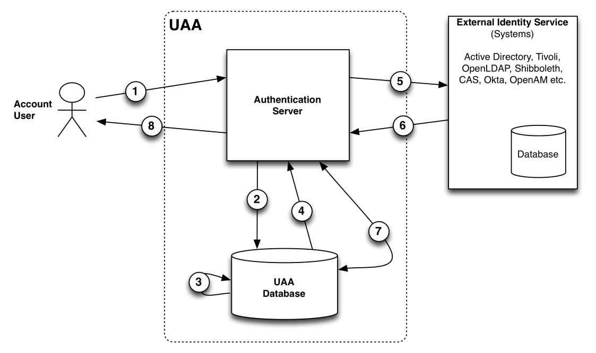
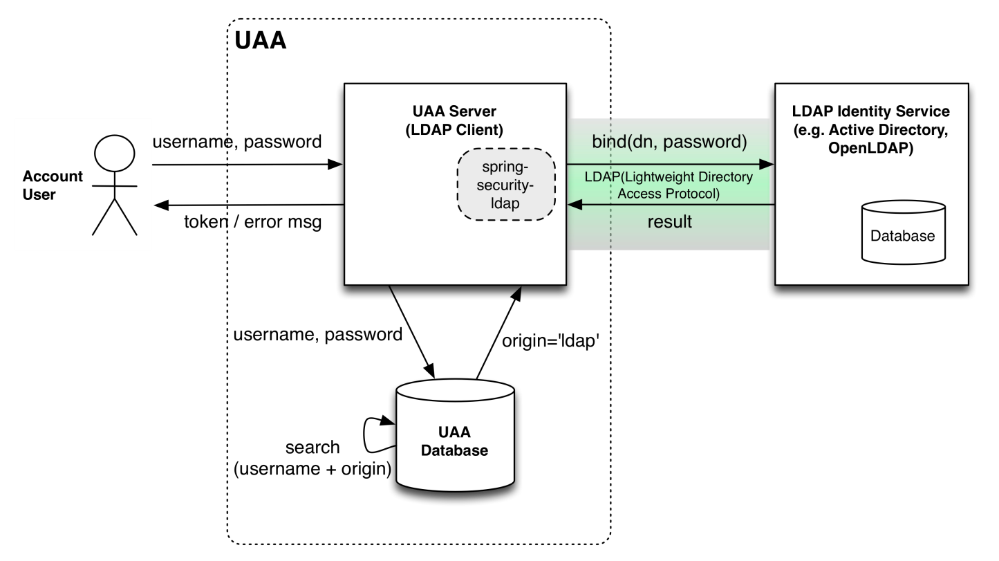
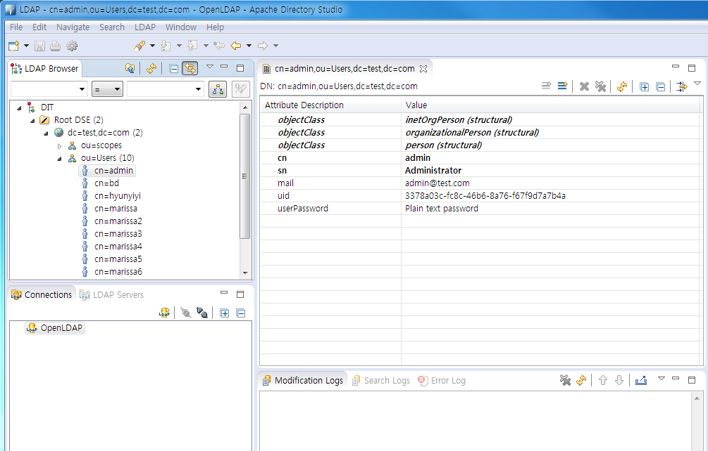

# 1.  문서 개요

## 1.1.  목적 

본 문서(외부 Identity서비스 통합 가이드)는 개방형 클라우드 플랫폼 프로젝트의 UAA(User Account and Authentication) 컴포넌트에 외부 Identity서비스를 통합하는 방법을 가이드하는 문서이다.

본 가이드 문서는 UAA와 외부 Identity서비스 연동 아키텍쳐, 시나리오 및 연동 검증까지의 내용을 포함하고 있다. 또한 각 외부 Identity서비스의 이해 및 검증을 위해 간략하게 용어 및 설정방법을 설명한다.

단, 문서의 대상은 개방형 클라우드 플랫폼 관리자와 이를 통합하려는 인증서비스(시스템) 관리자로써, 각각에 대해 기본적인 지식을 보유하고 있다 가정한다. 따라서, 통합을 위해 필요한 내용 외의 인증서비스 개념이나 용어는 본 문서에 상세히 설명하지 않는다.

## 1.2.  범위

본 문서의 범위는 개방형 클라우드 플랫폼 프로젝트의 UAA컴포넌트와 기타 외부 Identity서비스의 연동검증에 관련된 내용으로 한정하며, 검증을 위한 외부 Identity서비스는 오픈소스 소프트웨어를 사용한다.

## 1.3.  참고자료 

-   UAA docs, [https://docs.cloudfoundry.org/concepts/architecture/uaa.html](https://docs.cloudfoundry.org/concepts/architecture/uaa.html)

-   UAA source, [https://github.com/cloudfoundry/uaa](https://github.com/cloudfoundry/uaa)

-   UAA-LDAP, [https://github.com/cloudfoundry/uaa/blob/master/docs/UAA-LDAP.md](https://github.com/cloudfoundry/uaa/blob/master/docs/UAA-LDAP.md)

-   [https://support.pivotal.io/hc/en-us/articles/204140418-Configuring-LDAP-Integration-with-PCF](https://support.pivotal.io/hc/en-us/articles/204140418-Configuring-LDAP-Integration-with-PCF)

-   [http://docs.pivotal.io/pivotalcf/opsguide/ldap-uaa.html](http://docs.pivotal.io/pivotalcf/opsguide/ldap-uaa.html)

-   LDAP, [http://wiki.tunelinux.pe.kr/display/sysadmin/LDAP](http://wiki.tunelinux.pe.kr/display/sysadmin/LDAP)

-   OpenLDAP, [http://www.openldap.org/](http://www.openldap.org/)

-   UAA-OpenAM, [https://github.com/cloudfoundry/uaa/blob/master/docs/login/OpenAM-README.md](https://github.com/cloudfoundry/uaa/blob/master/docs/login/OpenAM-README.md)

-   OpenAM,  [http://openam.forgerock.org/doc/bootstrap/getting-started/index.html](http://openam.forgerock.org/doc/bootstrap/getting-started/index.html)

-   VoglmaierReinhard, 2003,  [http://blog.samlsecurity.com/2012/02/saml-metadata.html](http://blog.samlsecurity.com/2012/02/saml-metadata.html)

-   [http://docs.pivotal.io/pivotalcf/opsguide/sso.html](http://docs.pivotal.io/pivotalcf/opsguide/sso.html)

-   [http://www.authenticationworld.com/](http://www.authenticationworld.com/)

-   SAML,  [https://en.wikipedia.org/wiki/Security_Assertion_Markup_Language](https://en.wikipedia.org/wiki/Security_Assertion_Markup_Language)

-   SAML V2.0 Technical Overview,  [http://docs.oasis-open.org/security/saml/Post2.0/sstc-saml-tech-overview-2.0-cd-02.pdf](http://docs.oasis-open.org/security/saml/Post2.0/sstc-saml-tech-overview-2.0-cd-02.pdf)

-   Oasis(SAML2.0), [http://docs.oasis-open.org/security/saml/v2.0](http://docs.oasis-open.org/security/saml/v2.0)

-   [https://en.wikipedia.org/wiki/SAML-based_products_and_services](https://en.wikipedia.org/wiki/SAML-based_products_and_services)

-   Naidu.jitta, 2012,  [http://www.xtivia.com/configuring-liferay-6-1-ee-saml-identity-provider-service-provider/](http://www.xtivia.com/configuring-liferay-6-1-ee-saml-identity-provider-service-provider/)

# 2.  UAA와 외부 Identity서비스 통합 개요

UAA(User Account and Authentication Service)는 개방형 클라우드 플랫폼의 컴포넌트로써, 사용자 인증은 UAA의 주요 역할 중 하나이다. UAA의 사용자 인증은 기본적으로는 자체 데이터베이스를 통해 수행되지만, 다양한 인증 방법/기술 또는 서비스에 대한 확장성을 위해 ID(identity) 서비스 플러그인을 지원한다. *사용자는 이를 통해 기존에 사용하고 있던 인증
시스템을 UAA와 통합하거나, 여러 Identity 서비스가 연계된 인증을 사용할 수 있으며, 다양한 인증 매커니즘들 (LDAP, SAML2) 로도 인증 할 수 있다.*

## 2.1.  UAA 사용자 인증 프로세스

UAA는 자체 사용자 데이터베이스(DB)를 가지고 있으며, 인증은 해당 데이터베이스에 저장된 user-name, origin, password 3개의 변수를 사용하여 수행된다. [그림 2-1]은 UAA의 일반적인 인증 프로세스를 보여준다.

**[ 그림 2-1] UAA 인증 프로세스**

origin은 사용자 계정이 존재하는 위치를 간접적으로 나타내는 정보이다. UAA는 username과 origin을 혼합한 정보를 고유한 identity로 간주한다. 따라서 검색된 username의 origin이 ‘uaa’인 경우, UAA의 database에 존재하는 password 비교를 통해 인증하게 된다.

## 2.2.  UAA 외부 Identity서비스 연동 아키텍처 

UAA에 외부 Identity서비스를 통합하는 경우, 사용자 인증은 [그림 2-2]와 같이 동작한다.

**[ 그림 2-2] UAA 외부 ID 서비스 연동 아키텍처**

1.  사용자는 username과 password를 통해 인증을 요청한다.

2.  UAA authentication server는 UAA database에 username검색을 요청한다.

3.  username을 검색한다.

4.  검색된 username이 없는 경우, 사용자 없음을 응답한다.

5.  UAA에 외부 ID 서비스가 통합되어 있는 경우, 해당 외부 ID 서비스에     인증을 요청한다. 이때, 연동되는 ID 서비스에 따라 요청 방법 및 전달하는 정보가 달라진다.

6.  외부 ID 서비스는 인증 결과를 UAA authentication server에 응답한다.

7.  인증된 사용자의 username을 UAA database에 저장한다. (이때, 인증 매니저에 등록된 외부 Identity서비스의 이름을 orgin 값으로 함께 저장한다.)

주의할 점은 UAA는 외부 Identity서비스에 요청하기 전에, 자신의 내부 데이터베이스에서 사용자를 먼저검색한다는 것이다. 만약 사용자가 UAA database에 존재하고, 입력한 패스워드가 매치한다면 인증은 UAA에서 끝난다.

# 3.  UAA와 LDAP Identity서비스 통합 가이드 

본 장에서는 LDAP관련 용어 및 인증 시 사용하는 검색 프로세스에 대해 간략히 설명한다. 이후, LDAP Identity서비스를 UAA와 연동하는 방법을 가이드한다.

## 3.1.  LDAP 용어 및 인증 프로세스

LDAP(Lightweight Directory Access Protocol)은 디렉터리 서비스가 관리하는 데이터에 접근하는 방법을 정의한 프로토콜이다. 데이터는 객체의 속성으로 저장되며, 객체 내의 정보는 인증 및 접근제어를 통해 안전하게 보호할 수 있다. LDAP을 구현한 소프트웨어로는 OpenLDAP, ApacheDS, Active Directory, Tivoli 등이 있다.

### 3.1.1.  LDAP 관련 용어 및 개념

- **DIT(Directory Information Tree)**: DIT는 디렉터리 트리(Tree) 구조를 말한다. 트리 구조에서 각 노드들을 엔트리(Entry)라고 부르고, 엔트리는 LDAP에서 하나의 데이터를 나타낸다. 모든 엔트리는 그 자신의 위치와 고유성을 나타내는 **DN(Distinguished Name)**으로 구분된다. 다음은 LDAP에서의 간단한 DIT 예를 보여준다.

트리 구조의 최상위 DN은dc=test, dc=com 이고, 이 엔트리의 아래에 두개의 엔트리가 존재한다. 각각의 엔트리DN은 ou=Users, dc=test, dc=com 과 ou=scopes, dc=test, dc=com 이다. 해당 DIT에서 각각의 엔트리 위치에 전체 DN이 아니라 단지 ou=Users와 같은 앞부분만 써놓았는데, 이것을 RDN(Relative Distinguished Name)이라고 한다.

- **객체클래스 (objectClass)**: 객체 클래스는 일반적으로 객체의 템플릿이라 부르며, 엔트리를 정의하는데 사용될 수 있는 속성 집합을 정의한다. 엔트리는 하나 이상의 객체 클래스에 속할 수 있는데, 예를 들면 사람에 대한 엔트리는 person 객체 클래스에 의해 정의되지만 inetOrgPerson, groupOfNames와 Organization 객체 클래스 내의 속성에 의해서도 정의될 수 있다.

- **속성 (attribute)**: 속성은 엔트리 안에 있는 데이터이다. 각각의 엔트리는 엔트리를 설명하는 하나 또는 그 이상의 속성들을 포함한다. 각각의 속성은 이름을 가지고 있고, objectClass(es)에 속해있다. 아래 표는 자주사용되는 속성의 약어와 설명을 나타낸다.

  
  |속성 약어|설명|
  |-----------|-----------------------------------|
  |uid         |User id; 사용자 아이디|
  |cn          |Common Name; 이름|
  |sn          |Surname; 성|
  |ou          |Organisational Unit; 조직 단위|
  |dc          |Domain Component; 도메인 구성요소|
  |c           |Country; 국가|
  

- **LDIF(LDAP Data Interchange Format)**: LDIF 파일 포맷은 디렉터리 정보를 import 및 export 하거나 디렉터리에 적용 되어야 하는 일련의 변경들을 기술하기 위해 사용된다. 일반적인 LDIF 파일은 다음처럼 보인다.

  
		# 하나의 entry를 표현한 LDIF 예
		dn: cn=admin,ou=Users,dc=test,dc=com

		changetype: add

		objectClass: person

		objectClass: organizationalPerson

		objectClass: inetOrgPerson

		cn: admin

		sn: Administrator

		userPassword: adminsecret

		uid: 3378a03c-fc8c-46b6-8a76-f67f9d7a7b4a

		mail: admin@test.com

- **ACL(Access Control List)**: 엔트리 속성에 대한 접근권한은 ACL을 작성하여 제어할 수 있다. 아래는 ACL작성 예를 보여준다.
  
		# 모든 사용자에게 자신의 데이터를 변경할 수 있도록 허가함
		# 모든 사용자에게 디렉터리 읽기권한을 허가함

		olcAccess: to *

		by self write

		by dn.base="cn=admin,dc=test,dc=com" write

		by * read

access to에는 <접근권한을 적용 할 대상(엔트리 또는 속성)>을 작성하고, by에는 <인가받는 엔트리> <인가권한>을 작성한다. 

### 3.1.2.  LDAP 인증 프로세스

LDAP은 클라이언트-서버 모델에 기초하여 동작한다. LDAP클라이언트는 LDAP서버에 연결해 엔트리에 대한 조회 또는 수정을 요청하고, 서버는 이에 대해 응답한다. LDAP은 Add, Bind, Delete, Search and Compare, Modify, Modify DN 등과 같은 다양한 연산(operation)을 제공한다. 이 중 ***Bind는 LDAP 서버에 연결을 위한 인증수행 방법***이며, 아래와 같은 프로세스로 진행된다.

1.  LDAP클라이언트는 LDAP서버의 호스트명이나, IP주소와 PORT번호로 접속한다.

	-HTTP 연결을 하는 경우, URL은 ldap://<IP 또는 호스트명>, PORT는 389를 사용한다.

	-HTTPS 연결을 하는 경우, URL은 ldaps://<IP 또는 호스트명>, PORT는 636를 사용한다.

2.  LDAP클라이언트는 특정 사용자명 또는 익명사용자(anonymous)로 인증을 요청한다.

	-익명사용자의 경우, 서버의 설정에 따라 인증이 허용되지 않을 수 있다.

3.  LDAP서버는 사용자를 검색하고, 사용자가 있으면 DN을 응답한다.

4.  LDAP클라이언트는 3에서 응답받은 사용자 DN과 password로 인증을 요청한다.

5.  인증에 성공하면, LDAP 클라이언트는 LDAP 서버와 세션을 맺는다. (binding)

## 3.2.  UAA – LDAP Identity서비스 연동 아키텍처

UAA와 LDAP Identity서비스를 통합하면, UAA는 Uaa database에 존재하지 않은 사용자에 대한 인증을 LDAP Identity서비스에 위임한다. [그림 3-1]은 UAA와 LDAP Identity서비스의 연동 아키텍처를 나타낸다.

**[ 그림 3-1] UAA 와 LDAP ID 서비스 연동 아키텍쳐**

UAA내에서 LDAP인증은 Spring-Security-LDAP모듈을 활용하며, UAA는 LDAP Client가 된다. 사용자가 처음에 인증되면, UAA는 UAA database에 shadow 사용자를 생성한다. shadow사용자는 LDAP의 email 속성으로부터 로드한 이메일 주소와 사용자이름으로 생성되며, origin 값으로 LDAP을 가지게 된다.

## 3.3.  UAA – OpenLDAP 통합 및 검증

UAA와 LDAP을 구현한 오픈소스 소프트웨어인 OpenLDAP의 통합 및 검증은 다음과 같은 순서로 진행한다.

1.  **OpenLDAP 설치**:OpenLDAP을 설치 및 설정한다.

	-설치환경; Ubuntu 14.04, OpenLDAP 2.4.31

	-OpenLDAP Client환경; Windows 7 64bit, Apache Directory Studio

2.  **UAA 에 OpenLDAP 연동 설정**: UAA설정파일을 수정한다.

	-UAA실행환경; Windows 7 64bit, tomcat 7.0.53

3.  **UAA 와 OpenLDAP 연동 검증**: OpenLDAP에 사용자를 추가 한 후, UAA로그인 페이지에서 로그인이 되는 지 확인한다.

### 3.3.1.  OpenLDAP 설치 및 설정

OpenLDAP은 LDAP을 구현한 오픈소스 소프트웨어이다. OpenLDAP은 slapd라는 데몬에 의해 동작한다. 아래 [그림3-2]는 OpenLDAP의 간단한 아키텍쳐를 보여준다.

**[ 그림 3-2] OpenLDAP 아키텍쳐 ( 이미지 출처; (VoglmaierReinhard, 2003))**

- **LDAP Client**: OpenLDAP Server와 통신하기 위한 클라이언트(e.g. CLI, apache directory studio)

- **OpenLDAP Server**: OpenLDAP Server는 Frontend와 Backend로 구성된다. Frontend는 OpenLDAP 서비스를 실행하는 데몬 즉, slapd를 말한다. Backend는 저장소 인터페이스이며, database는 backend의 인스턴스이다.

- **LDAP Repository**: 실제로 디렉터리 데이터를 소유하고 있는 저장소이다. Backend에 의해 접근 및 관리된다.

UAA는 Ubuntu에서 OpenLDAP을 간단히 설치하고 검증할 수 있도록, 프로젝트 폴더 안에 3개의 파일을 제공한다. 아래 표는 각각의 파일명과 파일위치 및 설명을 나타낸다.

  
	--------------------- ---------------------------------------------------------------------------------------------------------------
	파일명					파일위치 및 설명
	--------------------- ---------------------------------------------------------------------------------------------------------------
	install-ldap.sh			파일위치: scripts/ldap/install-ldap.sh              
							OpenLDAP 및 LDAP utils를 설치하고 설정하는 스크립트파일이다.
							※ 해당 스크립트는 ubuntu를 기준으로 작성되었다.
	--------------------- ---------------------------------------------------------------------------------------------------------------
	ldap_db_init.ldif		파일위치: uaa/src/main/resources/ldap_db_init.ldif
							install-ldap.sh 실행 시 사용되는 파일로써, OpenLDAP에서 사용할 database와 관련된 설정, ACL등을 포함하고 있다.
	--------------------- ---------------------------------------------------------------------------------------------------------------
	ldap_init.ldif			파일위치: uaa/src/main/resources/ldap_init.ldif
							install-ldap.sh 실행 시 사용되는 파일로써, 초기 디렉터리 데이터를 생성한다.
	--------------------- ---------------------------------------------------------------------------------------------------------------  

아래는 제공되는 **‘install-ldap.sh’** 파일의 일부 내용을 보여준다.

	#!/bin/bash

	set -e

	cd `dirname $0`/../..

	sudo apt-get -qy purge slapd ldap-utils

	set -x

	sudo apt-get -qy update

	sudo DEBIAN_FRONTEND=noninteractive apt-get -qy install slapd ldap-utils

	sudo ldapadd -Y EXTERNAL -H ldapi:/// -f /home/ubuntu/OpenLDAP/ldap_db_init.ldif

	sudo ldapadd -x -D 'cn=admin,dc=test,dc=com' -w password -f /home/ubuntu/OpenLDAP/ldap_init.ldif

아래는 제공되는 **‘ldap_db_init.ldif’** 파일의 일부 내용을 보여준다.

	# 버클리 DB를 사용하기 위한 설정
	# Load modules for database type

	dn: cn=module,cn=config

	objectclass: olcModuleList

	cn: module

	olcModuleLoad: back_bdb.la

	# Create directory database

	dn: olcDatabase=bdb,cn=config

	objectClass: olcDatabaseConfig

	objectClass: olcBdbConfig

	olcDatabase: bdb

	# Domain name (e.g. home.local)

	olcSuffix: dc=test,dc=com

	…

	# Manager of the database

	olcRootDN: cn=admin,dc=test,dc=com

	olcRootPW: {SSHA}XerHS1s6xgIHpLrR9hCvelH7grepkqiv #평문 값 = ‘password’

	… 중략

	# ACL 설정

	# Allow users to change their own password

	# Allow anonymous to authenticate against the password

	# Allow admin to change any password

	olcAccess: to attrs=userPassword

	by self write

	by anonymous auth

	by dn.base="cn=admin,dc=test,dc=com" write

	by dn.base="cn=admin,ou=Users,dc=test,dc=com" read

	by * none

	# Allow users to change their own record

	# Allow anyone to read directory

	olcAccess: to *

	by self write

	by dn.base="cn=admin,dc=test,dc=com" write

	by * read

아래는 제공되는 **‘ldap_init.ldif’**파일의 일부 내용을 보여준다.

	dn: dc=test,dc=com

	changetype: add

	objectClass: top

	objectClass: dcObject

	objectClass: domain

	dn: ou=Users,dc=test,dc=com

	changetype: add

	objectClass: organizationalUnit

	ou: Users

	dn: cn=admin,ou=Users,dc=test,dc=com

	changetype: add

	objectClass: person

	objectClass: organizationalPerson

	objectClass: inetOrgPerson

	cn: admin

	sn: Administrator

	userPassword: adminsecret

	uid: 3378a03c-fc8c-46b6-8a76-f67f9d7a7b4a

	mail: admin@test.com

	dn: cn=marissa,ou=Users,dc=test,dc=com

	changetype: add

	objectClass: person

	objectClass: organizationalPerson

	objectClass: inetOrgPerson

	cn: marissa

	userPassword: koala

	uid: 20f459e0-e30b-4d1f-998c-3ded7f769db1

	mail: marissa@test.com

	sn: Marissa

	… 생략

‘install-ldap.sh’ 파일이 정상적으로 실행되면, OpenLDAP설치 및 설정이 완료된다. 설치된 OpenLDAP의 접속 및 디렉터리 구조는 Apache Directory Studio(LDAP Client) ([Apache Directory Studio](https://directory.apache.org/studio/downloads.html))툴을 이용하면 쉽게 확인할 수 있다. 아래 [그림 3-3]은 Apache Directory Studio로 설치한 OpenLDAP에 연결하였을 때 나타나는 구성된 디렉터리 구조를 보여준다.

**[ 그림 3-3] Active Directory Studio 로 디렉터리 구조 확인**

왼쪽 하단에 ‘Connections’ 탭에서 오른쪽 마우스를 클릭하여, 설치한 OpenLDAP에 대한 Connection을 생성할 수 있다. 생성된 Connection에 대한 인증을 마치면, 위와 같은 화면을 볼 수 있다.

### 3.3.2.  UAA와 OpenLDAP 연동 설정

UAA와 OpenLDAP을 연동하기 위해서는 UAA에 OpenLDAP과 관련된 몇 가지 정보들을 설정해 주어야한다.

1.  UAA프로젝트 내의 uaa/src/main/resources/uaa.yml파일을 연다.

2.  uaa.yml 파일 최상단에 ‘spring_profiles: saml, default, mysql’ 을 작성한다.

3.  '#ldap:' 과 그 하위 속성의 주석(#)을 해제한다. 이때, ‘ldap.profile’은 3가지 bind방법으로 구분되어 있으며, 이 중 하나의 bind profile을 선택하여 사용하도록 한다. UAA는 LDAP Identity서비스와의 호환성을 고려하여, 서로 다른 인증 방법을 제공한다. 따라서, 연동 할 LDAP ID 서비스의 설정에 맞는 인증방법을 선택해야 한다. 각 인증방법의 차이는 다음과 같다.

	-**Simple Bind:**사용자 DN을 구성하고, 사용자를 인증한다. 

	-**Search and Bind**: 사용자 DN을 찾고, 사용자를 인증한다.

	-**Search and Compare**: 사용자 DN을 찾고, 사용자 패스워드 속성에 대해 비교를 수행한다.

4.  해제한 속성의 값으로 아래와 같은 몇 가지 정보들을 설정해야 한다.

	-**ldap.base.url**: LDAP IDP서비스의 URL정보를 제공한다. URL은 ldap:// 또는 ldaps:// 로 시작해야 한다. SSL(ldaps)을 사용할 경우, LDAP서버는 신뢰된 인증서를 가지고 있거나, 인증서가 JVM의 신뢰 저장소(trust store)에 import되어 있어야 한다.

	-**ldap.base.mailAttributeName**: 사용자의 이메일 주소를 포함하고 있는 속성의 이름을 제공한다. 기본 값은 mail이다.

	-**ldap.base.userDn**: 디렉터리 검색 시 사용할 DN을 제공한다. 

	-**ldap.base.password**: 위의 DN을 디렉터리에서 검색하기 위한 패스워드를 제공한다.

	-**ldap.base.searchBase**: 디렉터리의 부분을 검색 할 필요가 있는 경우에만 제공한다.

	-**ldap.base.searchFilter**: 쿼리에서 사용할 검색 필터를 제공한다. {0} 는 사용자가 입력한 값으로 대체된다.

위의 설정정보들은 3에서 선택한 인증방법에 따라 값이 조금씩 달라진다. 아래는 3가지 인증방법 중 simple bind인증방식을 선택한 경우, **uaa.yml** 파일의 예를 보여준다.

 
	spring_profiles: ldap, default, mysql

	ldap:
		profile:
			file: ldap/ldap-simple-bind.xml

	base:
		url: 'ldap://<LDAP ID 서비스 url>:<포트>/'
		userDnPattern: 'cn={0},ou=Users,dc=test,dc=com;cn=0},ou=OtherUsers,dc=example,dc=com'

### 3.3.3.  UAA와 OpenLDAP 연동 검증

UAA와 OpenLDAP 연동 검증은 다음과 같은 시나리오로 진행한다.

1.  로컬환경에서 uaa를 구동하고, 브라우저에서 localhost:8080/uaa/login에 접속한다.

2.  아이디/패스워드 ‘ldapuser’/‘1111’ 로 로그인되지 않는 것을 확인한다.

3.  Apache Directory Studio를 구동하여, 설치한 OpenLDAP에 접속한다. (admin 사용자로 인증)

4.  OpenLDAP의 DIT에 ‘cn=ldapuser’가 존재하지 않는 것을 확인한다.

5.  OpenLDAP의 DIT에서 ‘ou=Users’를 선택하고 오른쪽마우스를 클릭한다.

6.  New > New Entry 메뉴를 선택하고, ‘Create entry from scratch’가 선택된 상태에서 ‘Next’버튼을 선택한다.

7.  Object Classes로 person을 선택하고, ‘Next’버튼을 선택한다.

8.  RDN에 ‘cn', ‘ldapuser’ 를 입력하고 ‘Next’버튼을 선택한다.

9.  ‘sn’값으로는 ‘open’을 입력하고, ‘userPassword’ Attribute type을 추가한다.

10. 패스워드는 ‘1111’로 설정한다.

11. 브라우저에서 localhost:8080/uaa/login에 접속한다.

12. 생성한 엔트리와 패스워드로 로그인 되는 것을 확인한다.

# 4.  UAA와 SAML Identity서비스 통합 가이드

본 장에서는 SAML관련 용어 및 인증 프로세스에 대해 간략히 설명한다. 이후, SAML Identity서비스를 UAA와 연동하는 방법을 가이드한다.

## 4.1.  SAML 용어 및 인증 프로세스

SAML(Security Assertion Markup Language)은 보안토큰(assertion)의 교환을 위해 사용되는 표준들의 모음으로써, 보안토큰은 사용자에 대한 인증과 권한승인 정보를 포함한다. SAML은 OASIS Security Service Technical Committee에서 만들었으며, 보안토큰을 위한 XML 데이터 포맷, protocol, profile 등의 명세를 제공한다. SAML을 구현한 소프트웨어로는 Shibboleth, CAS, Okta, OpenAM 등이 있다.

## 4.1.1.  SAML 관련 용어 및 개념

- **Principal**: identity를 인증받을 수 있는 사용자를 의미한다. (즉, IDP에 ID를 가지고 있는 사용자)

- **IDP(Identity Provider) 또는 Asserting Party**: Principal을 위해 Identity정보를 생성, 유지 및 관리한다. 연합안에서 다른 서비스 제공자들의 principal인증을 제공한다.

- **SP(Service Provider) 또는 Relying Party**: assertion의 소비자를 말한다.

- **SAML assertions**: 보안토큰이라고도 불리우며, 대개 IDP(assertion 생산자)로부터 SP(assertion 소비자)로 전송된다. Assertion은 사용자에 대한 인증상태, 속성 및 권한정보를 포함하며, 미리 정의된 XML 데이터 포맷을 사용한다. 아래는 Assertion의 예를 보여준다.
 
		<saml:Assertion xmlns**:saml="urn:oasis:names:tc:SAML:2.0:assertion" ID="s260dc814528934718f60ec3246c39d89cb70f792c" IssueInstant="2015-10-12T04:47:56Z" Version="2.0">

			<saml:Issuer>http://openpaas-am.cf.open-paas.com:80/openam</saml:Issuer>

				<saml:Subject>

					<saml:NameID Format="urn:oasis:names:tc:SAML:1.1:nameid-format:emailAddress" NameQualifier="http://localhost:8081/openam">
						yihyunyi@bluedigm.com
					</saml:NameID>

					<saml:SubjectConfirmation Method="urn:oasis:names:tc:SAML:2.0:cm:bearer">

					<saml:SubjectConfirmationData InResponseTo="a4f044g675bj6f45698hd6b1ifh4h9" NotOnOrAfter="2015-10-12T04:57:56Z" Recipient="http://localhost:8080/saml/SSO/alias/cloudfoundry-saml-login"/>

					</saml:SubjectConfirmation>

			</saml:Subject>

			<saml:Conditions NotBefore="2015-10-12T04:37:56Z" NotOnOrAfter="2015-10-12T04:57:56Z">

				<saml:AudienceRestriction>

					<saml:Audience>cloudfoundry-saml-login</saml:Audience>

				</saml:AudienceRestriction>

			</saml:Conditions>

			<saml:AuthnStatement AuthnInstant="2015-10-12T04:47:56Z" SessionIndex="s218c591987504a92c4bb4c7321fb1fb82751aa901">

				<saml:AuthnContext> <saml:AuthnContextClassRef>urn:oasis:names:tc:SAML:2.0:ac:classes:PasswordProtectedTransport</saml:AuthnContextClassRef>

				</saml:AuthnContext>

			</saml:AuthnStatement>

			<saml:AttributeStatement>

				<saml:Attribute Name="urn:oasis:names:tc:SAML:1.1:nameid-format:unspecified">

					<saml:AttributeValue xmlns:xs="http://www.w3.org/2001/XMLSchema"   xmlns:xsi="http://www.w3.org/2001/XMLSchema-instance"   xsi:type="xs:string" >yihyunyi@bluedigm.com</saml:AttributeValue>

				</saml:Attribute>

			</saml:AttributeStatement>

		</saml:Assertion>
  
assertion에 대한 명세는 oasis의 saml-core-2.0-os 문서에서 확인 할 수 있다.

- **SAML protocols**: SAML Assertion획득과 identity관리를 위한 요청(Request) 및 응답(Response) 메시지를 정의한 것이다. SAML protocol은 메시지에 무엇을 담을 것인지에 대한 것이고, 전달방법은 바인딩(binding) 선택에 의해 결정된다. Protocol에 대한 명세는 oasis의 saml-core-2.0-os 문서에서 확인 할 수 있다.

- **SAML bindings**: SAML 요청(request)과 응답(response)을 어떤 표준 메시징 또는 통신프로토콜과 맵핑시킬지 결정하는 것을 말한다. SAML2.0에는 HTTP Redirect Binding, HTTP POST Binding, HTTP Artifact Binding, SAML SOAP Binding, Reverse SOAP(PAOS) Binding, SAML URI Binding 6개의 binding들이 정의되어 있다. 각 binding에 대한 명세는 oasis의 saml-bindings-2.0-os 문서에서 확인 할 수 있다.

- **SAML profiles**: 정의된 유스케이스에서 지원하는 assertions, protocols, bindings의 조합이다. SAML profile은 특정 비즈니스 유스케이스를 만족시키기 위해 정의한다. 다양한 Profile에 대한 명세는 oasis의 saml-profiles-2.0-os 문서에서 확인 할 수 있다.

- SAML metadata: IDP와 SP각각의 entity를 위한 설정 데이터로써, metadata는 서로 공유한다. metadata는SAML entity가 지원하는 bindings, 역할(IDP, SP, etc), identifier 정보, identity 속성, 암호화와 서명을 위한 키 정보 등을 명세한다. Metadata에 대한 명세는 oasis의 saml-metadata-2.0-os 문서에서 확인 할 수 있다.

- **XML namespace**: XML문서에서 엘레먼트 타입과 속성이름으로 사용될 이름들의 집합을 말한다. XML namespace는 종종 XML 스키마(XML 문서의 구조와 엘리먼트, 속성들의 관계를 정의하여 다양한 자료형을 사용할 수 있도록 정의된 문서 구조)와 관련이 있다. 예를들면, SAML은 스키마를 정의하고, 각각은 unique한 XML namespace를 가지고 있다. 아래 표는 SAML에서 자주 사용되는 몇가지 namespace를 정리한 표이다.

  
	|접두사   |XML namesapce                                        |설명|
	|--------|----------------------------------------------------|-----------------------------------------------------------------------|
	|md:      |urn:oasis:names:tc:SAML:2.0:metadata                 |SAML2.0 metadata namespace|
	|samlp:   |urn:oasis:names:tc:SAML:2.0:protocol                 |SAML2.0 protocol namespace|
	|-        |urn:oasis:names:tc:SAML:2.0:bindings:<name>        |SAML2.0 binding namespace|
	|saml:    |urn:oasis:names:tc:SAML:2.0:assertion                |SAML2.0 assertion namespace|
	|-        |urn:oasis:names:tc:SAML:1.1:nameid-format:<name>   |SAML2.0 nameid namespace 이름식별자의 포맷과 관련된 네임스페이스(unspecified, emailAddress 등)|
	|ds:      |http://www.w3.org/2000/09/xmldsig#                  |XML Signature namespace|

### 4.1.2.  SAML 인증 프로세스

SAML이 정상적으로 동작하기 위해서는 IDP와 SP사이의 연합과 Metadata 등록이 우선 필요하다. 아래 [그림 4-1]은 HTTP Redirect Binding을 사용하는 경우 SAML 인증 프로세스를 보여준다.

**[ 그림 4-1] SAML HTTP Redirect Binding 프로세스 ( 이미지 출처 ; (Naidu.jitta, 2012))**

1.  Browser는 SP에게 리소스를 요청한다.

2.  SP는 Browser에 IDP로의 리다이렉션을 전달한다.

3.  Browser는 IDP에 SAML 인증을 요청한다.

4.  User는 아이디/패스워드를 입력하여 IDP에 인증한다.

5.  HTTP Form에 인증요청에 대한 응답(assertion을 포함하여)을 담아 Browser에 전달한다.

6.  Browser는 IDP로부터 받은 응답정보(assertion)를 SP에 제시한다.

7.  SP는 Browser가 1에서 요청한 리소스를 전달한다.

## 4.2.  UAA – SAML Identity서비스 연동 아키텍처 

UAA와 SAML Identity서비스를 통합하면, UAA는 Uaa database에 존재하지 않은 사용자에 대한 인증을 SAML Identity서비스에 위임한다. [그림 4-2]는 UAA와 SAML Identity서비스의 연동 아키텍처를 나타낸다.

**[ 그림 4-2] UAA 와 SAML ID 서비스 연동 아키텍쳐**

UAA내에서 SAML인증은 Spring-Security-SAML모듈을 활용하며, UAA는 SAML Service Provider가 된다. 사용자가 처음에 인증되면, UAA는 UAA database에 shadow 사용자를 생성한다. shadow사용자는 SAML의 email 속성으로부터 로드한 이메일 주소와 사용자이름으로 생성되며, origin 값으로 SAML을 가지게 된다.

## 4.3.  UAA – OpenAM 통합 및 검증

UAA와 SAML을 구현한 오픈소스 소프트웨어인 OpenAM의 통합 및 검증은 다음과 같은 순서로 진행한다.

1.  **OpenAM 설치**: OpenAM을 설치 및 설정한다.

 	-설치환경; Windows 7 64bit, tomcat 7.0.53, OpenAM 11.0.0

2.  **UAA 와 OpenAM 연동 설정**: UAA 설정파일을 수정하고, OpenAM에 추가 설정을 한다.

	-UAA실행환경; Windows 7 64bit, tomcat 7.0.53

3.  **UAA 와 OpenAM 연동 검증**: OpenLDAP에 User를 추가 후, UAA 로그인 페이지에서 로그인이 되는 지 확인한다.

### 4.3.1.  OpenAM 설치 및 설정

OpenAM은 웹 어플리케이션으로 동작 할 수 있으므로, ForgeRock사이트([ForgeRock OpenAM D/L](https://forgerock.org/downloads/openam-archive/))에서 ‘.war’ 파일을 다운로드하고 이를 apache tomcat에서 구동한다. 이후, 브라우저로 로컬에서 구동중인 OpenAM에 접속하여 초기화 과정을 수행하고, OpenAM을 IDP로 설정한다. OpenAM 설치 및 설정과정은 로컬환경에서 동작한다는 가정하에 작성되었으며, 로컬에서 구동하지 않는 경우 반드시 OpenAM 도메인이 필요하다.

**OpenAM 설치**

1.  Apache tomcat의 webapps 폴더아래 ‘openam’폴더를 생성한다.

2.  OpenAM war 파일을 생성한 ‘openam’ 폴더에 복사한다.

3.  Apache tomcat의 **conf/server.xml** 파일을 열고, 다음 내용들을 수정한다.

	-<Server port="8005" shutdown="SHUTDOWN"\>의 ‘8005’ 값을 ‘-1’ 로 수정한다.

	-<Connector port="8080" protocol="HTTP/1.1" connectionTimeout="20000" redirectPort="8443" /\>의 ‘8080’ 값을 **‘8081’**로 수정한다.

	-<Connector port="8009" protocol="AJP/1.3" redirectPort="8443" \/>를 삭제한다.

4.  Apache tomcat의 bin/catalina.bat를 실행한다. (catalina.bat run)

**OpenAM 초기화**

1.  브라우저를 열고 **http://localhost:8081/openam**에 접속한다.

2.  ‘Create Default Configuration’(기본 구성 만들기)을 클릭하고, amAdmin와 UrlAccessAgent를 위한 패스워드를 입력한다. (amAdmin 패스워드=‘password’, UrlAccessAgent 패스워드=’secret12’)

3.  패스워드를 입력하고 ‘Create’(구성만들기)를 클릭하여 설정을 마친다. (이때, window의 경우 사용자 폴더 아래 openam 디렉터리가 생성되는데, 만약 인스톨을 재시작하고 싶다면 해당 디렉터리를 삭제하고 tomcat을 재시작한다.)

4.  구성이 완료되면, 아이디/패스워드 amAdmin/’password’로 로그인 한다.

**OpenAM IDP 설정**

1.  amAdmin으로 로그인 한 상태에서, ‘Create Hosted Identity Provider’(호스트 identity 공급자 만들기)를 클릭한다.

2.  signing key(서명 키)는 ‘test’를 선택한다.

3.  COT(Circle of Trust)(새 신뢰주기)에 ‘circleoftrust’를 기입한다.

4.  ‘urn:oasis:names:tc:SAML:1.1:nameid-format:unspecified’라는 이름의 속성을 추가한다. 값은 메일을 선택한다. (이 속성은 이메일이 사용자 이름이 된다는 것을 의미한다.)

5.  'Configure'(구성)을 선택하여, IDP설정을 마친다.

### 4.3.2.  UAA와 OpenAM 연동 설정

UAA와 OpenAM을 연동하기 위해서는 UAA에 OpenAM을 IDP로 설정하고, OpenAM에 UAA를 SP로 등록해주어야 한다.

**UAA 에 OpenAM 을 IDP 로 설정**

1.  UAA프로젝트 내의 uaa/src/main/resources/uaa.yml파일을 연다.

2.  uaa.yml 파일 최상단에 ‘spring_profiles: saml, default, mysql’ 을 작성한다.

3.  UAA프로젝트 내의 uaa/src/main/resources/login.yml파일을 연다.

4.  login.saml에 속하는 '#providers:' 의 주석(#)을 해제한다.

5.  'openam-local' 부분의 주석(#)을 모두 해제한다.

		#login.yml SAML Provider 설정 요약
		#BEGIN SAML PROVIDERS

		providers:

		openam-local:

		idpMetadata: http://localhost:8081/openam/saml2/jsp/exportmetadata.jsp?entityid=http://localhost:8081/openam

		nameID: urn:oasis:names:tc:SAML:1.1:nameid-format:emailAddress

		… 중략

		showSamlLoginLink: true

		linkText: 'Log in with OpenAM'

		#END SAML PROVIDER
 

	-**idpMetadata**: IDP 즉, OpenAM의 metadata를 가져올 수 있는 URL을 제공한다.

	-**nameID**: 이름으로 사용할 포맷을 작성한다.

	-**showSamlLoginLink**: UAA로그인 페이지에 SAML 링크를 보여줄 것인지 여부를 작성한다.

	-**linkText**: SAML 로그인 링크가 보여질 이름을 작성한다.

6.  UAA를 8080포트로 시작한다. (uaa 프로젝트 폴더에서 ./gradlew run 실행)

		DEBUG --- MetadataManager: Initializing provider data org.cloudfoundry.identity.uaa.login.saml.FixedHttpMetaDataProvider@41f4a18b
		DEBUG --- MetadataManager: Found metadata EntityDescriptor with ID
		DEBUG --- MetadataManager: Remote entity http://localhost:8081/openam available
		DEBUG --- MetadataManager: Metadata provider was initialized org.cloudfoundry.identity.uaa.login.saml.FixedHttpMetaDataProvider@41f4a18b
		DEBUG --- MetadataManager: Reloading metadata was finished

**OpenAM 에 UAA 를 SP 로 등록**

1.  OpenAM에 amAdmin으로 로그인 한 상태에서, ‘Register a service provider’(원격 서비스 공급자 등록) 버튼을 클릭한다.

2.  메타데이터가 URL에 'http://localhost:8080/uaa/saml/metadata' 를 넣는다.

3.  ‘Configure(구성)’ 버튼을 클릭한다.

### 4.3.3.  UAA와 OpenAM 연동 검증

연동 검증을 위해OpenAM에 새로운 사용자를 추가하고, 추가한 사용자로 로그인이 되는지 확인한다.

1.  OpenAM에 amAdmin으로 로그인 한 상태에서, ‘Access Control’(액세스 제어) 메뉴탭을 클릭한다.

2.  '/ (Top Level Realm)'(최상위 수준 영역)을 클릭한다.

3.  'Subjects'(주제) 탭을 클릭한다.

4.  'New'(새로만들기)를 클릭한 후, 새 사용자의 정보를 작성한다.

주의; 빈칸 없이 작성한다, 비밀번호의 기본 제약은 8자리 이상이다.

5.  확인을 선택하여 사용자를 생성한 후, 사용자 목록에서 생성한 사용자를 선택 한다.

6.  전자메일주소 필드를 작성하고, 저장한다.

7.  OpenAM에서 로그아웃한다.

8.  브라우저에서 UAA에 접속한다. (http://localhost:8080/uaa/login)

9.  페이지 하단에 나타나는 'Log in with OpenAM’ 글자를 클릭한다. (링크 이름은 4.3.1에서 login.yml에 ‘linkText’ 설정 값으로 나타난다.)

10. OpenAM 페이지로 리다이렉트 된다.

11. OpenAM 페이지에서 생성한 사용자아이디와 패스워드로 로그인한다.

12. UAA로그인 성공 화면이 나오는 것을 확인한다.

※ Firefox 브라우저에 SAML Tracer툴을 설치하면, SAML 메시지를 볼 수 있다. 다음은 UAA와 OpenAM 연동 검증 시, SAML Tracer로 확인한 요청 및 응답 메시지를 보여준다.

		GET http://localhost:8080/saml/discovery?returnIDParam=idp&entityID=cloudfoundry-saml-login&idp=openam-local&isPassive=true HTTP/1.1

		GET http://localhost:8080/saml/login/alias/cloudfoundry-saml-login?disco=true&idp=http%3A%2F%2Flocalhost%3A8081%2Fopenam HTTP/1.1

    
		<saml2p:AuthnRequest xmlns:saml2p="urn:oasis:names:tc:SAML:2.0:protocol"

		AssertionConsumerServiceURL="http://localhost:8080/saml/SSO/alias/cloudfoundry-saml-login"

		Destination="http://localhost:8081/openam/SSORedirect/metaAlias/idp"
			ForceAuthn="false"
			ID="a4f044g675bj6f45698hd6b1ifh4h9"
			IsPassive="false"
			IssueInstant="2015-10-12T04:47:47.472Z"
			ProtocolBinding="urn:oasis:names:tc:SAML:2.0:bindings:HTTP-POST"
			Version="2.0"
			>

			<saml2:Issuer xmlns:saml2="urn:oasis:names:tc:SAML:2.0:assertion">cloudfoundry-saml-login</saml2:Issuer>

			<saml2p:NameIDPolicy Format="urn:oasis:names:tc:SAML:1.1:nameid-format:emailAddress" />

		</saml2p:AuthnRequest>

  
		POST http://localhost/openam/UI/Login HTTP/1.1

		POST http://localhost:8080/saml/SSO/alias/cloudfoundry-saml-login HTTP/1.1

		<samlp:Response xmlns:samlp="urn:oasis:names:tc:SAML:2.0:protocol"
			ID="s21bb40659604bc5623fc06975cbdcab7cbb59ae41"
			InResponseTo="a4f044g675bj6f45698hd6b1ifh4h9"
			Version="2.0"
			IssueInstant="2015-10-12T04:47:56Z"
			Destination="http://localhost:8080/saml/SSO/alias/cloudfoundry-saml-login">

			<saml:Issuer xmlns:saml="urn:oasis:names:tc:SAML:2.0:assertion">http://localhost:8081/openam</saml:Issuer>
	
			<samlp:Status xmlns:samlp="urn:oasis:names:tc:SAML:2.0:protocol">
				<samlp:StatusCode xmlns:samlp="urn:oasis:names:tc:SAML:2.0:protocol" Value="urn:oasis:names:tc:SAML:2.0:status:Success"/>
			</samlp:Status>
	
			<saml:Assertion xmlns:saml="urn:oasis:names:tc:SAML:2.0:assertion" ID="s260dc814528934718f60ec3246c39d89cb70f792c" IssueInstant="2015-10-12T04:47:56Z" 	Version="2.0">
		
				<saml:Issuer>http://localhost:8081/openam</saml:Issuer>
		
				<ds:Signature xmlns:ds="http://www.w3.org/2000/09/xmldsig#">
					<ds:SignedInfo>
						<ds:CanonicalizationMethod Algorithm="http://www.w3.org/2001/10/xml-exc-c14n#" />
						<ds:SignatureMethod Algorithm="http://www.w3.org/2000/09/xmldsig#rsa-sha1" />
						<ds:Reference URI="#s260dc814528934718f60ec3246c39d89cb70f792c">
							<ds:Transforms>
								<ds:Transform Algorithm="http://www.w3.org/2000/09/xmldsig#enveloped-signature" />
								<ds:Transform Algorithm="http://www.w3.org/2001/10/xml-exc-c14n#" />
							</ds:Transforms>
							<ds:DigestMethod Algorithm="http://www.w3.org/2000/09/xmldsig#sha1" />
							<ds:DigestValue>SuniGUiOzC4trdgqJ/Oc4ub2dNs=</ds:DigestValue>
						</ds:Reference>
					</ds:SignedInfo>
		
					<ds:SignatureValue>
						SQKhMoqUDIR/MtslvsfowNEOTP4UrXUL+bkyW6WYKxzG8iO3OJhMnNqqO8Ww/3P1yLGqz6G33vuO
						qINMqz1/ZXr5Qkx0cdy7Uu9Zef6s7qjZ8QO0WE/y1315W/DXwqIPIe6dhVKCrd5p94f5vaCl6Het
						jPuFqxBK5MArjo5zLGE=
					</ds:SignatureValue>
			
					<ds:KeyInfo>
						<ds:X509Data>
							<ds:X509Certificate>
								MIICQDCCAakCBEeNB0swDQYJKoZIhvcNAQEEBQAwZzELMAkGA1UEBhMCVVMxEzARBgNVBAgTCkNh
								bGlmb3JuaWExFDASBgNVBAcTC1NhbnRhIENsYXJhMQwwCgYDVQQKEwNTdW4xEDAOBgNVBAsTB09w
								ZW5TU08xDTALBgNVBAMTBHRlc3QwHhcNMDgwMTE1MTkxOTM5WhcNMTgwMTEyMTkxOTM5WjBnMQsw
								CQYDVQQGEwJVUzETMBEGA1UECBMKQ2FsaWZvcm5pYTEUMBIGA1UEBxMLU2FudGEgQ2xhcmExDDAK
								BgNVBAoTA1N1bjEQMA4GA1UECxMHT3BlblNTTzENMAsGA1UEAxMEdGVzdDCBnzANBgkqhkiG9w0B
								AQEFAAOBjQAwgYkCgYEArSQc/U75GB2AtKhbGS5piiLkmJzqEsp64rDxbMJ+xDrye0EN/q1U5Of+
								RkDsaN/igkAvV1cuXEgTL6RlafFPcUX7QxDhZBhsYF9pbwtMzi4A4su9hnxIhURebGEmxKW9qJNY
								Js0Vo5+IgjxuEWnjnnVgHTs1+mq5QYTA7E6ZyL8CAwEAATANBgkqhkiG9w0BAQQFAAOBgQB3Pw/U
								QzPKTPTYi9upbFXlrAKMwtFf2OW4yvGWWvlcwcNSZJmTJ8ARvVYOMEVNbsT4OFcfu2/PeYoAdiDA
								cGy/F2Zuj8XJJpuQRSE6PtQqBuDEHjjmOQJ0rV/r8mO1ZCtHRhpZ5zYRjhRC9eCbjx9VrFax0JDC
								/FfwWigmrW0Y0Q==
							</ds:X509Certificate>
						</ds:X509Data>
					</ds:KeyInfo>
				</ds:Signature>
		
				<saml:Subject>
					<saml:NameID Format="urn:oasis:names:tc:SAML:1.1:nameid-format:emailAddress"
						NameQualifier="http://localhost:8081/openam">
						yihyunyi@bluedigm.com
					</saml:NameID>
		
					<saml:SubjectConfirmation Method="urn:oasis:names:tc:SAML:2.0:cm:bearer">
						<saml:SubjectConfirmationData InResponseTo="a4f044g675bj6f45698hd6b1ifh4h9"
							NotOnOrAfter="2015-10-12T04:57:56Z"
							Recipient="http://localhost:8080/saml/SSO/alias/cloudfoundry-saml-login"
							/>
					</saml:SubjectConfirmation>
		
				</saml:Subject>
		
				<saml:Conditions NotBefore="2015-10-12T04:37:56Z" NotOnOrAfter="2015-10-12T04:57:56Z">
					<saml:AudienceRestriction>
						<saml:Audience>cloudfoundry-saml-login</saml:Audience>
					</saml:AudienceRestriction>
				</saml:Conditions>
		
				<saml:AuthnStatement AuthnInstant="2015-10-12T04:47:56Z" SessionIndex="s218c591987504a92c4bb4c7321fb1fb82751aa901" >
					<saml:AuthnContext>
						<saml:AuthnContextClassRef>urn:oasis:names:tc:SAML:2.0:ac:classes:PasswordProtectedTransport</saml:AuthnContextClassRef>
					</saml:AuthnContext>
				</saml:AuthnStatement>
		
				<saml:AttributeStatement>
					<saml:Attribute Name="urn:oasis:names:tc:SAML:1.1:nameid-format:unspecified">
						<saml:AttributeValue xmlns:xs="http://www.w3.org/2001/XMLSchema" xmlns:xsi="http://www.w3.org/2001/XMLSchema-instance" xsi:type="xs:string">
							yihyunyi@bluedigm.com
						</saml:AttributeValue>
					</saml:Attribute>
				</saml:AttributeStatement>
			</saml:Assertion>
		</samlp:Response>

# 5.  문제해결

**Q. OpenLDAP 을 TLS 설정했을 때 , 아래와 같은 오류를 만나게됨**

->   자가서명된 인증서 때문에 발생

javax.net.ssl.SSLHandshakeException: sun.security.validator.ValidatorException: PKIX path building failed: sun.security.provider.certpath.SunCertPathBuilderException: unable to find valid certification path to requested target

**A. java 에서 관리하는 키 저장소 $JAVA_HOME/jre/lib/security/cacerts 에 LDAP의 인증서를 등록**

1.  LDAP서버에서 OpenLDAP인증서 ldap01_slapd_cert.pem 를 가져온다.

2.  콘솔창에서 $JAVA_HOME/jre/lib/security/cacerts 위치로 간다.

3.  다음 명령어를 사용하여 인증서를 키 저장소에 추가한다.

4.  keytool -importcert -alias <동록할 이름> -file <인증서 파일> -keystore <키 저장소>

	예; keytool -importcert -alias "ldaps" -file ldap01_slapd_cert.pem -keystore cacerts

	초기 키 저장소 비밀번호는: changeit

**Q. SAMLv2 원격 서비스 공급자 만들 시 , metadata URL 등록에서 신뢰할 수 없다는 메시지**

영어메시지; Certificate found in Signature or KeyDescriptor under element "EntityDescriptor" is not trusted.

->   spring_saml_metadata.xml 의 signature와 관련된 오류

**A. 아래 Signature 부분을 삭제하고 저장한 후 , URL 대신 파일로 제공**

	<ds:Signature xmlns:ds="http://www.w3.org/2000/09/xmldsig#">
	<ds:SignedInfo>
	<ds:CanonicalizationMethod Algorithm="http://www.w3.org/2001/10/xml-exc-c14n#"/>
	<ds:SignatureMethod Algorithm="http://www.w3.org/2000/09/xmldsig#rsa-sha1"/>
	<ds:Reference URI="#cloudfoundry-saml-login">
	<ds:Transforms>
	<ds:Transform Algorithm="http://www.w3.org/2000/09/xmldsig#enveloped-signature"/>
	<ds:Transform Algorithm="http://www.w3.org/2001/10/xml-exc-c14n#"/>
	</ds:Transforms>
	<ds:DigestMethod Algorithm="http://www.w3.org/2000/09/xmldsig#sha1"/>
	<ds:DigestValue>GO72q4XgctuLBKHLH5y9V0bz9Kw=</ds:DigestValue>
	</ds:Reference>
	</ds:SignedInfo>
	<ds:SignatureValue>TA9/Qd0SqrpGVQgFy3H4+1SyKaQ9PHU2K2aythZHsHSvhj6TTGi76W0ur8cYu41eqRw+9yJoCCj3cRG6uK2KYdiaNEqErjXOvZybn8sJ3n3ssku0ZlOoamE0x08kGw7vsqPmD9u9c3uSvZelj9wHY4iKo1woZpTO6u/8ce9zPFs=
	</ds:SignatureValue>
	<ds:KeyInfo>
	<ds:X509Data>
	<ds:X509Certificate>

	… 중략

	</ds:X509Certificate>
	</ds:X509Data>
	</ds:KeyInfo>
	</ds:Signature>
